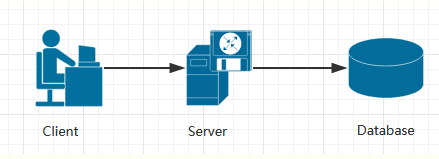
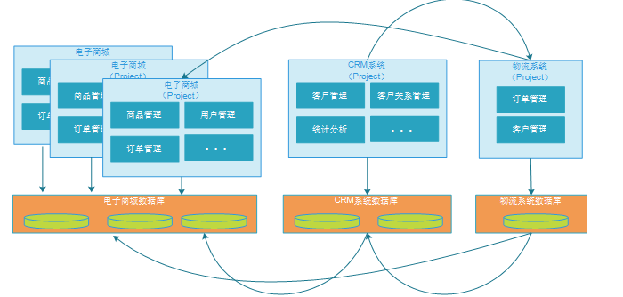
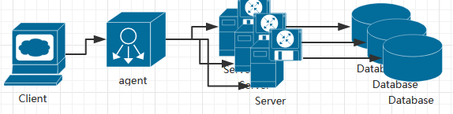
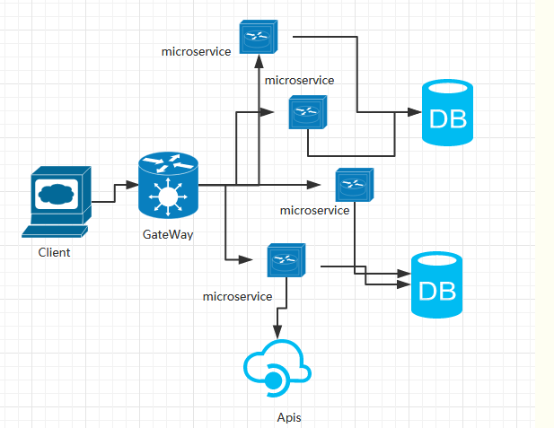
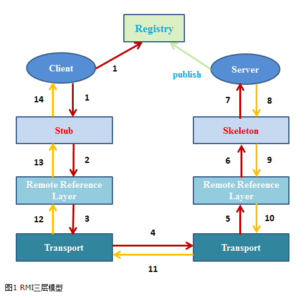
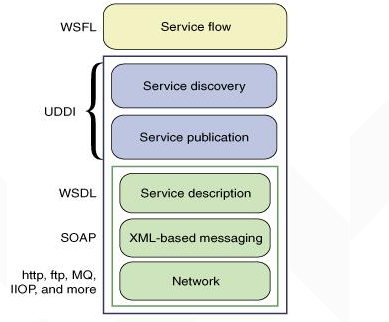

# 第一单元 软件架构与发展史

# 【授课重点】

1. 软件架构发展历史
2. 掌握互联网主流分布技术架构体系

# 【考核要求】

1. 软件架构发展历史
2. 掌握互联网主流分布技术架构体系 

# 【教学内容】

## 1.1 课程导入

随着互联网技术的发展,我国的上网人群日益增多,这就导致了流量非常大,并发量非常高的问题,传统的项目已经无法满足大用户量的访问需求,因此分布式架构诞生了!

在我们介绍分布式架构之前,先来了解一下软件架构的发展史,以及目前主流的架构体系!

## 1.2 软件架构发展历史

### 1.2.1  第一代软件

​	（1946－1953）

​	第一代软件是用机器语言编写的，机器语言是内置在计算机电路中的指令，由0和1组成。

### 1.2.2  第二代软件

（1954－1964）

当硬件变得更强大时，就需要更强大的软件工具使计算机得到更有效地使用。汇编语言向正确的方向前进了一大步，但是程序员还是必须记住很多汇编指令。

### 1.2.3  第三代软件

（1965－1970）

在这个时期，由于用集成电路取代了晶体管，处理器的运算速度得到了大幅度的提高，处理器在等待运算器准备下一个作业时，无所事事。因此需要编写一种程序，使所有计算机资源处于计算机的控制中，这种程序就是操作系统。

### 1.2.4  第四代软件

（1971－1989）

20世纪70年代出现了结构化程序设计技术，[Pascal语言](https://www.baidu.com/s?wd=Pascal%E8%AF%AD%E8%A8%80&tn=SE_PcZhidaonwhc_ngpagmjz&rsv_dl=gh_pc_zhidao)和Modula-2语言都是采用结构化程序设计规则制定的，Basic这种为第三代计算机设计的语言也被升级为具有结构化的版本，此外，还出现了灵活且功能强大的C语言。

### 1.2.5  第五代软件

（1990－至今）

第五代软件中有三个著名事件：在计算机软件业具有主导地位的Microsoft公司的崛起、面向对象的程序设计方法的出现以及万维网（World Wide Web）的普及。

## 架构的发展	

### 1.2.1 单一应用架构

单体架构比较初级，典型的三级架构，前端(Web/手机端)+中间业务逻辑层+数据库层。这是一种典型的Java Spring mvc或者Python Drango框架的应用。其架构图如下所示：

 

单体架构

单体架构的应用比较容易部署、测试， 在项目的初期，单体应用可以很好地运行。然而，随着需求的不断增加， 越来越多的人加入开发团队，代码库也在飞速地膨胀。慢慢地，单体应用变得越来越臃肿，可维护性、灵活性逐渐降低，维护成本越来越高。下面是单体架构应用的一些缺点：

**复杂性高**： 以一个百万行级别的单体应用为例，整个项目包含的模块非常多、模块的边界模糊、 依赖关系不清晰、 代码质量参差不齐、 混乱地堆砌在一起。可想而知整个项目非常复杂。 每次修改代码都心惊胆战， 甚至添加一个简单的功能， 或者修改一个Bug都会带来隐含的缺陷。

**技术债务**： 随着时间推移、需求变更和人员更迭，会逐渐形成应用程序的技术债务， 并且越积 越多。“ 不坏不修”， 这在软件开发中非常常见， 在单体应用中这种思想更甚。 已使用的系统设计或代码难以被修改，因为应用程序中的其他模块可能会以意料之外的方式使用它。

**部署频率低**： 随着代码的增多，构建和部署的时间也会增加。而在单体应用中， 每次功能的变更或缺陷的修复都会导致需要重新部署整个应用。全量部署的方式耗时长、 影响范围大、 风险高， 这使得单体应用项目上线部署的频率较低。 而部署频率低又导致两次发布之间会有大量的功能变更和缺陷修复，出错率比较高。

**可靠性差**： 某个应用Bug，例如死循环、内存溢出等， 可能会导致整个应用的崩溃。

**扩展能力受限**： 单体应用只能作为一个整体进行扩展，无法根据业务模块的需要进行伸缩。例如，应用中有的模块是计算密集型的，它需要强劲的CPU； 有的模块则是IO密集型的，需要更大的内存。 由于这些模块部署在一起，不得不在硬件的选择上做出妥协。

**阻碍技术创新**： 单体应用往往使用统一的技术平台或方案解决所有的问题， 团队中的每个成员 都必须使用相同的开发语言和框架，要想引入新框架或新技术平台会非常困难。

### 1.2.2 垂直应用架构

垂直应用架构是以单体项目为单位进行进行的垂直划分项目即将一个大型项目拆分成一个一个单体项目,架构如图:

 

特点：
1、以单体结构规模的项目为单位进行垂直划分项目即将一个大项目拆分成一个一个单体结构项目。

2、项目与项目之间的存在数据冗余，耦合性较大，比如上图中三个项目都存在客户信息。

3、项目之间的接口多为数据同步功能，如：数据库之间的数据库，通过网络接口进行数据库同步。

优点：
1、项目架构简单，前期开发成本低，周期短，小型项目的首选。

2、通过垂直拆分，原来的单体项目不至于无限扩大。

3、不同的项目可采用不同的技术。

缺点：
1、全部功能集成在一个工程中，对于大型项目不易开发、扩展及维护。

2、系统性能扩展只能通过扩展集群结点，成本高、有瓶颈。

### 1.2.3 分布式服务架构

中级架构，分布式应用，中间层分布式+数据库分布式，是单体架构的并发扩展，将一个大的系统划分为多个业务模块，业务模块分别部署在不同的服务器上，各个业务模块之间通过接口进行数据交互。数据库也大量采用分布式数据库，如redis、ES、solor等。通过LVS/Nginx代理应用，将用户请求均衡的负载到不同的服务器上。其架构图如下所示：

 

该架构相对于单体架构来说，这种架构提供了负载均衡的能力，大大提高了系统负载能力，解决了网站高并发的需求。另外还有以下特点：

**降低了耦合度**：把模块拆分,使用接口通信,降低模块之间的耦合度。

**责任清晰**：把项目拆分成若干个子项目,不同的团队负责不同的子项目。

**扩展方便**：增加功能时只需要再增加一个子项目,调用其他系统的接口就可以。

**部署方便**:可以灵活的进行分布式部署。

**提高代码的复用性**：比如service层,如果不采用分布式rest服务方式架构就会在手机wap商城,微信商城,pc,android，ios每个端都要写一个service层逻辑,开发量大,难以维护一起升级,这时候就可以采用分布式rest服务方式,公用一个service层。

**缺点 :** 系统之间的交互要使用远程通信,接口开发增大工作量,但是利大于弊。

### 1.2.4 流动计算架构

微服务架构，主要是中间层分解，将系统拆分成很多小应用（微服务），微服务可以部署在不同的服务器上，也可以部署在相同的服务器不同的容器上。当应用的故障不会影响到其他应用，单应用的负载也不会影响到其他应用，其代表框架有Spring cloud、Dubbo等。 其架构图如下所示：

 

**易于开发和维护**： 一个微服务只会关注一个特定的业务功能，所以它业务清晰、代码量较少。 开发和维护单个微服务相对简单。而整个应用是由若干个微服务构建而成的，所以整个应用也会被维持在一个可控状态。

**单个微服务启动较快**： 单个微服务代码量较少， 所以启动会比较快。

**局部修改容易部署**： 单体应用只要有修改，就得重新部署整个应用，微服务解决了这样的问题。 一般来说，对某个微服务进行修改，只需要重新部署这个服务即可。

**技术栈不受限**：在微服务架构中，可以结合项目业务及团队的特点，合理地选择技术栈。例如某些服务可使用关系型数据库MySQL；某些微服务有图形计算的需求，可以使用Neo4j；甚至可根据需要，部分微服务使用Java开发，部分微服务使用Node.js开发。

微服务虽然有很多吸引人的地方，但它并不是免费的午餐，使用它是有代价的。使用微服务架构面临的挑战。

**运维要求较高**：更多的服务意味着更多的运维投入。在单体架构中，只需要保证一个应用的正常运行。而在微服务中，需要保证几十甚至几百个服务服务的正常运行与协作，这给运维带来了很大的挑战。

**分布式固有的复杂性**：使用微服务构建的是分布式系统。对于一个分布式系统，系统容错、网络延迟、分布式事务等都会带来巨大的挑战。

**接口调整成本高**：微服务之间通过接口进行通信。如果修改某一个微服务的API，可能所有使用了该接口的微服务都需要做调整。

**重复劳动**：很多服务可能都会使用到相同的功能，而这个功能并没有达到分解为一个微服务的程度，这个时候，可能各个服务都会开发这一功能，从而导致代码重复。尽管可以使用共享库来解决这个问题（例如可以将这个功能封装成公共组件，需要该功能的微服务引用该组件），但共享库在多语言环境下就不一定行得通了。

## 1.3 掌握互联网主流分布技术架构体系

### 1.3.1 微软DCOM分布架构概念

分布式组件对象模型）是一系列微软的概念和程序接口，利用这个接口，客户端程序对象能够请求来自网络中另一台计算机上的服务器程序对象。DCOM基于组件对象模型（COM），COM提供了一套允许同一台计算机上的客户端和服务器之间进行通信的接口（运行在Windows95或者其后的版本上）。

DCOM（分布式组件对象模型,分布式组件对象模式）是一系列微软的概念和程序接口，利用这个接口，客户端程序对象能够请求来自网络中另一台计算机上的服务器程序对象。DCOM基于组件对象模型（COM），COM提供了一套允许同一台计算机上的客户端和服务器之间进行通信的接口（运行在Windows95或者其后的版本上）。

Microsoft Distributed Component Object Model（DCOM）是Component Object Model（COM）的扩展，它支持不同的两台机器上的组件间的通信，而且不论它们是运行在局域网、广域网、还是Internet上。借助DCOM你的应用程序将能够任意进行空间分布。

由于DCOM是COM这个组件技术的无缝升级，所以你能够从你现有的有关COM得知识中获益，你的以前在COM中开发的应用程序、组件、工具都可以移入分布式的环境中。DCOM将为你屏蔽底层网络协议的细节，你只需要集中精力于你的应用。

COM已经不再是单纯的技术和编程规范，而是一种研发思想，在这里，我们逐步分析COM与DCOM思想，带领大家进入分布式系统的殿堂。

### 1.3.2 对象管理组织OMG分布式架构CORBA概念

**CORBA 是由OMG 组织为解决分布式处理环境中软硬件系统互连而提出的一种解决方案**

对象管理组织（OMG）制订了OMA(Object Management Architecture，对象管理体系结构)参考模型，该模型描述了OMG规范所遵循的概念化的基础结构。
从最底层开始，OMA分别由对象请求代理ORB、对象服务、公共设施、域接口和应用接口这几个部分组成，其核心部分是对象请求代理ORB（Object Request Broker）。对象服务是为使用和实现对象而提供的基本服务集合；公共设施是向终端用户应用程序提供的一组共享服务接口；域接口是为应用领域服务而提供的接口；应用接口是由开发商提供的产品，用于它们的接口，不属于OMG标准的内容。
CORBA（Common Object Request Broker Architecture，公共对象请求代理体系结构，通用对象请求代理体系结构）是建立在OMA概念之上，由对象管理组织（OMG）组织为解决分布式处理环境(DCE)中，硬件和软件系统的互连而提出的一种解决方案。CORBA 遵从OMA模型。

### 1.3.3 JAVA RMI分布式技术简要介绍

RMI(Remote Method Invocation)是JAVA早期版本(JDK 1.1)提供的分布式应用解决方案，它作为重要的API被广泛的应用在EJB中。随着互联网应用的发展，分布式处理任务也随之复杂起 来，WebService也得到普遍的推广和应用。
        在某些方面，例如跨语言平台的分布式应用，RMI就显得力不从心了。在实际的应用中，是采用WebService还是传统的RMI来实现？这是一个需要权衡的问题，两者的比较如下所述：

           1. 比起WebService，它只能使用(调用)由JAVA编写的远程服务。而WebService是跨语言平台的，只要客户端和服务端双方都遵守SOAP规范即可；
           MI是在TCP协议基础上传递可序列化的java对象(字节数据)，而WebService是在HTTP协议基础上通过XML来传输数据的。因此，在同等业务数据量的前提下，RMI的效率要高于WebService。
                   因此，RMI可以用在业务结构比较简单，而要求实时高效的分布式应用中。 
                   从设计角度上讲，JAVA采用的是三层结构模式来实现RMI。在整个体系结构中，有如下几个关键角色构成了通信双方：
                   1.客户端：
           1）桩(StubObject)：远程对象在客户端上的代理；
           2）远程引用层(RemoteReference Layer)：解析并执行远程引用协议；
           3）传输层(Transport)：发送调用、传递远程方法参数、接收远程方法执行结果。
                   2.服务端：
           1）骨架(Skeleton)：读取客户端传递的方法参数，调用服务器方的实际对象方法，并接收方法执行后的返回值；
           2）远程引用层(Remote ReferenceLayer)：处理远程引用语法之后向骨架发送远程方法调用；
           3）传输层(Transport)：监听客户端的入站连接，接收并转发调用到远程引用层。
                   3.注册表(Registry)：以URL形式注册远程对象，并向客户端回复对远程对象的引用。

 

在实际的应用中，客户端并没有真正的和服务端直接对话来进行远程调用，而是通过本地JVM环境下的桩对象来进行的。
        1.远程调用过程：
        1）客户端从远程服务器的注册表中查询并获取远程对象引用。当进行远程调用时，客户端首先会与桩对象(Stub Object)进行对话，而这个桩对象将远程方法所需的参数进行序列化后，传递给它下层的远程引用层(RRL)；
        2）桩对象与远程对象具有相同的接口和方法列表，当客户端调用远程对象时，实际上是由相应的桩对象代理完成的。远程引用层在将桩的本地引用转换为服务器上对象的远程引用后，再将调用传递给传输层(Transport)，由传输层通过TCP协议发送调用；      
        3）在服务器端，传输层监听入站连接，它一旦接收到客户端远程调用后，就将这个引用转发给其上层的远程引用层；
        4）服务器端的远程引用层将客户端发送的远程应用转换为本地虚拟机的引用后，再将请求传递给骨架(Skeleton)；
        5）骨架读取参数，又将请求传递给服务器，最后由服务器进行实际的方法调用。
        2.**结果返回过程：        1）****如果远程方法调用后有返回值，则服务器将这些结果又沿着“骨架->远程引用层->传输层”向下传递；        2）****客户端的传输层接收到返回值后，又沿着“传输层->远程引用层->桩”向上传递，然后由桩来反序列化这些返回值，并将最终的结果传递给客户端程序。**
        又从技术的角度上讲，有如下几个主要类或接口扮演着上述三层模型中的关键角色：
        1）注册表：java.rmi.Naming和ava.rmi.Registry；
        2）骨架：java.rmi.remote.Skeleton        
        3）桩：java.rmi.server.RemoteStub
        4）远程引用层：java.rmi.server.RemoteRef和sun.rmi.transport.Endpoint；
        5）传输层：sun.rmi.transport.Transport
        作为一般的RMI应用，JAVA为我们隐藏了其中的处理细节，而让开发者有更多的精力和时间花在实际的应用中。开发RMI的步骤如下所述： 
        1.服务端：
        1）定义Remote子接口，在其内部定义要发布的远程方法，并且这些方法都要Throws RemoteException；
        2）定义远程对象的实现类，通常有两种方式：
              a. 继承UnicastRemoteObject或Activatable，并同时实现Remote子接口； 
               b. 只实现Remote子接口和java.io.Serializable接口。 
        3）编译桩（在JAVA 1.5及以后版本中，如果远程对象实现类继承了UnicastRemoteObject或Activatable，则无需此步，由JVM自动完成。否则需手工利用rmic工具编译生成此实现类对应的桩类，并放到和实现类相同的编译目录下）； 
        4）启动服务器：依次完成注册表的启动和远程对象绑定。另外，如果远程对象实现类在定义时没有继承UnicastRemoteObject或Activatable，则必须在服务器端显示的调用UnicastRemoteObject类中某个重载的exportObject(Remote remote)静态方法，将此实现类对象导出成为一个真正的远程对象。 
        2.客户端： 
       1）定义用于接收远程对象的Remote子接口，只需实现java.rmi.Remote接口即可。但要求必须与服务器端对等的Remote子接口保持一致，即有相同的接口名称、包路径和方法列表等。
       2）通过符合JRMP规范的URL字符串在注册表中获取并强转成Remote子接口对象；
       3）调用这个Remote子接口对象中的某个方法就是为一次远程方法调用行为。

### 1.3.4 WebService简要介绍

**什么是WebService？**

> 它是一种构建应用程序的普遍模型,可以在任何支持网络通信的操作系统中实施运行;它是一种新的web webservice应用程序分支，是自包含、自描述、模块 化的应用，可以发布、定位、通过web调用。Web Service是一个应用组件,它逻辑性的为其他应用程序提供数据与服务.各应用程序通过网络协议和规定的一些标准数据格式（Http，XML，Soap)来访问Web Service,通过Web Service内部执行得到所需结果.Web Service可以执行从简单的请求到复杂商务处理的任何功能。一旦部署以后，其他Web Service应用程序可以发现并调用它部署的服务。
>
> 可以将其理解为服务器通过特殊API，为其他用户提供服务的一种方式。它可以实现跨平台调度。

**WebService是由哪几部分组成的？**

> WebService框架核心是基于简单对象访问协议（Simple Object Access Protocol，SOAP）、Web 服务描述语言（Web Service Description Language，WSDL）以及通用描述、发现和集成（Universal Description Discovery and Integration，UDDI）。
>
>  

**各部分详细介绍**

**soap**:简单对象访问协议,是一个基于xml访问的协议。它包含有四部分：SOAP封装(envelop)，封装定义了一个描述消息中的内容是什么，是谁发送的，谁应当接受并处理它以及如何处理它们的框架；SOAP编码规则（encoding rules），用于表示应用程序需要使用的数据类型的实例; SOAP RPC表示(RPC representation)，表示远程过程调用和应答的协定;SOAP绑定（binding），使用底层协议交换信息。SOAP是以HTTP作为底层通信协议，以RPC作为一致性的调用途径，以XML做为数据传输格式。可以简单理解为SOAP=HTTP+RPC+XML

**wsdl**:用来描述WEB服务，他将Web服务描述定义为一组服务访问点，客户端可以通过这些服务访问点对包含面向文档信息或面向过程调用的服务进行访问(类似远程过程调用)。WSDL首先对访问的操作和访问时使用的请求/响应消息进行抽象描述，然后将其绑定到具体的传输协议和消息格式上以最终定义具体部署的服务访问点。

**uddi**: UDDI是一个分布式的互联网服务注册机制，它集描述(Universal Description)、检索(Discovery)与集成(Integration)为一体，其核心是注册机制。UDDI实现了一组可公开访问的接 口，通过这些接口，网络服务可以向服务信息库注册其服务信息、服务需求者可以找到分散在世界各地的网络服务。