# 第七单元 Dubbo项目整合

# 【授课重点】

1. 创建Maven聚合dubbo项目

# 【考核要求】

1. 独立创建Maven聚合dubbo项目

# 【教学内容】

## 7.1 课程导入	

  	企业Maven的dubbo聚合项目应用比较广泛，我们在实际中怎么完成项目的创建尼

## 7.2 创建Mavan聚合dubbo项目

### 7.2.1 创建聚合项目父工程 

  创建聚合项目父工程名称：lianxi_dubbo_parent

###   create a maven Project

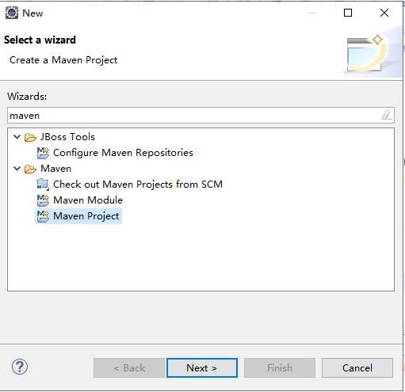 

###  Next>

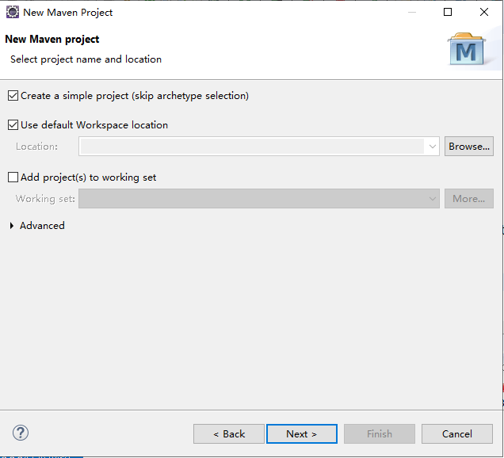 

勾选上 Create a simple project

### Next>

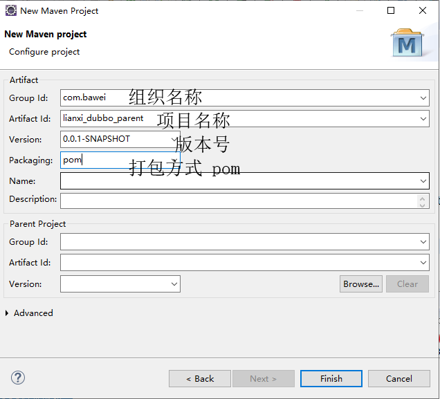 

###   Finish


###   pom.xml文件加入依赖管理(认真读读)

```
  <!-- 定义主要版本号 -->
	<properties>
		<spring.version>5.1.5.RELEASE</spring.version>
		<mybatis.version>3.4.2</mybatis.version>
		<log4j.version>1.2.17</log4j.version>
		<druid.version>1.0.9</druid.version>
		<mysql.version>5.1.6</mysql.version>
		<mybatis.spring.version>1.3.0</mybatis.spring.version>
		<jackson.version>2.9.1</jackson.version>
		<validator.version>5.1.0.Final</validator.version>
		<poi.version>3.9</poi.version>
		<jstl.version>1.2</jstl.version>
		<servlet-api.version>2.5</servlet-api.version>
		<jsp-api.version>2.0</jsp-api.version>
		<commons-lang3.version>3.3.2</commons-lang3.version>
		<commons-io.version>1.3.1</commons-io.version>
		<commons-net.version>3.3</commons-net.version>
		<commons-fileupload.version>1.3.1</commons-fileupload.version>
		<junit-version>4.12</junit-version>
		<!-- aop使用 -->
		<aspectj-version>1.8.0</aspectj-version>
		<!-- 分页助手 -->
		<jedis.version>2.9.0</jedis.version>
		<pagehelper-version>5.1.2</pagehelper-version>
		<dubbo.version>2.7.3</dubbo.version>
		<jsp-api.version>2.2</jsp-api.version>
		<json-simple.version>1.1.1</json-simple.version>
		<gson.version>2.8.5</gson.version>
		<kafka.version>0.8.2.1</kafka.version>
		<ik.version>2012_u6</ik.version>
		<lucene.version>7.2.1</lucene.version>
		<spring-kafka.version>2.2.4.RELEASE</spring-kafka.version>
		<spring-data-redis.version>2.1.5.RELEASE</spring-data-redis.version>
		<spring-data-elasticsearch.version>3.1.5.RELEASE</spring-data-elasticsearch.version>
		<validation-api.version>2.0.1.Final</validation-api.version>
		<fastjson.version>1.2.7</fastjson.version>
	</properties>


	<dependencyManagement>

		<dependencies>

			<dependency>
				<groupId>com.alibaba</groupId>
				<artifactId>fastjson</artifactId>
				<version>${fastjson.version}</version>
			</dependency>

			<!-- 引入dubbo的依赖配置 -->
			<dependency>
				<groupId>org.apache.dubbo</groupId>
				<artifactId>dubbo</artifactId>
				<version>${dubbo.version}</version>
				<exclusions>
					<exclusion>
						<groupId>io.netty</groupId>
						<artifactId>netty-all</artifactId>
					</exclusion>
					<exclusion>
						<artifactId>org.springframework</artifactId>
						<groupId>spring-context</groupId>
					</exclusion>
				</exclusions>
			</dependency>
			<dependency>
				<groupId>org.apache.dubbo</groupId>
				<artifactId>dubbo-dependencies-zookeeper</artifactId>
				<version>${dubbo.version}</version>
				<type>pom</type>
			</dependency>

			<!-- validation-api -->
			<dependency>
				<groupId>javax.validation</groupId>
				<artifactId>validation-api</artifactId>
				<version>${validation-api.version}</version>
			</dependency>
			<!-- 单独引入lucene项目的分词器 -->
			<dependency>
				<groupId>org.apache.lucene</groupId>
				<artifactId>lucene-core</artifactId>
				<version>${lucene.version}</version>
			</dependency>
			<!-- 加入ik分词器 -->
			<dependency>
				<groupId>com.janeluo</groupId>
				<artifactId>ikanalyzer</artifactId>
				<version>${ik.version}</version>
				<!-- 排除自带的lucene操作 -->
				<exclusions>
					<exclusion>
						<groupId>org.apache.lucene</groupId>
						<artifactId>lucene-queries</artifactId>
					</exclusion>
					<exclusion>
						<groupId>org.apache.lucene</groupId>
						<artifactId>lucene-queryparser</artifactId>
					</exclusion>
				</exclusions>
			</dependency>

			<!-- 引入spring-kafka依赖 -->
			<dependency>
				<groupId>org.springframework.kafka</groupId>
				<artifactId>spring-kafka</artifactId>
				<version>${spring-kafka.version}</version>
			</dependency>
			<!-- kafka的依赖 -->
			<dependency>
				<groupId>org.apache.kafka</groupId>
				<artifactId>kafka_2.10</artifactId>
				<version>${kafka.version}</version>
				<exclusions>
					<exclusion>
						<artifactId>jmxri</artifactId>
						<groupId>com.sun.jmx</groupId>
					</exclusion>
					<exclusion>
						<artifactId>jms</artifactId>
						<groupId>javax.jms</groupId>
					</exclusion>
					<exclusion>
						<artifactId>jmxtools</artifactId>
						<groupId>com.sun.jdmk</groupId>
					</exclusion>
				</exclusions>
			</dependency>

			<!-- 引入 redis.clients/jedis 依赖 -->
			<dependency>
				<groupId>redis.clients</groupId>
				<artifactId>jedis</artifactId>
				<version>${jedis.version}</version>
			</dependency>

			<!-- 引入 spring-data-redis 依赖 -->
			<dependency>
				<groupId>org.springframework.data</groupId>
				<artifactId>spring-data-redis</artifactId>
				<version>${spring-data-redis.version}</version>
			</dependency>


			<!-- spring-core 依赖 -->
			<dependency>
				<groupId>org.springframework</groupId>
				<artifactId>spring-core</artifactId>
				<!-- 引用版本 -->
				<version>${spring.version}</version>
			</dependency>

			<!-- spring-context 依赖 -->
			<dependency>
				<groupId>org.springframework</groupId>
				<artifactId>spring-context</artifactId>
				<version>${spring.version}</version>
			</dependency>

			<!-- spring-beans依赖 -->
			<dependency>
				<groupId>org.springframework</groupId>
				<artifactId>spring-beans</artifactId>
				<version>${spring.version}</version>
			</dependency>
			<!-- spring-web依赖 -->
			<dependency>
				<groupId>org.springframework</groupId>
				<artifactId>spring-web</artifactId>
				<version>${spring.version}</version>
			</dependency>
			<!-- spring-webmvc依赖 -->
			<dependency>
				<groupId>org.springframework</groupId>
				<artifactId>spring-webmvc</artifactId>
				<version>${spring.version}</version>
			</dependency>
			<!-- spring-jdbc依赖 -->
			<dependency>
				<groupId>org.springframework</groupId>
				<artifactId>spring-jdbc</artifactId>
				<version>${spring.version}</version>
			</dependency>
			<!-- spring-tx 事务依赖 -->
			<dependency>
				<groupId>org.springframework</groupId>
				<artifactId>spring-tx</artifactId>
				<version>${spring.version}</version>
			</dependency>
			<!-- spring-context-support上下文依赖 -->
			<dependency>
				<groupId>org.springframework</groupId>
				<artifactId>spring-context-support</artifactId>
				<version>${spring.version}</version>
			</dependency>
			<!-- 引入spring-test依赖 -->
			<dependency>
				<groupId>org.springframework</groupId>
				<artifactId>spring-test</artifactId>
				<version>${spring.version}</version>
			</dependency>

			<!-- mybatis核心包 -->
			<dependency>
				<groupId>org.mybatis</groupId>
				<artifactId>mybatis</artifactId>
				<version>${mybatis.version}</version>
			</dependency>
			<!-- mybatis-spring 整合jar -->
			<dependency>
				<groupId>org.mybatis</groupId>
				<artifactId>mybatis-spring</artifactId>
				<version>${mybatis.spring.version}</version>
			</dependency>
			<!-- druid数据源 -->
			<dependency>
				<groupId>com.alibaba</groupId>
				<artifactId>druid</artifactId>
				<version>${druid.version}</version>
			</dependency>
			<!-- Mysql数据库驱动包 -->
			<dependency>
				<groupId>mysql</groupId>
				<artifactId>mysql-connector-java</artifactId>
				<version>${mysql.version}</version>
			</dependency>
			<!-- 日志文件管理包 -->
			<!-- log start -->
			<dependency>
				<groupId>log4j</groupId>
				<artifactId>log4j</artifactId>
				<version>${log4j.version}</version>
			</dependency>
			<!-- 单元测试 -->
			<dependency>
				<groupId>junit</groupId>
				<artifactId>junit</artifactId>
				<version>${junit-version}</version>
				<scope>test</scope>
			</dependency>
			<!-- 上传组件包 -->
			<dependency>
				<groupId>commons-fileupload</groupId>
				<artifactId>commons-fileupload</artifactId>
				<version>${commons-fileupload.version}</version>
			</dependency>
			<!-- common-io依赖 -->
			<dependency>
				<groupId>commons-io</groupId>
				<artifactId>commons-io</artifactId>
				<version>${commons-io.version}</version>
			</dependency>
			<!-- poi execl操作依赖 -->
			<dependency>
				<groupId>org.apache.poi</groupId>
				<artifactId>poi</artifactId>
				<version>${poi.version}</version>
			</dependency>
			<!-- 引入jstl依赖 -->
			<dependency>
				<groupId>jstl</groupId>
				<artifactId>jstl</artifactId>
				<version>${jstl.version}</version>
			</dependency>
			<!-- 引入jsp-api依赖 -->
			<dependency>
				<groupId>javax.servlet.jsp</groupId>
				<artifactId>jsp-api</artifactId>
				<version>${jsp-api.version}</version>
				<scope>provided</scope>
			</dependency>
			<dependency>
				<groupId>javax.servlet</groupId>
				<artifactId>servlet-api</artifactId>
				<version>${servlet-api.version}</version>
				<scope>provided</scope>
			</dependency>

			<!-- 引入jackson的依赖 -->
			<dependency>
				<groupId>com.fasterxml.jackson.core</groupId>
				<artifactId>jackson-databind</artifactId>
				<version>${jackson.version}</version>
			</dependency>

			<!-- 依赖的公共包 -->
			<dependency>
				<groupId>org.apache.commons</groupId>
				<artifactId>commons-lang3</artifactId>
				<version>${commons-lang3.version}</version>
			</dependency>

			<!-- 引入org.aspectj依赖 -->
			<dependency>
				<groupId>org.aspectj</groupId>
				<artifactId>aspectjweaver</artifactId>
				<version>${aspectj-version}</version>
			</dependency>
			<dependency>
				<groupId>org.aspectj</groupId>
				<artifactId>aspectjrt</artifactId>
				<version>${aspectj-version}</version>
			</dependency>
			<!-- 引入验证依赖 -->
			<dependency>
				<groupId>org.hibernate</groupId>
				<artifactId>hibernate-validator</artifactId>
				<version>${validator.version}</version>
			</dependency>

			<!-- 引入mybaits pagehelper分页助手依赖 -->
			<dependency>
				<groupId>com.github.pagehelper</groupId>
				<artifactId>pagehelper</artifactId>
				<version>${pagehelper-version}</version>
			</dependency>


			<!-- 富文本编辑器使用该文件上传 -->
			<dependency>
				<groupId>com.googlecode.json-simple</groupId>
				<artifactId>json-simple</artifactId>
				<version>${json-simple.version}</version>
			</dependency>

			<!-- google Gson -->
			<dependency>
				<groupId>com.google.code.gson</groupId>
				<artifactId>gson</artifactId>
				<version>${gson.version}</version>
			</dependency>

			<!-- spring-data-elasticsearch 提高到3.1.5 -->
			<dependency>
				<groupId>org.springframework.data</groupId>
				<artifactId>spring-data-elasticsearch</artifactId>
				<version>${spring-data-elasticsearch.version}</version>
			</dependency>
		</dependencies>
	</dependencyManagement>


	<build>
		<plugins>
			<!-- 引入jetty -->
			<plugin>
				<groupId>org.eclipse.jetty</groupId>
				<artifactId>jetty-maven-plugin</artifactId>
				<version>9.4.20.v20190813</version>
				<configuration>
					<httpConnector>
						<!-- 端口号 -->
						<port>80</port>
						<!-- 项目访问路径 -->
						<host>localhost</host>
					</httpConnector>
					<contextHandlers>
						<jettyWebAppContext>
							<!-- 虚拟路径 -->
							<contextPath>/pic</contextPath>
							<!-- 物理路径 -->
							<resourceBase>d:/pic/</resourceBase>
						</jettyWebAppContext>
					</contextHandlers>
					<scanIntervalSeconds>1</scanIntervalSeconds>
				</configuration>
			</plugin>

			<!-- 打包去掉测试类 -->
			<plugin>
				<groupId>org.apache.maven.plugins</groupId>
				<artifactId>maven-surefire-plugin</artifactId>
				<version>2.18.1</version>
				<configuration>
					<skipTests>true</skipTests>
				</configuration>
			</plugin>

			<!-- 编译的环境 jdk版本1.8 -->
			<plugin>
				<groupId>org.apache.maven.plugins</groupId>
				<artifactId>maven-compiler-plugin</artifactId>
				<version>3.5.1</version>
				<configuration>
					<source>1.8</source>
					<target>1.8</target>
					<encoding>UTF-8</encoding>
				</configuration>
			</plugin>

		</plugins>
	</build>
```


### 7.2.2 创建服务接口模块 

创建服务接口模块名称：lianxi_dubbo_interface

### create a Maven module

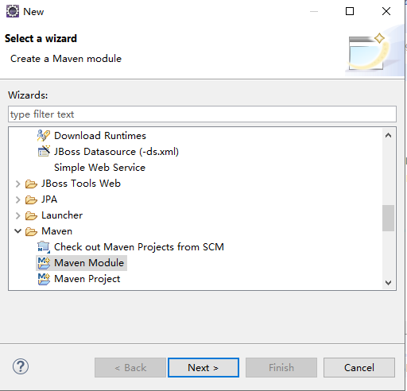 

### Next>

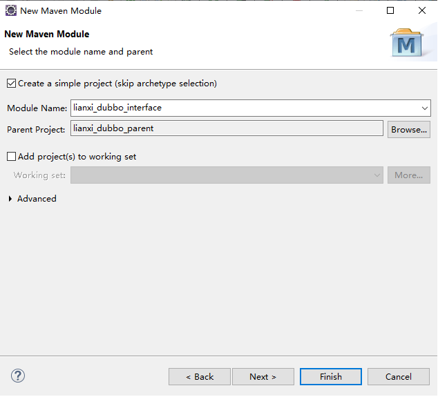 

### Next>

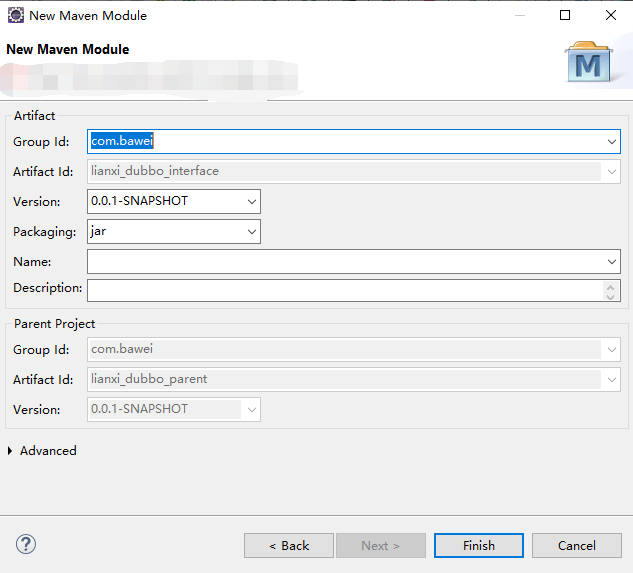 

​     打包方式是jar

​     Finish完成


###     pom.xml文件加入依赖管理 (考虑到es整合，结合专高二课程)

```
<dependencies>
     	<!-- spring-data-elasticsearch 提高到3.1.5 -->
			<dependency>
				<groupId>org.springframework.data</groupId>
				<artifactId>spring-data-elasticsearch</artifactId>
			</dependency>
  </dependencies>
```


### 创建服务接口

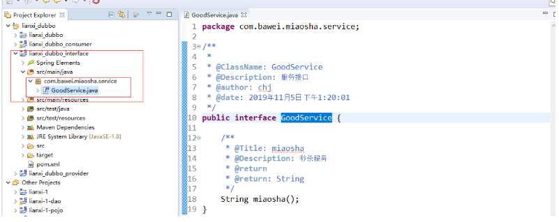 

### 7.2.3 创建服务的提供者

  创建服务提供者名称lianxi_dubbo_provider

   备注：打包方式是war

   步骤：参考1.2

### pom.xml文件加入依赖(记得修改jetty端口号：81(任何不冲突端口号))

```
<dependencies>

		<!-- 引入dubbo的依赖配置 -->
		<dependency>
			<groupId>org.apache.dubbo</groupId>
			<artifactId>dubbo</artifactId>
		</dependency>
		<dependency>
			<groupId>org.apache.dubbo</groupId>
			<artifactId>dubbo-dependencies-zookeeper</artifactId>
			<type>pom</type>
		</dependency>
		
		<!-- spring -web依赖 -->
		<dependency>
			<groupId>org.springframework</groupId>
			<artifactId>spring-web</artifactId>
		</dependency>

		<dependency>
			<groupId>org.springframework</groupId>
			<artifactId>spring-webmvc</artifactId>
		</dependency>
		
		<dependency>
			<groupId>com.bawei</groupId>
			<artifactId>lianxi_dubbo_interface</artifactId>
			<version>0.0.1-SNAPSHOT</version>
		</dependency>
	</dependencies>
	
	
	<build>
		<plugins>
			<!-- 引入jetty -->
			<plugin>
				<groupId>org.eclipse.jetty</groupId>
				<artifactId>jetty-maven-plugin</artifactId>
				<version>9.4.20.v20190813</version>
				<configuration>
					<httpConnector>
						<!-- 端口号 -->
						<port>81</port>
						<!-- 项目访问路径 -->
						<host>localhost</host>
					</httpConnector>
					<contextHandlers>
						<jettyWebAppContext>
							<!-- 虚拟路径 -->
							<contextPath>/pic</contextPath>
							<!-- 物理路径 -->
							<resourceBase>d:/pic/</resourceBase>
						</jettyWebAppContext>
					</contextHandlers>
					<scanIntervalSeconds>1</scanIntervalSeconds>
				</configuration>
			</plugin>

			<!-- 打包去掉测试类 -->
			<plugin>
				<groupId>org.apache.maven.plugins</groupId>
				<artifactId>maven-surefire-plugin</artifactId>
				<version>2.18.1</version>
				<configuration>
					<skipTests>true</skipTests>
				</configuration>
			</plugin>

			<!-- 编译的环境 jdk版本1.8 -->
			<plugin>
				<groupId>org.apache.maven.plugins</groupId>
				<artifactId>maven-compiler-plugin</artifactId>
				<version>3.5.1</version>
				<configuration>
					<source>1.8</source>
					<target>1.8</target>
					<encoding>UTF-8</encoding>
				</configuration>
			</plugin>

		</plugins>
	</build>
```


### 创建服务的实现

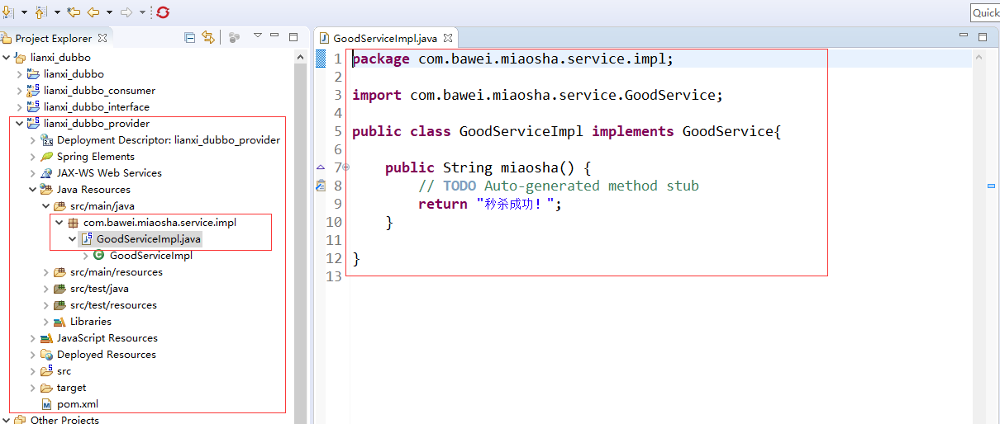


### 服务注册到zookeeper的配置文件 provider.xml

 

具体内容：（**读读里边的配置**)

```
<?xml version="1.0" encoding="UTF-8"?>
<beans xmlns="http://www.springframework.org/schema/beans"
	xmlns:xsi="http://www.w3.org/2001/XMLSchema-instance"
	xmlns:dubbo="http://dubbo.apache.org/schema/dubbo"
	xsi:schemaLocation="http://www.springframework.org/schema/beans        
	http://www.springframework.org/schema/beans/spring-beans-4.3.xsd        
	http://dubbo.apache.org/schema/dubbo        
	http://dubbo.apache.org/schema/dubbo/dubbo.xsd">

	<!-- 提供方应用信息，用于计算依赖关系 -->
	<dubbo:application name="hello-world-app" />

	<!-- 使用zookeeper注册中心暴露服务地址 -->
	<dubbo:registry
		address="zookeeper://192.168.73.129:2181" />

	<!-- 用dubbo协议在20880端口暴露服务 -->
	<dubbo:protocol name="dubbo" port="20880" />

	<!-- 声明需要暴露的服务接口 -->
	<dubbo:service
		interface="com.bawei.miaosha.service.GoodService" ref="goodService" />

	<!-- 和本地bean一样实现服务 -->
	<bean id="goodService"
		class="com.bawei.miaosha.service.impl.GoodServiceImpl" />
</beans>
```

以上标签：dubbo:application,dubbo:registry,dubbo:protocol,dubbo:service 记得背一下。


### 在web.xml文件中加入启动服务的配置，通过spring容器操作

```
<!-- 启动spring -->
	<context-param>
		<param-name>contextConfigLocation</param-name>
		<param-value>classpath:provider.xml</param-value>
	</context-param>
	<listener>
		<listener-class>org.springframework.web.context.ContextLoaderListener</listener-class>
	</listener>
```

​       服务的提供者只是注册服务到zookeeper的注册中心，当通过jetty:run启动服务的时候(前提先启动zookeeper服务)，就可以在zookeeper的客户端的根节点中查看。

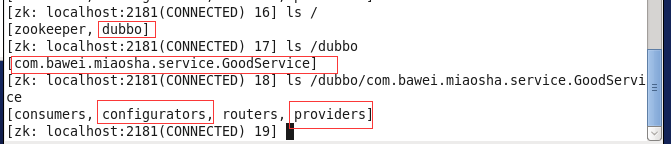 

图上红色的部分就是可以查看到的节点。

### 7.2.4 创建服务的消费者

   消费者名称：lianxi_dubbo_consumer

   备注：打包方式是war

   步骤：参考1.2

###   pom.xml文件加入依赖(记得修改jetty端口号：82（任何不冲突端口号）)

```
<dependencies>

		<!-- 引入dubbo的依赖配置 -->
		<dependency>
			<groupId>org.apache.dubbo</groupId>
			<artifactId>dubbo</artifactId>
		</dependency>
		<dependency>
			<groupId>org.apache.dubbo</groupId>
			<artifactId>dubbo-dependencies-zookeeper</artifactId>
			<type>pom</type>
		</dependency>


		<!-- spring -web依赖 -->
		<dependency>
			<groupId>org.springframework</groupId>
			<artifactId>spring-web</artifactId>
		</dependency>

		<dependency>
			<groupId>org.springframework</groupId>
			<artifactId>spring-webmvc</artifactId>
		</dependency>


		<!-- 验证依赖 -->
		<dependency>
			<groupId>org.hibernate</groupId>
			<artifactId>hibernate-validator</artifactId>
		</dependency>

		<!-- validation-api -->
		<dependency>
			<groupId>javax.validation</groupId>
			<artifactId>validation-api</artifactId>
		</dependency>


		<!-- 引入jstl依赖 -->
		<dependency>
			<groupId>jstl</groupId>
			<artifactId>jstl</artifactId>
		</dependency>
		<!-- 引入jsp-api依赖 -->
		<dependency>
			<groupId>javax.servlet.jsp</groupId>
			<artifactId>jsp-api</artifactId>
			<scope>provided</scope>
		</dependency>
		<dependency>
			<groupId>javax.servlet</groupId>
			<artifactId>servlet-api</artifactId>
			<scope>provided</scope>
		</dependency>
		<!-- 上传组件包 -->
		<dependency>
			<groupId>commons-fileupload</groupId>
			<artifactId>commons-fileupload</artifactId>
		</dependency>
		<!-- common-io依赖 -->
		<dependency>
			<groupId>commons-io</groupId>
			<artifactId>commons-io</artifactId>
		</dependency>


		<dependency>
			<groupId>com.bawei</groupId>
			<artifactId>lianxi_dubbo_interface</artifactId>
			<version>0.0.1-SNAPSHOT</version>
		</dependency>
	</dependencies>

	<build>
		<plugins>
			<!-- 引入jetty -->
			<plugin>
				<groupId>org.eclipse.jetty</groupId>
				<artifactId>jetty-maven-plugin</artifactId>
				<version>9.4.20.v20190813</version>
				<configuration>
					<httpConnector>
						<!-- 端口号 -->
						<port>82</port>
						<!-- 项目访问路径 -->
						<host>localhost</host>
					</httpConnector>
					<contextHandlers>
						<jettyWebAppContext>
							<!-- 虚拟路径 -->
							<contextPath>/pic</contextPath>
							<!-- 物理路径 -->
							<resourceBase>d:/pic/</resourceBase>
						</jettyWebAppContext>
					</contextHandlers>
					<scanIntervalSeconds>1</scanIntervalSeconds>
				</configuration>
			</plugin>

			<!-- 打包去掉测试类 -->
			<plugin>
				<groupId>org.apache.maven.plugins</groupId>
				<artifactId>maven-surefire-plugin</artifactId>
				<version>2.18.1</version>
				<configuration>
					<skipTests>true</skipTests>
				</configuration>
			</plugin>

			<!-- 编译的环境 jdk版本1.8 -->
			<plugin>
				<groupId>org.apache.maven.plugins</groupId>
				<artifactId>maven-compiler-plugin</artifactId>
				<version>3.5.1</version>
				<configuration>
					<source>1.8</source>
					<target>1.8</target>
					<encoding>UTF-8</encoding>
				</configuration>
			</plugin>

		</plugins>
	</build>
```


### 从zookeeper订阅服务，配置文件consumer.xml

```
<?xml version="1.0" encoding="UTF-8"?>
<beans xmlns="http://www.springframework.org/schema/beans"
    xmlns:xsi="http://www.w3.org/2001/XMLSchema-instance"
    xmlns:dubbo="http://dubbo.apache.org/schema/dubbo"
    xsi:schemaLocation="http://www.springframework.org/schema/beans        
    http://www.springframework.org/schema/beans/spring-beans.xsd        
    http://dubbo.apache.org/schema/dubbo        
    http://dubbo.apache.org/schema/dubbo/dubbo.xsd">
 
    <!-- 消费方应用名，用于计算依赖关系，不是匹配条件，不要与提供方一样 -->
    <dubbo:application name="consumer-of-helloworld-app"  />
 
    <!-- 使用zookeeper注册中心暴露发现服务地址 -->
    <dubbo:registry address="zookeeper://192.168.73.129:2181" />
 
    <!-- 生成远程服务代理，可以和本地bean一样使用demoService -->
    <dubbo:reference id="goodService" interface="com.bawei.miaosha.service.GoodService" />
</beans>
```

以上标签：dubbo:application,dubbo:register,dubbo:reference记得背一下。


### 创建一个App测试类

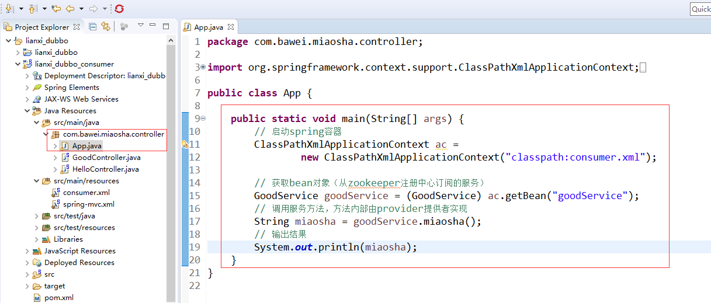 


具体代码：

```
package com.bawei.miaosha.controller;

import org.springframework.context.support.ClassPathXmlApplicationContext;

import com.bawei.miaosha.service.GoodService;

public class App {

	public static void main(String[] args) {
		// 启动spring容器
		ClassPathXmlApplicationContext ac = 
				new ClassPathXmlApplicationContext("classpath:consumer.xml");

		// 获取bean对象（从zookeeper注册中心订阅的服务）
		GoodService goodService = (GoodService) ac.getBean("goodService");
		// 调用服务方法，方法内部由provider提供者实现
		String miaosha = goodService.miaosha();
		// 输出结果
		System.out.println(miaosha);
	}
}

```

运行此Java程序，能够看到 输出秒杀成功，证明dubbo环境测试通过


### 如果想通过web程序访问，创建controller类

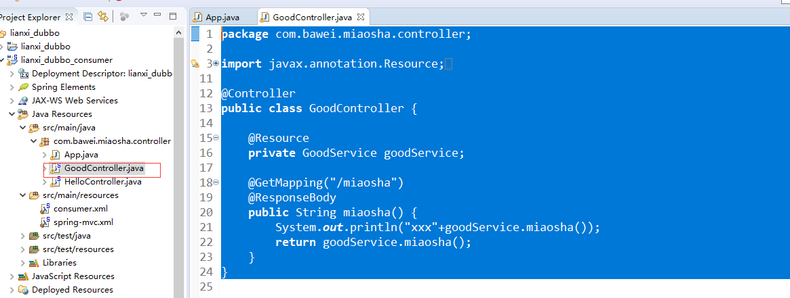 

具体代码：

```
package com.bawei.miaosha.controller;

import javax.annotation.Resource;

import org.springframework.stereotype.Controller;
import org.springframework.web.bind.annotation.GetMapping;
import org.springframework.web.bind.annotation.RequestMapping;
import org.springframework.web.bind.annotation.ResponseBody;

import com.bawei.miaosha.service.GoodService;

@Controller
public class GoodController {
	
	@Resource
	private GoodService goodService;
	
	@GetMapping("/miaosha")
	@ResponseBody
	public String miaosha() {
		System.out.println("xxx"+goodService.miaosha());
		return goodService.miaosha();
	}
}
```

### 在web.xml文件加入启动spring容器，和springwebmvc的配置

```
 <!-- 启动spring -->
	<context-param>
		<param-name>contextConfigLocation</param-name>
		<param-value>classpath:consumer.xml</param-value>
	</context-param>
	<listener>
		<listener-class>org.springframework.web.context.ContextLoaderListener</listener-class>
	</listener>
	
	
		<!-- post请求乱码解决 -->
	<filter>
		<filter-name>CharacterEncodingFilter</filter-name>
		<filter-class>org.springframework.web.filter.CharacterEncodingFilter</filter-class>
		<init-param>
			<param-name>encoding</param-name>
			<param-value>utf-8</param-value>
		</init-param>
	</filter>
	<filter-mapping>
		<filter-name>CharacterEncodingFilter</filter-name>
		<url-pattern>/*</url-pattern>
	</filter-mapping>
	
	<!-- 启动springMVC -->
	<servlet>
		<servlet-name>springDispatcherServlet</servlet-name>
		<servlet-class>org.springframework.web.servlet.DispatcherServlet</servlet-class>
		<init-param>
			<param-name>contextConfigLocation</param-name>
			<param-value>classpath:spring-mvc.xml</param-value>
		</init-param>
		<load-on-startup>1</load-on-startup>
	</servlet>

	<servlet-mapping>
		<servlet-name>springDispatcherServlet</servlet-name>
		<!-- 拦截所有的请求 -->
		<url-pattern>/</url-pattern>
	</servlet-mapping>
```


### spring-mvc.xml文件(记得修改扫描器的包名称)

```
<?xml version="1.0" encoding="UTF-8"?>
<beans xmlns="http://www.springframework.org/schema/beans"
	xmlns:xsi="http://www.w3.org/2001/XMLSchema-instance"
	xmlns:context="http://www.springframework.org/schema/context"
	xmlns:mvc="http://www.springframework.org/schema/mvc"
	xsi:schemaLocation="http://www.springframework.org/schema/beans http://www.springframework.org/schema/beans/spring-beans.xsd
		http://www.springframework.org/schema/context http://www.springframework.org/schema/context/spring-context-4.3.xsd
		http://www.springframework.org/schema/mvc http://www.springframework.org/schema/mvc/spring-mvc-4.3.xsd">

  
   
    <!-- 扫描器 -->
	<context:component-scan
		base-package="com.bawei.miaosha.controller"></context:component-scan>
	<!-- 视图解析图 -->
	<bean
		class="org.springframework.web.servlet.view.InternalResourceViewResolver">
		<!-- 配置前缀 -->
		<property name="prefix" value="/WEB-INF/view/"></property>
		<!-- 配置后缀 -->
		<property name="suffix" value=".jsp"></property>
	</bean>
	<!-- 不拦截静态资源 -->
	<mvc:default-servlet-handler />
	<!-- mvc注解驱动 -->
	<mvc:annotation-driven validator="validator"></mvc:annotation-driven>
	<!-- 文件上传的处理类 -->
	<bean id="multipartResolver"
		class="org.springframework.web.multipart.commons.CommonsMultipartResolver"></bean>

	<!-- hibernate 表单校验 -->
	<bean id="validator"
		class="org.springframework.validation.beanvalidation.LocalValidatorFactoryBean">
		<property name="providerClass"
			value="org.hibernate.validator.HibernateValidator"></property>
	</bean>
</beans>

```


### 通过浏览器访问:http://localhost:82/miaosha 测试能够看到输出结果，dubbo的web环境测试通过.


## 7.3 课程总结：

### 7.3.1 标签：背会的标签

| 标签                                                         | 用途         | 解释                                                         |
| ------------------------------------------------------------ | ------------ | ------------------------------------------------------------ |
| `<dubbo:service/>`                                           | 服务配置     | 用于暴露一个服务，定义服务的元信息，一个服务可以用多个协议暴露，一个服务也可以注册到多个注册中心 |
| `<dubbo:reference/>` [[2\]](http://dubbo.apache.org/zh-cn/docs/user/configuration/xml.html#fn2) | 引用配置     | 用于创建一个远程服务代理，一个引用可以指向多个注册中心       |
| `<dubbo:protocol/>`                                          | 协议配置     | 用于配置提供服务的协议信息，协议由提供方指定，消费方被动接受 |
| `<dubbo:application/>`                                       | 应用配置     | 用于配置当前应用信息，不管该应用是提供者还是消费者           |
| `<dubbo:module/>`                                            | 模块配置     | 用于配置当前模块信息，可选                                   |
| `<dubbo:registry/>`                                          | 注册中心配置 | 用于配置连接注册中心相关信息                                 |
| `<dubbo:monitor/>`                                           | 监控中心配置 | 用于配置连接监控中心相关信息，可选                           |
| `<dubbo:provider/>`                                          | 提供方配置   | 当 ProtocolConfig 和 ServiceConfig 某属性没有配置时，采用此缺省值，可选 |
| `<dubbo:consumer/>`                                          | 消费方配置   | 当 ReferenceConfig 某属性没有配置时，采用此缺省值，可选      |
| `<dubbo:method/>`                                            | 方法配置     | 用于 ServiceConfig 和 ReferenceConfig 指定方法级的配置信息   |
| `<dubbo:argument/>`                                          | 参数配置     | 用于指定方法参数配置                                         |

### 7.3.2 注册中心

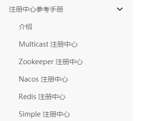

### 7.3.3 参考手册

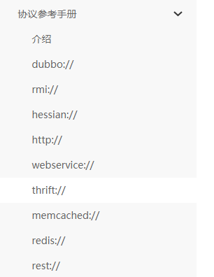

## 7.4 课程作业

​     在此项目的基础上，完成商品表的curd操作，商品表信息有：商品名称，价格，上架时间，商品图片,商品卖点.
