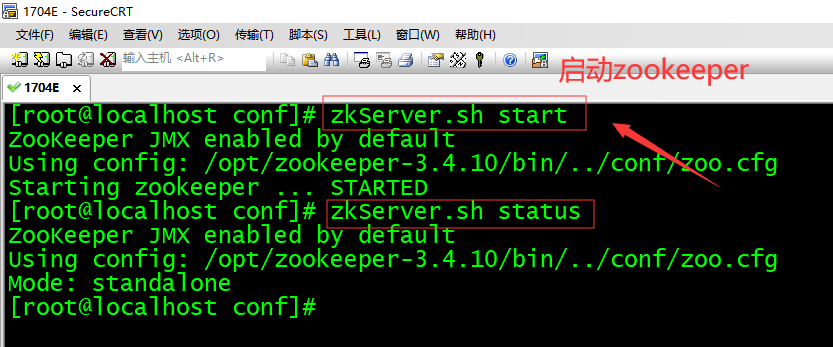
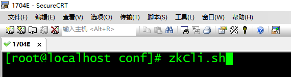
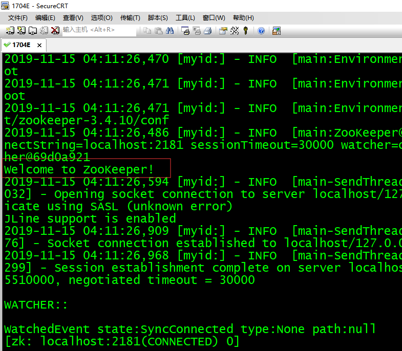
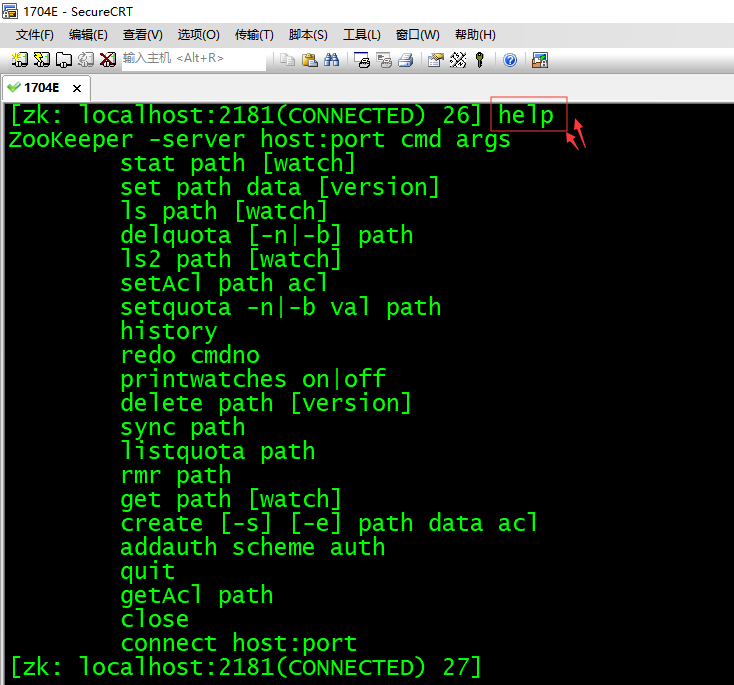

# 第三单元 zookeeper命令

# 【授课重点】

1. Zookeeper命令

# 【考核要求】

1. 掌握Zookeeper命令

# 【教学内容】

## 3.1 课程导入

​    在实际的应用中，我们经常回去通过命令来操作zookeeper，那如何掌握zookeeper的命令尼，它有那些命令。

## 3.2 Zookeeper的shell操作

 通过客户端操作zookeeper操作

###  3.2.1Zookeepe命令工具

####   启动zookeepr服务



在启动Zookeeper服务之后，输入以下命令，连接到Zookeeper服务

#### 客户端连接zookeeper



#### 启动成功 

能够看到如下信息



####  具体启动信息

```
[root@localhost conf]# zkCli.sh
Connecting to localhost:2181
2019-11-15 04:11:26,446 [myid:] - INFO  [main:Environment@100] - Client environment:zookeeper.version=3.4.10-39d3a4f269333c922ed3db283be479f9deacaa0f, built on 03/23/2017 10:13 GMT
2019-11-15 04:11:26,461 [myid:] - INFO  [main:Environment@100] - Client environment:host.name=localhost
2019-11-15 04:11:26,462 [myid:] - INFO  [main:Environment@100] - Client environment:java.version=1.8.0_171
2019-11-15 04:11:26,468 [myid:] - INFO  [main:Environment@100] - Client environment:java.vendor=Oracle Corporation
2019-11-15 04:11:26,468 [myid:] - INFO  [main:Environment@100] - Client environment:java.home=/opt/jdk1.8.0_171/jre
2019-11-15 04:11:26,468 [myid:] - INFO  [main:Environment@100] - Client environment:java.class.path=/opt/zookeeper-3.4.10/bin/../build/classes:/opt/zookeeper-3.4.10/bin/../build/lib/*.jar:/opt/zookeeper-3.4.10/bin/../lib/slf4j-log4j12-1.6.1.jar:/opt/zookeeper-3.4.10/bin/../lib/slf4j-api-1.6.1.jar:/opt/zookeeper-3.4.10/bin/../lib/netty-3.10.5.Final.jar:/opt/zookeeper-3.4.10/bin/../lib/log4j-1.2.16.jar:/opt/zookeeper-3.4.10/bin/../lib/jline-0.9.94.jar:/opt/zookeeper-3.4.10/bin/../zookeeper-3.4.10.jar:/opt/zookeeper-3.4.10/bin/../src/java/lib/*.jar:/opt/zookeeper-3.4.10/bin/../conf:.:/opt/jdk1.8.0_171/lib/dt.jar:/opt/jdk1.8.0_171/lib/tools.jar
2019-11-15 04:11:26,468 [myid:] - INFO  [main:Environment@100] - Client environment:java.library.path=/usr/java/packages/lib/amd64:/usr/lib64:/lib64:/lib:/usr/lib
2019-11-15 04:11:26,468 [myid:] - INFO  [main:Environment@100] - Client environment:java.io.tmpdir=/tmp
2019-11-15 04:11:26,469 [myid:] - INFO  [main:Environment@100] - Client environment:java.compiler=<NA>
2019-11-15 04:11:26,469 [myid:] - INFO  [main:Environment@100] - Client environment:os.name=Linux
2019-11-15 04:11:26,470 [myid:] - INFO  [main:Environment@100] - Client environment:os.arch=amd64
2019-11-15 04:11:26,470 [myid:] - INFO  [main:Environment@100] - Client environment:os.version=2.6.32-431.el6.x86_64
2019-11-15 04:11:26,470 [myid:] - INFO  [main:Environment@100] - Client environment:user.name=root
2019-11-15 04:11:26,471 [myid:] - INFO  [main:Environment@100] - Client environment:user.home=/root
2019-11-15 04:11:26,471 [myid:] - INFO  [main:Environment@100] - Client environment:user.dir=/opt/zookeeper-3.4.10/conf
2019-11-15 04:11:26,486 [myid:] - INFO  [main:ZooKeeper@438] - Initiating client connection, connectString=localhost:2181 sessionTimeout=30000 watcher=org.apache.zookeeper.ZooKeeperMain$MyWatcher@69d0a921
Welcome to ZooKeeper!
2019-11-15 04:11:26,594 [myid:] - INFO  [main-SendThread(localhost:2181):ClientCnxn$SendThread@1032] - Opening socket connection to server localhost/127.0.0.1:2181. Will not attempt to authenticate using SASL (unknown error)
JLine support is enabled
2019-11-15 04:11:26,909 [myid:] - INFO  [main-SendThread(localhost:2181):ClientCnxn$SendThread@876] - Socket connection established to localhost/127.0.0.1:2181, initiating session
2019-11-15 04:11:26,968 [myid:] - INFO  [main-SendThread(localhost:2181):ClientCnxn$SendThread@1299] - Session establishment complete on server localhost/127.0.0.1:2181, sessionid = 0x16e6e5385510000, negotiated timeout = 30000

WATCHER::

WatchedEvent state:SyncConnected type:None path:null
[zk: localhost:2181(CONNECTED) 0] 
```

连接成功之后，系统会输出Zookeeper的相关环境及配置信息，并在屏幕输出“welcome to Zookeeper！”等信息

#### 输入help

屏幕会输出可用的Zookeeper命令，如下图所示



### 3.2.2  使用Zookeeper命令简单操作步骤

(1) 使用ls命令查看当前Zookeeper中所包含的内容：ls /

```
[zk: localhost:2181(CONNECTED) 28] ls / 
[zookeeper, dubbo]
```

(2) 创建一个新的Znode节点"aa"，以及和它相关字符，执行命令：create /aa "my first zk"，默认是不带编号的

```
[zk: localhost:2181(CONNECTED) 29] create /aa "my first zk"
Created /aa
```

　创建带编号的持久性节点"bb"，

```
[zk: localhost:2181(CONNECTED) 1] create -s /bb "bb"
Created /bb0000000001
[zk: localhost:2181(CONNECTED) 2] 
```

　　创建不带编号的临时节点"cc"

```
[zk: localhost:2181(CONNECTED) 2] create -e /cc "cc"
Created /cc
[zk: localhost:2181(CONNECTED) 3] 
```

　　创建带编号的临时节点"dd"

```
[zk: localhost:2181(CONNECTED) 3] create -s -e /dd "dd"
Created /dd0000000003
[zk: localhost:2181(CONNECTED) 4] 
```

(3) 再次使用ls命令来查看现在Zookeeper的中所包含的内容：ls /

```
[zk: localhost:2181(CONNECTED) 4] ls /
[cc, dd0000000003, zookeeper, bb0000000001]
[zk: localhost:2181(CONNECTED) 5]
```

此时看到，aa节点已经被创建。 

关闭本次连接回话session，再重新打开一个连接

```
[zk: localhost:2181(CONNECTED) 5] close
2018-03-22 13:03:29,137 [myid:] - INFO  [main:ZooKeeper@684] - Session: 0x1624c10e8d90000 closed
[zk: localhost:2181(CLOSED) 6] 2018-03-22 13:03:29,139 [myid:] - INFO  [main-EventThread:ClientCnxn$EventThread@519] - EventThread shut down for session: 0x1624c10e8d90000

[zk: localhost:2181(CLOSED) 6] ls /
Not connected
[zk: localhost:2181(CLOSED) 7] connect hadoop1:2181
```

重新查看，临时节点已经随着上一次的会话关闭自动删除了

```
[zk: localhost:2181(CONNECTED) 8] ls /
[zookeeper, bb0000000001]
[zk: localhost:2181(CONNECTED) 9] 
```

(4) 使用get命令来确认第二步中所创建的Znode是否包含我们创建的字符串，执行命令：get /aa

```
[zk: localhost:2181(CONNECTED) 4] get /aa
my first zk
cZxid = 0x100000002
ctime = Wed Mar 21 20:01:02 CST 2018
mZxid = 0x100000002
mtime = Wed Mar 21 20:01:02 CST 2018
pZxid = 0x100000002
cversion = 0
dataVersion = 0
aclVersion = 0
ephemeralOwner = 0x0
dataLength = 11
numChildren = 0
[zk: localhost:2181(CONNECTED) 5] 
```

(5) 接下来通过set命令来对zk所关联的字符串进行设置，执行命令：set /aa haha123

```
[zk: localhost:2181(CONNECTED) 6] set /aa haha123 
cZxid = 0x100000002
ctime = Wed Mar 21 20:01:02 CST 2018
mZxid = 0x100000004
mtime = Wed Mar 21 20:04:10 CST 2018
pZxid = 0x100000002
cversion = 0
dataVersion = 1
aclVersion = 0
ephemeralOwner = 0x0
dataLength = 7
numChildren = 0
[zk: localhost:2181(CONNECTED) 7] 
```

(6) 再次使用get命令来查看，上次修改的内容，执行命令：get /aa

```
[zk: localhost:2181(CONNECTED) 7] get /aa
haha123
cZxid = 0x100000002
ctime = Wed Mar 21 20:01:02 CST 2018
mZxid = 0x100000004
mtime = Wed Mar 21 20:04:10 CST 2018
pZxid = 0x100000002
cversion = 0
dataVersion = 1
aclVersion = 0
ephemeralOwner = 0x0
dataLength = 7
numChildren = 0
[zk: localhost:2181(CONNECTED) 8] 
```

(7) 下面我们将刚才创建的Znode删除，执行命令：delete /aa

```
[zk: localhost:2181(CONNECTED) 8] delete /aa
[zk: localhost:2181(CONNECTED) 9] 
```

(8) 最后再次使用ls命令查看Zookeeper中的内容，执行命令：ls /

```
[zk: localhost:2181(CONNECTED) 9] ls /
[zookeeper]
[zk: localhost:2181(CONNECTED) 10] 
```

经过验证，zk节点已经删除。

(9) 退出，执行命令：quitt

```
[zk: localhost:2181(CONNECTED) 10] quit
Quitting...
2018-03-21 20:07:11,133 [myid:] - INFO  [main:ZooKeeper@684] - Session: 0x262486284b70000 closed
2018-03-21 20:07:11,139 [myid:] - INFO  [main-EventThread:ClientCnxn$EventThread@519] - EventThread shut down for session: 0x262486284b70000
```

### 3.2.3 状态信息

查看一个文件的状态信息

```
[zk: localhost:2181(CONNECTED) 1] stat /a
cZxid = 0x200000009
ctime = Thu Mar 22 13:07:19 CST 2018
mZxid = 0x200000009
mtime = Thu Mar 22 13:07:19 CST 2018
pZxid = 0x200000009
cversion = 0
dataVersion = 0
aclVersion = 0
ephemeralOwner = 0x0
dataLength = 1
numChildren = 0
```

信息说明

| **状态属性**   | **说明**                                                     |
| -------------- | ------------------------------------------------------------ |
| cZxid          | 数据节点创建时的事务ID                                       |
| ctime          | 数据节点创建时的时间                                         |
| mZxid          | 数据节点最后一次更新时的事务ID                               |
| mtime          | 数据节点最后一次更新时的时间                                 |
| pZxid          | 数据节点的子节点列表最后一次被修改（是子节点列表变更，而不是子节点内容变更）时的事务ID |
| cversion       | 子节点的版本号                                               |
| dataVersion    | 数据节点的版本号                                             |
| aclVersion     | 数据节点的ACL版本号                                          |
| ephemeralOwner | 如果节点是临时节点，则表示创建该节点的会话的SessionID；如果节点是持久节点，则该属性值为0 |
| dataLength     | 数据内容的长度                                               |
| numChildren    | 数据节点当前的子节点个数                                     |

（1）修改节点a的数据，**mZxid、****dataVersion、****dataLength 存储信息发生变化**

```
[zk: localhost:2181(CONNECTED) 2] set /a 'aaa'
cZxid = 0x200000009
ctime = Thu Mar 22 13:07:19 CST 2018
mZxid = 0x20000000a
mtime = Thu Mar 22 13:12:53 CST 2018
pZxid = 0x200000009
cversion = 0
dataVersion = 1
aclVersion = 0
ephemeralOwner = 0x0
dataLength = 3
numChildren = 0
```

（2）创建新的节点b，状态信息都会发生变化，zxid的事物ID也会增加

```
[zk: localhost:2181(CONNECTED) 5] stat /b
cZxid = 0x20000000b
ctime = Thu Mar 22 13:15:56 CST 2018
mZxid = 0x20000000b
mtime = Thu Mar 22 13:15:56 CST 2018
pZxid = 0x20000000b
cversion = 0
dataVersion = 0
aclVersion = 0
ephemeralOwner = 0x0
dataLength = 1
numChildren = 0
```

（3）在a节点下面新增节点c，**pZxid、****cversion、****numChildren 发生改变**

```
[zk: localhost:2181(CONNECTED) 6] create /a/c 'c'
Created /a/c
[zk: localhost:2181(CONNECTED) 7] stat /a
cZxid = 0x200000009
ctime = Thu Mar 22 13:07:19 CST 2018
mZxid = 0x20000000a
mtime = Thu Mar 22 13:12:53 CST 2018
pZxid = 0x20000000c
cversion = 1
dataVersion = 1
aclVersion = 0
ephemeralOwner = 0x0
dataLength = 3
numChildren = 1
```

（4）ephemeralOwner 持久性的节点信息是0x0临时的几点信息是本次会话的sessionid，如图

```
[zk: localhost:2181(CONNECTED) 32] create -s -e /dd "dd"
Created /dd0000000058
[zk: localhost:2181(CONNECTED) 33] stat /dd
Node does not exist: /dd
[zk: localhost:2181(CONNECTED) 34] stat /dd0000000058
cZxid = 0x1778
ctime = Fri Nov 15 04:57:56 EST 2019
mZxid = 0x1778
mtime = Fri Nov 15 04:57:56 EST 2019
pZxid = 0x1778
cversion = 0
dataVersion = 0
aclVersion = 0
ephemeralOwner = 0x16e6e5385510000
dataLength = 2
numChildren = 0
```


## 3.3 课程总结

1. 掌握zookeeper的常用命令

2. 理解zookeeper的节点类型


## 3.3 作业

根据要求完成相应内容(40分钟)

1. 启动客户端

2. 显示所有操作命令

3. 查看当前znode中所包含的内容

4. 查看当前节点详细数据

5. 分别创建2个普通节点
6. 获得节点的值
7. 创建短暂节点
    （1）在当前客户端是能查看到的创建的节点
    （2）退出当前客户端然后再重启客户端
    （3）再次查看根目录下短暂节点已经删除

8. 创建带序号的节点

​      （1）先创建一个普通的根节点/sanguo/weiguo
​      （2）创建带序号的节点

9. 修改节点数据值

10. 删除节点
11. 递归删除节点

