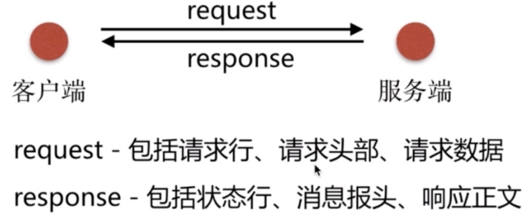
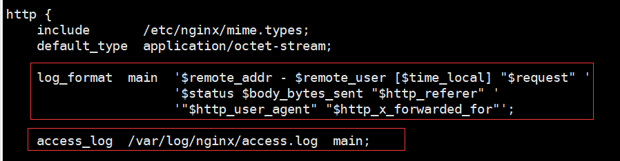
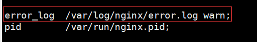
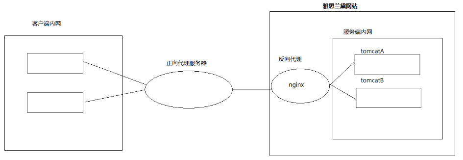
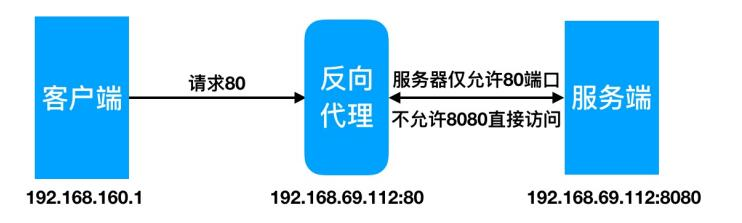

# 第十单元 nginx反向代理与负载均衡

# 【授课重点】

1. 日志配置
2. 虚拟主机配置
3. 静态资源配置
4. 反向代理配置
5. 负载均衡配置

# 【考核要求】

1. 掌握基于端口的虚拟主机配置
2. 掌握基于域名的虚拟主机配置
3. 掌握静态资源压缩配置
4. 掌握反向代理配置
5. 掌握负载均衡配置

# 【教学内容】

## 9.1 日志配置

### 9.1.1 访问日志

```
输入：curl	-v	http://www.baidu.com
```




nginx接收请求，访问日志格式及存储位置为：



nginx内置变量说明：

```
$remote_addr	//表示客户端地址
$remote_user	//http客户端请求nginx认证用户名
$time_local		//Nginx的时间
$request		//Request请求行,GET等方法、http协议版本
$status			//response返回状态码
$body_bytes_sent	//从服务端响应给客户端body信息大小
$http_referer	//http上一级页面,防盗链、用户行为分析
$http_user_agent	//http头部信息,	客户端访问设备
$http_x_forwarded_for	//http请求携带的ip信息
```

### 9.1.2 错误日志

	在配置nginx.conf 的时候，有一项是指定错误日志的，默认情况下不指定也没关系，因为nginx很少有错误日志记录的。但有时出现问题时，是有必要记录一下错误日志的，方便我们排查问题。
错误日志配置为：



error_log 级别分为 debug, info, notice, warn, error, crit。 
crit 记录的日志最少，而debug记录的日志最多。如果nginx遇到一些问题，比如502比较频繁出现，但是看默认的error_log并没有看到有意义的信息，那么就可以调一下错误日志的级别，当你调成error级别时，错误日志记录的内容会更加丰富。

## 9.2 虚拟主机配置

所谓虚拟主机，在web服务器里是一个独立的网站站点，这个站点对应独立的域名(也	可能是IP或端口)，具有独立的程序及资源目录，可以独立地对外提供服务供用户访问。

### 9.2.1 基于端口的虚拟主机配置

```
vim /etc/nginx/conf.d/virtual-host-port.conf
```


```
server {
    listen       81;
    server_name  localhost;

    location / {
        root   /opt/nginx/html;
        index  index.html index.htm;
    }

    error_page   500 502 503 504  /50x.html;
    location = /50x.html {
        root   /usr/share/nginx/html;
    }

}
server {
    listen       82;
    server_name  localhost;

    location / {
        root   /opt/nginx/html2;
        index  index.html index.htm;
    }

    error_page   500 502 503 504  /50x.html;
    location = /50x.html {
        root   /usr/share/nginx/html;
    }

}
```

### 9.2.2  基于域名的虚拟主机配置

```
vim /etc/nginx/conf.d/virtual-host-servername.conf
```


```
server {
    listen       80;
    server_name  www.test1.com;
          
    location / {
        root   /opt/nginx/html;
        index  index.html index.htm;
    }   

    error_page   500 502 503 504  /50x.html;
    location = /50x.html {
        root   /usr/share/nginx/html;
    }
    
}
server {
    listen       80;
    server_name www.test2.com;

    location / {
        root   /opt/nginx/html2;
        index  index.html index.htm;
    }

    error_page   500 502 503 504  /50x.html;
    location = /50x.html {
        root   /usr/share/nginx/html;
    }

}
```

## 9.3 静态资源配置

### 9.3.1 静态资源类型

Nginx 作为静态资源 Web 服务器部署配置, 传输非常的高效, 常常用于静态资源处理, 请求动静分离。

非服务器动态运行生成的文件属于静态资源。


### 9.3.2 静态资源配置语法

1. 高效 文件读取sendfile

```
Syntax:	sendfile	on	|	off;
Default:	sendfile	off;
Context:	http,	server,	location,	if in	location
```

 2. 提高网络传输效率 nopush

    ```
    Syntax:	tcp_nopush	on	|	off;
    Default:	tcp_nopush	off;
    Context:	http,	server,	location
    作用:	sendfile开启情况下,	提高网络包的'传输效率'
    ```

 3. http1.1保持长连接时长keepalive_timeout（单位：s）

    ```
    Syntax:	keepalive_timeout	秒数;
    Default:	keepalive_timeout  65;
    Context:	http,	server,	location
    ```

 4. 与 tcp_nopush 对应的配置 tcp_nodelay

    ```
    Syntax:	tcp_nodelay	on	|	off;
    Default:	tcp_nodelay	on;
    Context:	http,	server,	location
    作用:在keepalive连接下,提高网络的传输'实时性'
    ```

    

### 9.3.3 静态资源压缩

Nginx 将响应报文发送给客户端之前可以启用压缩功能，这能够有效地节约带宽，并提	高响应给客户端的速度。


1. 开启gzip压缩配置

   ```
   Syntax: gzip on | off;
   Default: gzip off;
   Context: http, server, location, if in location 
   作用: 传输压缩
   ```

2. 配置gzip压缩比率

   ```
   Syntax: gzip_comp_level level;
   Default: gzip_comp_level 1;
   Context: http, server, location 
   作用: 压缩本身比较耗费服务端性能
   ```

3. 配置gzip压缩协议版本

   ```
   Syntax: gzip_http_version 1.0 | 1.1;
   Default: gzip_http_version 1.1;
   Context: http, server, location
   作用: 压缩使用在http哪个协议, 主流版本1.1
   ```

4. 图片压缩案例

   ```
   server {
       listen       80;
       server_name  static.test.com;
   
       sendfile on;
       access_log /var/log/nginx/static_access.log main;
   
       location ~ .*\.(jpg|gif|png)$ {
           gzip on;
           gzip_http_version 1.1;
           gzip_comp_level 2;
           gzip_types text/plain application/json application/x-javascript application/css application/xml application/xml+rsstext/javascript application/x-http d-php image/jpeg image/gif image/png;
           expires 1h;
           root /opt/nginx/static-html/images;
       }
   }
   ```

### 9.3.4 静态资源缓存

​	HTTP协议定义的缓存机制(如: Expires; Cache-control 等)

​	

```
1. 浏览器无缓存

	浏览器请求->无缓存->请求WEB服务器->请求响应->呈现

2. 浏览器有缓存

	浏览器请求->有缓存->校验过期->是否有更新->呈现 

	Expires HTTP1.0, 		

	Cache-Control(max-age) HTTP1.1
```

   1. 缓存配置语法expires

      ```
      Syntax: expires [modified] time;
      expires epoch | max | off;
      Default: expires off;
      Context: http, server, location, if in location 
      作用: 添加Cache-Control Expires头
      ```

   2. 配置静态资源缓存

      ```
      location~ .*\.(js|css|html)$ {
      root /soft/code/js;
      expires	1h;
      }
      location~ .*\.(jpg|gif|png)$ {
      root /opt/nginx/static-html/images;
      expires	7d;
      }
      ```

   3. 开发代码没有正式上线时, 希望静态⽂件不被缓存

      ```
      //取消js css html等静态文件缓存
      location ~ .*\.(css|js|swf|json|mp4|htm|html)$ {
      add_header Cache-Control no-store;
      add_header Pragma no-cache;
      }
      ```

## 9.4 反向代理





```
vim /etc/nginx/conf.d/proxy.conf
```

```
server	{
				listen	80;
				server_name	www.proxy.com;
				index	index.html;
				location	/	{
				proxy_pass	http://192.168.69.112:8080;
				include	proxy_params;
				}
}
```

## 9.5 负载均衡

### 9.5.1 解决方案

```
硬件和软件都可以实现负载均衡
1. 硬件负载均衡使用F5，网络第四层负载均衡
2. 软件负载均衡可以使用LVS、nginx、haproxy，网络第七层负载均衡
```

### 9.5.2 Nginx负载均衡策略

​	upstream 支持4种负载均衡调度算法:	

```
A) 轮询(默认):每个请求按时间顺序逐一分配到不同的后端服务器;

B)ip_hash:每个请求按访问者IP的hash结果分配，同一个IP客户端固定访问一个后端服务器。可以保证来自同一ip的请求被打到固定的机器上，可以解决session问题。

C)url_hash:按访问url的hash结果来分配请求，使每个url定向到同一个后端服务器。

D)fair:这是比上面两个更加智能的负载均衡算法。此种算法可以依据页面大小和加载时间长短智能地进行负载均衡，也就是根据后端服务器的响应时间来分配请求，响应时间短的优先分配。Nginx本身是不支持fair的，如果需要使用这种调度算法，必须下载Nginx的upstream_fair模块。
```

### 9.5.3 Nginx负载均衡配置

```
upstream tomcat1{
  #ip_hash;
  server 192.168.161.128:9090 weight=2;
  server 192.168.161.128:9091 weight=1;
}

server {
    listen       80;
    server_name  www.hgshop.com;

    location / {
        proxy_pass http://tomcat1;
        #root   /opt/nginx/html;
        #index  index.html index.htm;
    }

    error_page   500 502 503 504  /50x.html;
    location = /50x.html {
        root   /usr/share/nginx/html;
    }

}
```
