# 第五单元 Dubbo 实例开发


# 【授课重点】

1. Maven 聚合创建工程
2. 编写服务接口层工程
3. 编写服务提供者工程
4. 编写服务调用者工程
5. 用监控中心管理服务

# 【考核要求】

1. 利用spring整合dubbo
2. 与zookeeper注册中心通讯
3. 创建聚合工程
4. 实现dubbo服务的提供者和调用者
5. 监控中心管理服务

# 【教学内容】

# 5.1 课程导入

​    上一单元讲述了dubbo的原理以及RPC，大家对dubbo框架有了基本的了解，本单元通过实例进一步阐述如何在实践中中使用dubbo。本单元讲述的过程以最简单的服务进行整合。本节的开发工具使用eclipse Oxygen.3a Release (4.7.3a)，Dubbo 版本使用2.7.3，zookeeper 使用3.4.14。

  新创建工作空间

1、jdk 设置是否正确

​	不要使用jre 要使用jdk

2、maven设置是否正确

​	1、installations

​	2、setting

3、字符集

​	workspace =》utf8


# 5.2 创建聚合工程

​	本项目需要创建一个父工程，在该工程中包含三个模块 ，三个模块分别是接口模块、调用者模块、服务提供者模块。

​      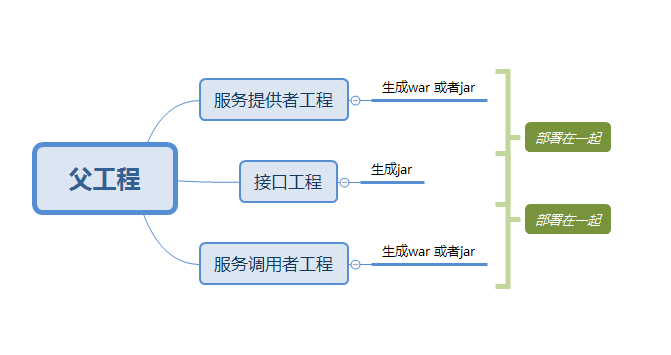  

## 5.2.1  创建父工程

​     1. 第一步

​	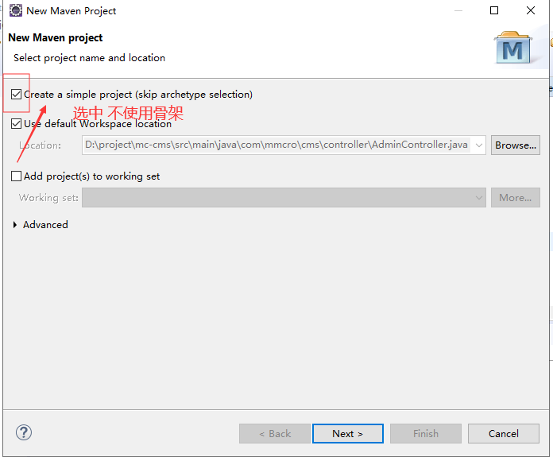 


​	

2. 输入父工程坐标

   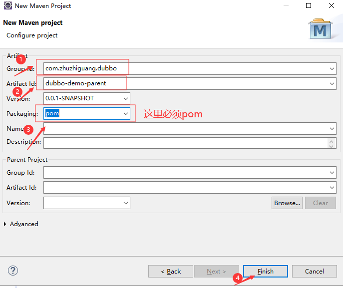  

   

   

   3. 创建好后父工程的结构如下

      

      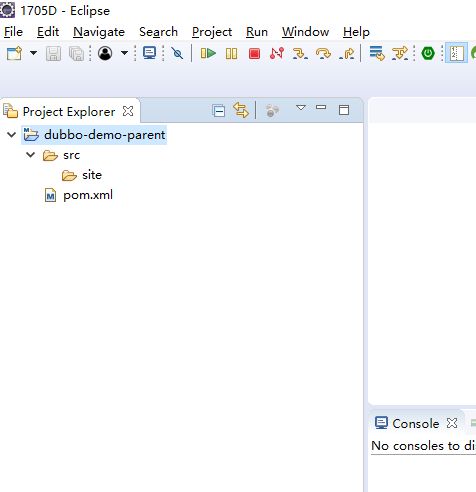 

   

   

   

    

   4. 配置pom.xml  管理依赖,

      添加关于dobbo 使用的依赖，添加的以来内容如下：

      ```xml
      <properties>
      		<dubbo.version>2.7.3</dubbo.version>
      		<spring.version>5.1.5.RELEASE</spring.version>
      	</properties>
      	<dependencyManagement>
      		<!-- https://mvnrepository.com/artifact/org.apache.dubbo/dubbo -->
      		<dependencies>
      			<dependency>
      				<groupId>org.apache.dubbo</groupId>
      				<artifactId>dubbo</artifactId>
      				<version>2.7.3</version>
      			</dependency>
      			<dependency>
      				<groupId>org.javassist</groupId>
      				<artifactId>javassist</artifactId>
      				<version>3.20.0-GA</version>
      			</dependency>
      			<!-- java.lang.NoClassDefFoundError: org/apache/curator/RetryPolicy -->
      			<dependency>
      				<groupId>org.apache.curator</groupId>
      				<artifactId>curator-framework</artifactId>
      				<version>2.8.0</version>
      			</dependency>
      			<dependency>
      				<groupId>org.apache.curator</groupId>
      				<artifactId>curator-recipes</artifactId>
      				<version>2.8.0</version>
      			</dependency>
      ```

      

      ```xml
      		<dependency>
      			<groupId>io.netty</groupId>
      			<artifactId>netty-all</artifactId>
      			<version>4.1.32.Final</version>
      		</dependency>
      ```


      ```xml
      		<!-- https://mvnrepository.com/artifact/org.slf4j/slf4j-api -->
      		<dependency>
      			<groupId>org.slf4j</groupId>
      			<artifactId>slf4j-api</artifactId>
      			<version>1.7.25</version>
      		</dependency>
      
      	</dependencies>
      
      </dependencyManagement>
      ```

   5.  至此，父工程建完毕

​      

## 5.2.2 创建服务接口层工程

​	1.  在父工程上点击鼠标右键，创建服务接口层工程。

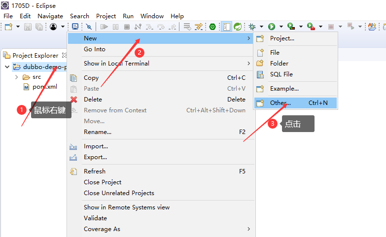 


2. 选择mavne module


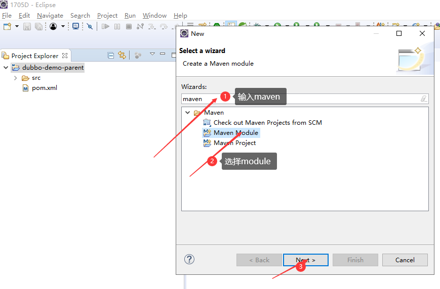 


3. 输入项目/module 名称

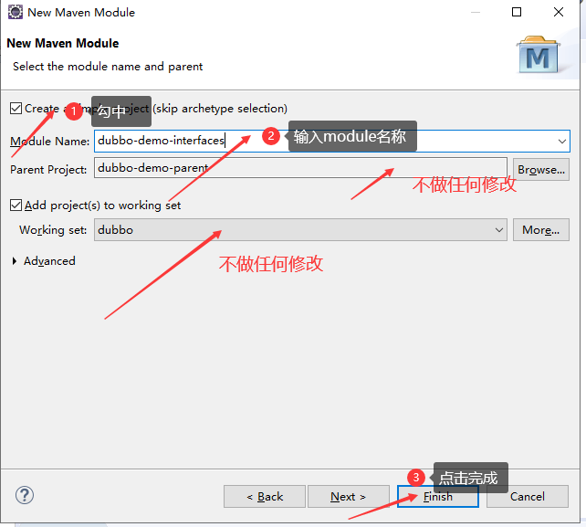 


4. 创建接口类和共有的实体Bean

   这里我们以学生管理为例。

   学生的实体Bean 为：

   

   ```java
   package com.zhuzhiguang.study.entity;
   
   import java.io.Serializable;
   
   /**
   
   - 
   
   - @author zhuzg
     *
      */
     public class Student implements Serializable {
   
     /**
   
     - */
       private static final long serialVersionUID = 3961196445338342913L;
   
     int id;
     String name;
   
     public int getId() {
     	return id;
     }
     public void setId(int id) {
     	this.id = id;
     }
     public String getName() {
     	return name;
     }
     public void setName(String name) {
     	this.name = name;
     }
     @Override
     public int hashCode() {
     	final int prime = 31;
     	int result = 1;
     	result = prime * result + id;
     	result = prime * result + ((name == null) ? 0 : name.hashCode());
     	return result;
     }
     @Override
     public boolean equals(Object obj) {
     	if (this == obj)
     		return true;
     	if (obj == null)
     		return false;
     	if (getClass() != obj.getClass())
     		return false;
     	Student other = (Student) obj;
     	if (id != other.id)
     		return false;
     	if (name == null) {
     		if (other.name != null)
     			return false;
     	} else if (!name.equals(other.name))
     		return false;
     	return true;
     }
   
     
   
     @Override
     public String toString() {
     	return "Student [id=" + id + ", name=" + name + "]";
     }
   
     /**
   
     - */
       public Student() {
       super();
       }
   
     /**
   
     - 
     - @param id
     - @param name
       */
       public Student(int id, String name) {
       super();
       this.id = id;
       this.name = name;
       }
     }
   
     
   ```

   4. 接口层的文件为：

   

   ​    package com.zhuzhiguang.study.service;

      import com.zhuzhiguang.study.entity.Student;

      /**

      - 

      - @author zhuzg
        *
         */
        public interface StudentService {

        /**

        - 根据id获取学生
        - @param id
        - @return
          */
          Student getById(Integer id);

        /**

        - 统计学生的人数
        - @return
          */
          int count();

        /**

        - 向某人打招呼
        - @param somebody
        - @return
          */
          String sayHello(String somebody);

      }

      

   

## 5.2.3 创建服务提供者工程


1.  创建工程  方式同创建接口层工程一致。

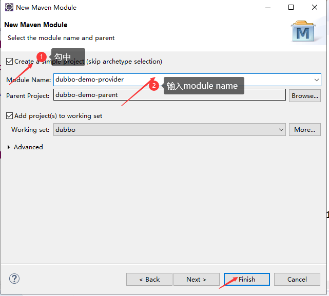  


2. 引入对接口层的依赖

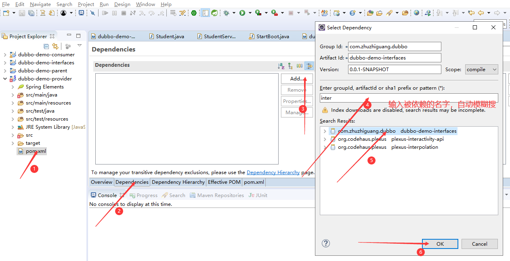 

​	


3、添加其他依赖

​	在pom 文件中直接添加下列内容：

```xml
<!-- 依赖接口类 -->
	<dependency>
		<groupId>com.zhuzhiguang.dubbo</groupId>
		<artifactId>dubbo-demo-interfaces</artifactId>
		<version>0.0.1-SNAPSHOT</version>
	</dependency>
```


```xml
	<!-- 链接zookeeper 使用 -->
	<dependency>
		<groupId>org.apache.curator</groupId>
		<artifactId>curator-framework</artifactId>
	</dependency>
	<dependency>
		<groupId>org.apache.curator</groupId>
		<artifactId>curator-recipes</artifactId>

	</dependency>

	<!-- 引入通信框架 -->
	<dependency>
		<groupId>io.netty</groupId>
		<artifactId>netty-all</artifactId>
	</dependency>

	<!-- 用于动态生成class字节码  在动态代理的中用到 --> 
	<dependency>
		<groupId>org.javassist</groupId>
		<artifactId>javassist</artifactId>
	</dependency>
	
	<!-- 引入日志 -->
	<dependency>
		<groupId>org.slf4j</groupId>
		<artifactId>slf4j-api</artifactId>
	</dependency>
	
	<!-- 引入dubbo 的依赖 -->
	<dependency>
		<groupId>org.apache.dubbo</groupId>
		<artifactId>dubbo</artifactId>
	</dependency>
```


 4、编写服务

​	编写服务需要实现接口层的Java接口。内容如下:

```java
package com.zhuzhiguang.study.service.impl;
```

```java
import com.zhuzhiguang.study.entity.Student;
import com.zhuzhiguang.study.service.StudentService;

/**

- 

- @author zhuzg
  *
   */
  public class StudentServiceImpl implements StudentService{

  @Override
  public Student getById(Integer id) {
  	// TODO Auto-generated method stub
  	return new Student(id,"tst" + id);
  	
  	
  }

  @Override
  public int count() {
  	// TODO Auto-generated method stub
  	return 10;
  }

  @Override
  public String sayHello(String somebody) {
  	// TODO Auto-generated method stub
  	return "hi," + somebody;
  }

}


```

5.  编写上下文配置文件

   通过配置文件暴露接口，提供服务。 内容如下：

   ~~~xml
   <?xml version="1.0" encoding="UTF-8"?>
   <beans xmlns="http://www.springframework.org/schema/beans"
       xmlns:xsi="http://www.w3.org/2001/XMLSchema-instance"
       xmlns:dubbo="http://dubbo.apache.org/schema/dubbo"
       xsi:schemaLocation="http://www.springframework.org/schema/beans        http://www.springframework.org/schema/beans/spring-beans-4.3.xsd        http://dubbo.apache.org/schema/dubbo        http://dubbo.apache.org/schema/dubbo/dubbo.xsd">
   
   ```
   <!-- 提供方应用信息，用于计算依赖关系 -->
   <dubbo:application name="student-app"  />
    
   <!-- 使用multicast广播注册中心暴露服务地址 -->
   <dubbo:registry address="zookeeper://127.0.0.1:2181" />
    
   <!-- 用dubbo协议在20880端口暴露服务 -->
   <dubbo:protocol name="dubbo" port="20880" />
    
   <!-- 声明需要暴露的服务接口 -->
   <dubbo:service interface="com.zhuzhiguang.study.service.StudentService" ref="studentService" />
    
   <!-- 和本地bean一样实现服务 -->
   <bean id="studentService" class="com.zhuzhiguang.study.service.impl.StudentServiceImpl" />
   ```
   
   </beans>
   
   ~~~

6.  编写启动类

   

    * ```java
       package com.zhuzhiguang.study;
       
       import java.io.IOException;
       
       import org.springframework.context.support.ClassPathXmlApplicationContext;
       
       /*
          */
         public class StartBoot {
       
         /**
       
         - 
       
         - @param args
       
         - @throws IOException 
           */
           public static void main(String[] args) throws IOException {
           System.out.println("开始启动服务提供者");
       
            // 加载配置文件  
            ClassPathXmlApplicationContext context = 
           		 new ClassPathXmlApplicationContext("classpath:dubbo-provider.xml");
       
            // 启动服务
               context.start();
               System.in.read(); // 按任意键退出
       
         }
       
       }
       ```
    
       ```java
       
       ```

## 5.2.4 测试服务提供者

 1. 启动zookeeper 

    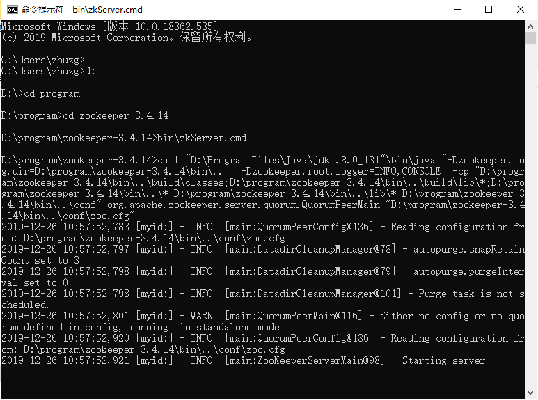 

    

 2.  进入zookeeper 命令行控制台

    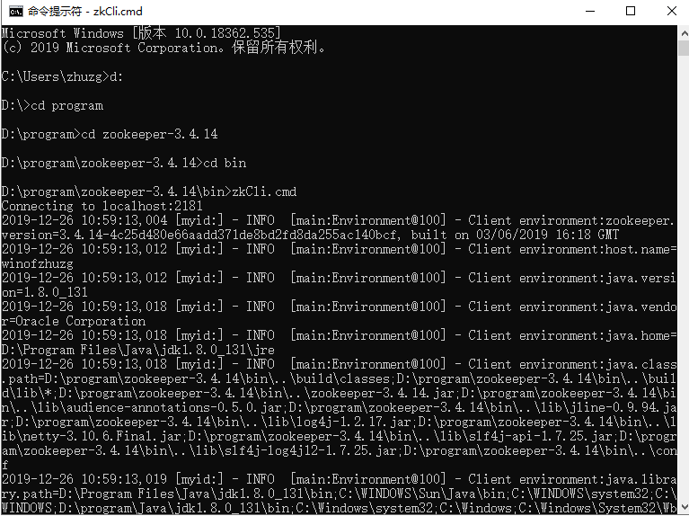 	


3.  观察zookeeper 中节点

   ​	在zookeeper 控制台中输入命令  ls  / 

     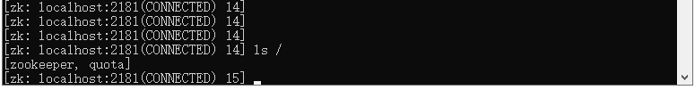


4. 启动服务提供者

   运行服务提供者中的StartBoot main 函数。

   然后再次观察 zookeeper 客户端  看到有了dubbo 的节点，说明服务已经启动。

   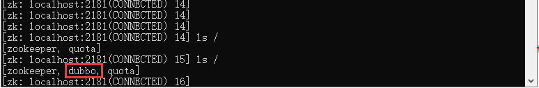 


## 5.2.5 创建服务调用者工程

 1. 创建工程过程同创建接口工程和提供者工程一致。其中的pom.xml 文件内容为：

    

    ~~~xml
    <project xmlns="http://maven.apache.org/POM/4.0.0" xmlns:xsi="http://www.w3.org/2001/XMLSchema-instance" xsi:schemaLocation="http://maven.apache.org/POM/4.0.0 http://maven.apache.org/xsd/maven-4.0.0.xsd">
      <modelVersion>4.0.0</modelVersion>
      <parent>
        <groupId>com.zhuzhiguang.dubbo</groupId>
        <artifactId>dubbo-demo-parent</artifactId>
        <version>0.0.1-SNAPSHOT</version>
      </parent>
      <artifactId>dubbo-demo-consumer</artifactId>
    
      <dependencies>
    		
    
    ```
    	<!-- 依赖接口类 -->
    	<dependency>
    		<groupId>com.zhuzhiguang.dubbo</groupId>
    		<artifactId>dubbo-demo-interfaces</artifactId>
    		<version>0.0.1-SNAPSHOT</version>
    	</dependency>
    ```
    
    ```
    	<!-- 链接zookeeper 使用 -->
    	<dependency>
    		<groupId>org.apache.curator</groupId>
    		<artifactId>curator-framework</artifactId>
    	</dependency>
    	<dependency>
    		<groupId>org.apache.curator</groupId>
    		<artifactId>curator-recipes</artifactId>
    
    	</dependency>
    
    	<!-- 引入通信框架 -->
    	<dependency>
    		<groupId>io.netty</groupId>
    		<artifactId>netty-all</artifactId>
    	</dependency>
    
    	<!-- 用于动态生成class字节码  在动态代理的中用到 --> 
    	<dependency>
    		<groupId>org.javassist</groupId>
    		<artifactId>javassist</artifactId>
    	</dependency>
    	
    	<!-- 引入日志 -->
    	<dependency>
    		<groupId>org.slf4j</groupId>
    		<artifactId>slf4j-api</artifactId>
    	</dependency>
    	
    	<!-- 引入dubbo 的依赖 -->
    	<dependency>
    		<groupId>org.apache.dubbo</groupId>
    		<artifactId>dubbo</artifactId>
    	</dependency>
    </dependencies>
    ```
    
    </project>
    ~~~

    

 2.  编写上下文配置文件

    ```xml
    <?xml version="1.0" encoding="UTF-8"?>
    <beans xmlns="http://www.springframework.org/schema/beans"
        xmlns:xsi="http://www.w3.org/2001/XMLSchema-instance"
        xmlns:dubbo="http://dubbo.apache.org/schema/dubbo"
        xsi:schemaLocation="http://www.springframework.org/schema/beans        http://www.springframework.org/schema/beans/spring-beans-4.3.xsd        http://dubbo.apache.org/schema/dubbo        http://dubbo.apache.org/schema/dubbo/dubbo.xsd">
     
        <!-- 提供方应用信息，用于计算依赖关系 -->
        <dubbo:application name="student-app-consumer"  />
     
        <!-- 使用zookeeper注册中心暴露服务地址 -->
        <dubbo:registry address="zookeeper://127.0.0.1:2181" />   
     
        <!-- 声明需要暴露的服务接口 -->
        <dubbo:reference interface="com.zhuzhiguang.study.service.StudentService" id="studentServiceDemo" />
     
     
    </beans>
    ```

    

 3. 编写调用代码

    ~~~java
    package com.zhuzhiguang.study;
    
    import java.io.IOException;
    
    import org.springframework.context.support.ClassPathXmlApplicationContext;
    
    import com.zhuzhiguang.study.entity.Student;
    import com.zhuzhiguang.study.service.StudentService;
    
    /**
    
    - 
    
    - @author zhuzg
      *
       */
      public class StartBoot {
    
      /**
    
      - 
    
      - @param args
    
      - @throws IOException 
        */
        public static void main(String[] args) throws IOException {
        System.out.println("开始启动服务调用者者");
    
         ClassPathXmlApplicationContext context = 
        		 new ClassPathXmlApplicationContext("classpath:dubbo-consumer.xml");
    
        ```
        context.start();
        
        StudentService studentService = (StudentService)context.getBean("studentServiceDemo");
        int count = studentService.count();
        System.out.println("count is " + count);
        String hello = studentService.sayHello("tom");
        System.out.println(" hello is : " + hello);
        Student student = studentService.getById(10);
        System.out.println("student is " + student);
        ```
    
      
        ```
        System.in.read(); // 按任意键退出
        ```
    
      }
    
    }
    ~~~

    

     

    4.   测试调用者

    ​	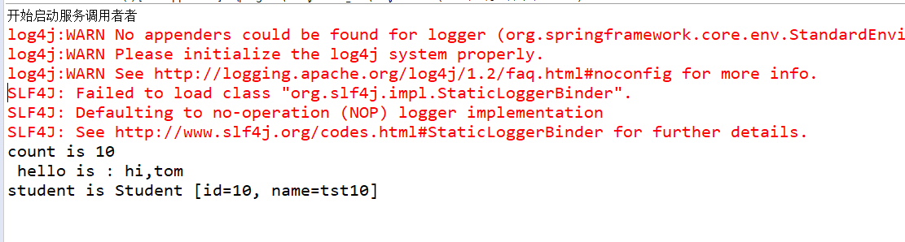 

​    


#    5.3  课堂小结

 	1. 利用Maven 创建了聚合工程
 	2. 编写服务接口层工程
 	3. 编写服务提供者工程
 	4. 编写服务调用者工程
 	5. 用zookker 客户端控制台查看服务


# 5.3  课后作业

 	1. 利用Maven创建聚合工程，包含两个服务提供者（ProviderA，ProviderB）、两个调用者（ConsumerC,ConsumerD） 以及一个接口层(MyInterface)。
 	2. ProviderA，ProviderB 都实现 MyInterface接口
 	3. 暴露ProviderA，ProviderB 服务。
 	4. 编写调用者 ConsumerC 和 ConsumerD
 	5. ConsumerC  调用ProviderA，ProviderB； ConsumerD 也  调用ProviderA，ProviderB。 
 	6. ProviderA，ProviderB 中提供的功能可以自定义。


