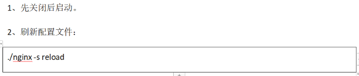

# 第八单元 Nginx安装与配置

# 【授课重点】

1.  了解Nginx负载均衡的概念 

2. 掌握Nginx的应用场景

3. 掌握Nginx的编译安装

4. 了解Nginx的目录结构

5. 掌握Nginx配置文件

6. 掌握Nginx配置参数

7. 掌握服务启动/停止/重启命令

8. Nginx虚拟主机配置

# 【考核要求】

1. 掌握Nginx负载均衡

2. 掌握Nginx的应用场景

3. 掌握Nginx的编译安装

4. 掌握Nginx的目录结构

5. 掌握Nginx配置文件

6. 掌握Nginx虚拟主机配置

# 【教学内容】

## 8.1 课程导入


## 8.2 什么是Nginx

​       Nginx 是一款高性能的 http 服务器/反向代理服务器及电子邮件（IMAP/POP3）代理服务器。由俄罗斯的程序设计师 Igor Sysoev 所开发，官方测试 nginx 能够支支撑 5 万并发链接，并且 cpu、内存等资源消耗却非常低，运行非常稳定。

 

### 8.2.1 Nginx 应用场景

1、http 服务器。Nginx 是一个 http 服务可以独立提供 http 服务。可以做网页静态服务器。

2、虚拟主机。可以实现在一台服务器虚拟出多个网站。例如个人网站使用的虚拟主机。

3、反向代理，负载均衡。当网站的访问量达到一定程度后，单台服务器不能满足用户的请求时，需要用多台服务器集群可以使用 nginx 做反向代理。并且多台服务器可以平均分担负载，不会因为某台服务器负载高宕机而某台服务器闲置的情况

## 8.3 Nginx的安装

### 8.3.1 Nginx安装

1. 官网下载nginx  http://nginx.org/

 


2. 点击downLoad

​    下载页面 http://nginx.org/en/download.html

 


3. 下载

    


4. 上传到linux中

​    解压到指定的目录中

 

5. 切换到安装的目录中

 


6. #检查安装环境,并指定将来要安装的路径

   ```
   ./configure --prefix=/usr/local/nginx
   ```

   

   **----  知识点小贴士 ----**

   ​        Makefile是一种配置文件， Makefile 一个工程中的源文件不计数，其按类型、功能、模块分别放在若干个目录中，makefile定义了一系列的规则来指定，哪些文件需要先编译，哪些文件需要后编译，哪些文件需要重新编译，甚至于进行更复杂的功能操作，因为 makefile就像一个Shell脚本一样，其中也可以执行操作系统的命令。  

   ```
   ----  知识点小贴士 ----
   configure参数
   ./configure \
   --prefix=/usr \                                        指向安装目录
   --sbin-path=/usr/sbin/nginx \                          指向（执行）程序文件（nginx）
   --conf-path=/etc/nginx/nginx.conf \                    指向配置文件
   --error-log-path=/var/log/nginx/error.log \            指向log
   --http-log-path=/var/log/nginx/access.log \            指向http-log
   --pid-path=/var/run/nginx/nginx.pid \                  指向pid
   --lock-path=/var/lock/nginx.lock \                     （安装文件锁定，防止安装文件被别人利用，或自己误操作。）
   --user=nginx \
   --group=nginx \
   --with-http_ssl_module \           启用ngx_http_ssl_module支持（使支持https请求，需已安装openssl）
   --with-http_flv_module \           启用ngx_http_flv_module支持（提供寻求内存使用基于时间的偏移量文件）
   --with-http_stub_status_module \   启用ngx_http_stub_status_module支持（获取nginx自上次启动以来的工作状态）
   --with-http_gzip_static_module \   启用ngx_http_gzip_static_module支持（在线实时压缩输出数据流）
   --http-client-body-temp-path=/var/tmp/nginx/client/ \ 设定http客户端请求临时文件路径
   --http-proxy-temp-path=/var/tmp/nginx/proxy/ \ 设定http代理临时文件路径
   --http-fastcgi-temp-path=/var/tmp/nginx/fcgi/ \ 设定http fastcgi临时文件路径
   --http-uwsgi-temp-path=/var/tmp/nginx/uwsgi \ 设定http uwsgi临时文件路径
   --http-scgi-temp-path=/var/tmp/nginx/scgi \ 设定http scgi临时文件路径
   --with-pcre 启用pcre库
   ```

7. 环境有异常：

 

缺少 gcc pcre-devel openssl openssl-devel 环境

8. #使用YUM安装缺少的包

```
yum -y install gcc pcre-devel openssl openssl-devel
```

9. 编译安装

```
make && make install
```

10. 查看安装是否成功

 


### 8.3.2 启动nginx

启动nginx 的方式采用绝对路径的方式 

```
/usr/local/nginx/sbin/nginx 
```

 

启动成功

启动后查看进程

 

 

### 8.3.3  网页访问

默认的端口号:80

 

### 8.3.4 关闭nginx

关闭nginx操作

 

相对路径关闭操作

!

### 8.3.5 重启nginx

 


## 8.4 Nginx目录结构

###     8.4.1 tree命令

​      Linux tree命令用于以树状图列出目录的内容。执行tree指令，它会列出指定目录下的所有文件，包括子目录里的文件。

首先执行 tree 的安装

```
yum install tree -y
```

###    8.4.3 执行tree命令

 

目录介绍

```
conf #这是Nginx所有配置文件的目录，极其重要
html #这是编译安装时Nginx的默认站点目录，类似Apache的默认站点htdocs目录
logs #这是Nginx默认的日志路径，包括错误日志及访问日志
sbin #这是Nginx命令的目录，如Nginx的启动命令nginx
```

## 8.5 Nginx配置文件

​		如果你下载好啦，你的安装文件，不妨打开conf文件夹的nginx.conf文件，Nginx服务器的基础配置，默认的配置也存放在此。

### 8.5.1 nginx.conf

在 nginx.conf 的注释符号为： **#**

默认的 nginx 配置文件 nginx.conf 内容如下：

```
#user  nobody;
worker_processes  1;

#error_log  logs/error.log;
#error_log  logs/error.log  notice;
#error_log  logs/error.log  info;

#pid        logs/nginx.pid;


events {
    worker_connections  1024;
}


http {
    include       mime.types;
    default_type  application/octet-stream;

    #log_format  main  '$remote_addr - $remote_user [$time_local] "$request" '
    #                  '$status $body_bytes_sent "$http_referer" '
    #                  '"$http_user_agent" "$http_x_forwarded_for"';

    #access_log  logs/access.log  main;

    sendfile        on;
    #tcp_nopush     on;

    #keepalive_timeout  0;
    keepalive_timeout  65;

    #gzip  on;

    server {
        listen       80;
        server_name  localhost;

        #charset koi8-r;

        #access_log  logs/host.access.log  main;

        location / {
            root   html;
            index  index.html index.htm;
        }

        #error_page  404              /404.html;

        # redirect server error pages to the static page /50x.html
        #
        error_page   500 502 503 504  /50x.html;
        location = /50x.html {
            root   html;
        }

        # proxy the PHP scripts to Apache listening on 127.0.0.1:80
        #
        #location ~ \.php$ {
        #    proxy_pass   http://127.0.0.1;
        #}

        # pass the PHP scripts to FastCGI server listening on 127.0.0.1:9000
        #
        #location ~ \.php$ {
        #    root           html;
        #    fastcgi_pass   127.0.0.1:9000;
        #    fastcgi_index  index.php;
        #    fastcgi_param  SCRIPT_FILENAME  /scripts$fastcgi_script_name;
        #    include        fastcgi_params;
        #}

        # deny access to .htaccess files, if Apache's document root
        # concurs with nginx's one
        #
        #location ~ /\.ht {
        #    deny  all;
        #}
    }


    # another virtual host using mix of IP-, name-, and port-based configuration
    #
    #server {
    #    listen       8000;
    #    listen       somename:8080;
    #    server_name  somename  alias  another.alias;

    #    location / {
    #        root   html;
    #        index  index.html index.htm;
    #    }
    #}


    # HTTPS server
    #
    #server {
    #    listen       443 ssl;
    #    server_name  localhost;

    #    ssl_certificate      cert.pem;
    #    ssl_certificate_key  cert.key;

    #    ssl_session_cache    shared:SSL:1m;
    #    ssl_session_timeout  5m;

    #    ssl_ciphers  HIGH:!aNULL:!MD5;
    #    ssl_prefer_server_ciphers  on;

    #    location / {
    #        root   html;
    #        index  index.html index.htm;
    #    }
    #}

}
```

### 8.5.2 nginx 文件结构 

```
...              #全局块

events {         #events块
   ...
}

http      #http块
{
    ...   #http全局块
    server        #server块
    { 
        ...       #server全局块
        location [PATTERN]   #location块
        {
            ...
        }
        location [PATTERN] 
        {
            ...
        }
    }
    server
    {
      ...
    }
    ...     #http全局块
}
```

- 1、**全局块**：配置影响nginx全局的指令。一般有运行nginx服务器的用户组，nginx进程pid存放路径，日志存放路径，配置文件引入，允许生成worker process数等。
- 2、**events块**：配置影响nginx服务器或与用户的网络连接。有每个进程的最大连接数，选取哪种事件驱动模型处理连接请求，是否允许同时接受多个网路连接，开启多个网络连接序列化等。
- 3、**http块**：可以嵌套多个server，配置代理，缓存，日志定义等绝大多数功能和第三方模块的配置。如文件引入，mime-type定义，日志自定义，是否使用sendfile传输文件，连接超时时间，单连接请求数等。
- 4、**server块**：配置虚拟主机的相关参数，一个http中可以有多个server。
- 5、**location块**：配置请求的路由，以及各种页面的处理情况。

### 8.5.3 nginx.conf 配置项解释

```
########### 每个指令必须有分号结束。#################
#user administrator administrators;  #配置用户或者组，默认为nobody nobody。
#worker_processes 2;                 #允许生成的进程数，默认为1
#pid /nginx/pid/nginx.pid;           #指定nginx进程运行文件存放地址
error_log log/error.log debug;       #制定日志路径，级别。这个设置可以放入全局块，http块，server块，级别以此为：debug|info|notice|warn|error|crit|alert|emerg
events {
    accept_mutex on;                 #设置网路连接序列化，防止惊群现象发生，默认为on
    multi_accept on;                 #设置一个进程是否同时接受多个网络连接，默认为off
    #use epoll;           #事件驱动模型，select|poll|kqueue|epoll|resig|/dev/poll|eventport
    worker_connections  1024;       #最大连接数，默认为512
}
http {
    include       mime.types;      #文件扩展名与文件类型映射表
    default_type  application/octet-stream; #默认文件类型，默认为text/plain
    #access_log off;              #取消服务日志    
    log_format myFormat '$remote_addr–$remote_user [$time_local] $request $status $body_bytes_sent $http_referer $http_user_agent $http_x_forwarded_for'; #自定义格式
    access_log log/access.log myFormat;  #combined为日志格式的默认值
    sendfile on;      #允许sendfile方式传输文件，默认为off，可以在http块，server块，location块。
    sendfile_max_chunk 100k;   #每个进程每次调用传输数量不能大于设定的值，默认为0，即不设上限。
    keepalive_timeout 65;      #连接超时时间，默认为75s，可以在http，server，location块。

    upstream mysvr {   
      server 127.0.0.1:7878;
      server 192.168.10.121:3333 backup;  #热备
    }
    error_page 404 https://www.baidu.com; #错误页
    server {
        keepalive_requests 120;           #单连接请求上限次数。
        listen       4545;                #监听端口
        server_name  127.0.0.1;   		  #监听地址       
        location  ~*^.+$ {             #请求的url过滤，正则匹配，~为区分大小写，~*为不区分大小写。
           #root path;                    #根目录
           #index vv.txt;                 #设置默认页
           proxy_pass  http://mysvr;      #请求转向mysvr 定义的服务器列表
           deny 127.0.0.1;                #拒绝的ip
           allow 172.18.5.54;             #允许的ip           
        } 
    }
}
```

上面是nginx的基本配置，需要注意的有以下几点：

1、几个常见配置项：

- 1.$remote_addr 与 $http_x_forwarded_for 用以记录客户端的ip地址；
- 2.$remote_user ：用来记录客户端用户名称；
- 3.$time_local ： 用来记录访问时间与时区；
- 4.$request ： 用来记录请求的url与http协议；
- 5.$status ： 用来记录请求状态；成功是200；
- 6.$body_bytes_s ent ：记录发送给客户端文件主体内容大小；
- 7.$http_referer ：用来记录从那个页面链接访问过来的；
- 8.$http_user_agent ：记录客户端浏览器的相关信息；

2、惊群现象：一个网路连接到来，多个睡眠的进程被同事叫醒，但只有一个进程能获得链接，这样会影响系统性能。

3、每个指令必须有分号结束。


## 8.6 Nginx虚拟主机配置

### 8.6.1 配置虚拟主机

​        虚拟主机，也叫“网站空间”，就是把一台运行在互联网上的物理服务器划分成多个“虚拟”服务器。虚拟主机技术极大的促进了网络技术的应用和普及。同时虚拟主机的租用服务也成了网络时代的一种新型经济形式。

### 8.6.2 端口绑定

（1）上传静态网站：

将前端静态页cart.html 以及图片样式等资源 上传至  /usr/local/nginx/cart 下

将前端静态页search.html 以及图片样式等资源 上传至  /usr/local/nginx/search 下

（2）修改Nginx 的配置文件：/usr/local/nginx/conf/nginx.conf

```
    server {
        listen       81;
        server_name  localhost;
        location / {
            root   cart;
            index  cart.html;
        }      
    }
    server {
        listen       82;
        server_name  localhost;
        location / {
            root   search;
            index  search.html;
        }        
    }
```

（3）访问测试：

地址栏输入http://192.168.73.129:81 可以看到购物车页面

地址栏输入http://192.168.23.129:82 可以看到搜索页面

## 8.7 课程小结

1. 了解nginx的应用场景
2. 掌握nginx的环境搭建
3. 掌握nginx的目录结构
4. 掌握配置nginx.conf配置文件中单个选项配置的含义
5. 掌握nginx的虚拟主机配置

## 8.8 课下作业

1. 搭建nginx配置文件（20分钟)
2. 配置nginx转发到tomcat项目(10分钟)
3. 虚拟主机配置(10分钟)
