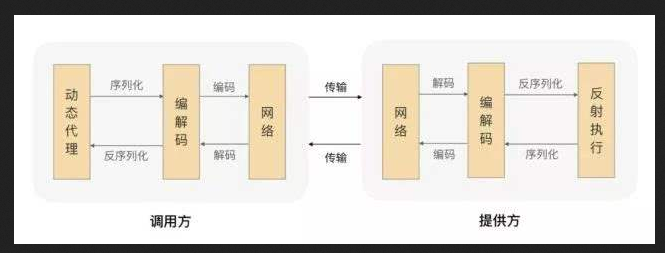
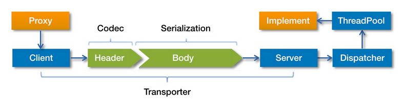
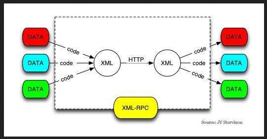

# 第六单元  Dubbo 理论知识扩展


# 【授课重点】

1. Dubbo框架的几种开发方式
2. Dubbo 框架的调用过程
3. Dubbo 注册中心
4. Dubbo 传输协议
5. Dubbo 负载均衡
6. Dubbo 容错方案

# 【考核要求】

1. 了解Dubbo 的基本调用过程
2. 灵活配置注册中心
3. 灵活切换传输协议
4. Dubbo 负载均衡的配置
5. 配置容错机制

# 【教学内容】

# 6.1 课程导入

​     上一节使用Dubbo 版本2.7.3，利用配置文件的方式开发了一个简单的Demo。在这个Demo的基础之上对Dubbo 的理论进行扩展。


# 6.2 Dubbo开发的方式

​	Dubbo 提供了多种开发方式，在实际工作当中需要其中一种或几种。

## 6.2.1 XML 配置

​		如上一节中我们的例子就是；下边是一个简单的例子。

```xml
  <beans xmlns:xsi="http://www.w3.org/2001/XMLSchema-instance"
       xmlns:dubbo="http://dubbo.apache.org/schema/dubbo"
       xmlns="http://www.springframework.org/schema/beans"
       xsi:schemaLocation="http://www.springframework.org/schema/beans http://www.springframework.org/schema/beans/spring-beans.xsd
       http://dubbo.apache.org/schema/dubbo http://dubbo.apache.org/schema/dubbo/dubbo.xsd">
    <dubbo:application name="demo-provider"/>
    <dubbo:registry address="zookeeper://127.0.0.1:2181"/>
    <dubbo:protocol name="dubbo" port="20890"/>
    <bean id="demoService" class="org.apache.dubbo.samples.basic.impl.DemoServiceImpl"/>
    <dubbo:service interface="org.apache.dubbo.samples.basic.api.DemoService" ref="demoService"/>
  </beans>
```


## 6.2.2 属性配置

​	如果你的应用足够简单，例如，不需要多注册中心或多协议，并且需要在spring容器中共享配置，那么，我们可以直接使用 `dubbo.properties`作为默认配置。

​        Dubbo可以自动加载classpath根目录下的dubbo.properties，但是你同样可以使用JVM参数来指定路径：`-Ddubbo.properties.file=xxx.properties`。

​	是一个典型的dubbo.properties配置样例。

```properties
	dubbo.application.name=foo
	dubbo.application.owner=bar
	dubbo.registry.address=10.20.153.10:9090
```


## 6.2.3 直接使用api

​	


```java
import org.apache.dubbo.rpc.config.ApplicationConfig;
import org.apache.dubbo.rpc.config.RegistryConfig;
import org.apache.dubbo.rpc.config.ProviderConfig;
import org.apache.dubbo.rpc.config.ServiceConfig;
import com.xxx.XxxService;
import com.xxx.XxxServiceImpl;
 
// 服务实现
XxxService xxxService = new XxxServiceImpl();
 
// 当前应用配置
ApplicationConfig application = new ApplicationConfig();
application.setName("xxx");
 
// 连接注册中心配置
RegistryConfig registry = new RegistryConfig();
registry.setAddress("10.20.130.230:9090");
registry.setUsername("aaa");
registry.setPassword("bbb");
 
// 服务提供者协议配置
ProtocolConfig protocol = new ProtocolConfig();
protocol.setName("dubbo");
protocol.setPort(12345);
protocol.setThreads(200);
 
// 注意：ServiceConfig为重对象，内部封装了与注册中心的连接，以及开启服务端口
 
// 服务提供者暴露服务配置
ServiceConfig<XxxService> service = new ServiceConfig<XxxService>(); // 此实例很重，封装了与注册中心的连接，请自行缓存，否则可能造成内存和连接泄漏
service.setApplication(application);
service.setRegistry(registry); // 多个注册中心可以用setRegistries()
service.setProtocol(protocol); // 多个协议可以用setProtocols()
service.setInterface(XxxService.class);
service.setRef(xxxService);
service.setVersion("1.0.0");
 
// 暴露及注册服务
service.export();

```

## 6.2.4 注解配置

​	这种方式是`2.6.3` 之后有的完整的提供。 这也是我们今后开发的主要方式；

### 6.2.4.1 服务提供方

Service`注解暴露服务

```java
@Service
public class AnnotationServiceImpl implements AnnotationService {
    @Override
    public String sayHello(String name) {
        return "annotation: hello, " + name;
    }
}
```


### 6.2.4.2 配置注解

指定配置

```java
Configuration
@EnableDubbo(scanBasePackages = "org.apache.dubbo.samples.simple.annotation.impl")
@PropertySource("classpath:/spring/dubbo-provider.properties")
static public class ProviderConfiguration {
       
}
```

### 6.2.4.3服务消费方

 Reference`注解引用服务

```java
@Component("annotationAction")
public class AnnotationAction {

    @Reference
    private AnnotationService annotationService;
    
    public String doSayHello(String name) {
        return annotationService.sayHello(name);
    }
}
```


# 6.3 Dubbo 的调用过程

​	Dubbo的调用时基于RPC 实现的。

​	典型的RPC 调用过程分成10个步骤，如下图所示：

​        


​       这里的序列化 、 编码 和传输都需要协议的支持。后边会详细解释。而Dubbo 官方也给出了Dubbo的调用过程的框架图：

​      

​    事实上RPC 调用可以跨语言，使用多种传输机制，下图也是一个典型的说明：

  


​    

# 6.4 Dubbo注册中心

## 6.4.1 直连方式

​	为什么需要这中方式呢，我们在开发的时候经常需要调式，如果加上zookeeper，增加了复杂性，为了便于开发，我们可以使用直连的方式，也就是直接让服务调用方直接找到服务提供方即可，不需要再通过注册中心。

### 6.4.1.1 服务提供方

​        配置文件中写法：      

```xml
    <dubbo:registry address=“N/A”/>
```

### 6.4.1.2 服务调用方

```xml
	 <dubbo:registry address="N/A" />

     <dubbo:reference interface="com.zhuzhiguang.service.StudentService" 
       id="studentServiceDemo"  url="dubbo://127.0.0.1:20880"/> 
```


## 6.4.2 Multicast 注册中心

​		这种方式不推荐使用。 这种方式真心的不好使用。

​	配置中心这样写：

```xml
      <dubbo:registry address="multicast://224.5.6.7:1234" />

```

​     或者

​	    

```xml
      <dubbo:registry protocol="multicast" address="224.5.6.7:1234" />
```

​	


## 6.4.2 Zookeeper 注册中心   

**这种方式是强烈的推荐方式。**	


使用这种方式必须让程序能够连接上zookeeper，有两种方式

### 6.4.2.1 zookeeper的客户端

需要zookeeper的客户端。maven 的依赖是：

```xml
<dependency>
    <groupId>org.apache.zookeeper</groupId>
    <artifactId>zookeeper</artifactId>
    <version>3.3.3</version>
</dependency>
```

配置文件中的

​	

```xml
   <dubbo:registry address="zookeeper://127.0.0.1:2181" /> 
```

​     或者

```xml
  <dubbo:registry protocol=“zookeeper” address="127.0.0.1:2181" /> 
```

 

### 6.4.2.2.2 zkclient客户端

当然客户端也可以使用  zkclient客户端。此时依赖是：

​	

```xml
<dependency>
    <groupId>com.github.sgroschupf</groupId>
    <artifactId>zkclient</artifactId>
    <version>0.1</version>
</dependency>
```

配置这样写：

```xml
<dubbo:registry ... client="zkclient" />
```

​	


当然客户端也可以使用  curator 客户端。此时依赖是：

```xml
<dependency>
    <groupId>com.netflix.curator</groupId>
    <artifactId>curator-framework</artifactId>
    <version>1.1.10</version>
</dependency>
```

配置这样写：

```xml
<dubbo:registry ... client="curator" />	
```

### 6.4.2.3 使用zookeeper集群

```xml
<dubbo:registry address="zookeeper://10.20.153.10:2181?backup=10.20.153.11:2181,10.20.153.12:2181" />
```

或者

```xml
<dubbo:registry protocol="zookeeper" address="10.20.153.10:2181,10.20.153.11:2181,10.20.153.12:2181" />
```


## 6.4.3 Nacos 注册中心

​	这种方式并不是常用。作为了解。

###  6.3.1 依赖

```xml
 <dependency>
        <groupId>com.alibaba</groupId>
        <artifactId>dubbo-registry-nacos</artifactId>
        <version>0.0.2</version>
    </dependency>   
    
    <!-- Keep latest Nacos client version -->
    <dependency>
        <groupId>com.alibaba.nacos</groupId>
        <artifactId>nacos-client</artifactId>
        <version>[0.6.1,)</version>
    </dependency>
```

### 6.3.2 配置

```xml
  <dubbo:registry address="nacos://10.20.153.10:8848" />
```

## 6.4.4 Redis 注册中心    

### 6.4.4.1 依赖

```xml

<!-- https://mvnrepository.com/artifact/org.apache.commons/commons-pool2 -->
<dependency>
    <groupId>org.apache.commons</groupId>
    <artifactId>commons-pool2</artifactId>
    <version>2.6.0</version>
</dependency>
	<!-- https://mvnrepository.com/artifact/redis.clients/jedis -->
<dependency>
    <groupId>redis.clients</groupId>
    <artifactId>jedis</artifactId>
    <version>3.0.1</version>
</dependency>
```


### 6.4.4.2 配置

下边的任何一行都是合法的。

```xml

<dubbo:registry address="redis://10.20.153.10:6379" />
<dubbo:registry address="redis://10.20.153.10:6379?backup=10.20.153.11:6379,10.20.153.12:6379" />
<dubbo:registry protocol="redis" address="10.20.153.10:6379" />
<dubbo:registry protocol="redis" address="10.20.153.10:6379,10.20.153.11:6379,10.20.153.12:6379" />
 
```

## 6.4.5 Simple 注册中心    

  这个注册中心实际上就是dubbo的服务提供者

 Simple 注册中心本身就是一个普通的 Dubbo 服务，可以减少第三方依赖，使整体通讯方式一致。


### 6.4.5.1 暴露注册中心的服务

​        Dubbo 提供了一个服务，这个服务充当了注册中心。因此我们需要把这个服务暴露出来。暴露的方式如下：

​	

```xml
<?xml version="1.0" encoding="UTF-8"?>
<beans xmlns="http://www.springframework.org/schema/beans"
    xmlns:xsi="http://www.w3.org/2001/XMLSchema-instance"
    xmlns:dubbo="http://dubbo.apache.org/schema/dubbo"
    xsi:schemaLocation="http://www.springframework.org/schema/beans http://www.springframework.org/schema/beans/spring-beans-4.3.xsd http://dubbo.apache.org/schema/dubbo http://dubbo.apache.org/schema/dubbo/dubbo.xsd">
    <!-- 当前应用信息配置 -->
    <dubbo:application name="simple-registry" />
    <!-- 暴露服务协议配置 -->
    <dubbo:protocol port="9090" />
    <!-- 暴露服务配置 -->
    <dubbo:service interface="org.apache.dubbo.registry.RegistryService" ref="registryService" registry="N/A" ondisconnect="disconnect" callbacks="1000">
        <dubbo:method name="subscribe"><dubbo:argument index="1" callback="true" /></dubbo:method>
        <dubbo:method name="unsubscribe"><dubbo:argument index="1" callback="false" /></dubbo:method>
    </dubbo:service>
    <!-- 简单注册中心实现，可自行扩展实现集群和状态同步 -->
    <bean id="registryService" class="org.apache.dubbo.registry.simple.SimpleRegistryService" />
</beans>


```

### 6.4.5.2 配置

​      以下这三个都是合法的配置

```xml
   <dubbo:registry address="127.0.0.1:9090" />
   <dubbo:service interface="org.apache.dubbo.registry.RegistryService" group="simple" version="1.0.0"/>
   <dubbo:registry address="127.0.0.1:9090" group="simple" version="1.0.0" />
```


# 6.5 Dubbo 传输协议

## 6.5.1 dubbo

​	单一长连接和 NIO 异步通讯，适合于小数据量大并发的服务调用.

​       服务消费者机器数远大于服务提供者机器数的情况

​      不适合上传文件等。

​     这里使用的是Hessian 二进制序列化


配置方式：

```xml
     <dubbo:provider protocol="dubbo" />

```

## 6.5.2 rmi

​	RMI 协议采用 JDK 标准的 `java.rmi.*` 实现

​       阻塞式短连接和 JDK 标准序列化方式

​        序列化：Java 标准二进制序列化

​     适合入传出参数数据包大小混合，消费者与提供者个数差不多，可传文件。

配置的格式：	

```xml
 <dubbo:protocol name="rmi" port="1099" />
```

## 6.5.3 hessian

​	Hessian 底层采用 Http 通讯，采用 Servlet 暴露服务，Dubbo 缺省内嵌 Jetty 作为服务器实现。

​        序列化：Hessian二进制序列化

​      适用范围：传入传出参数数据包较大，提供者比消费者个数多，提供者压力较大，可传文件。

​     适用场景：页面传输，文件传输，或与原生hessian服务互操作

   使用这个协议需要引入hessian 的依赖。

```xml
<dependency>
    <groupId>com.caucho</groupId>
    <artifactId>hessian</artifactId>
    <version>4.0.7</version>
</dependency>
```

 配置如下所示：

```xml
<dubbo:protocol name="hessian" port="8080" server="jetty" />
```


## 6.5.4 http

​	<dubbo:protocol name="http" port="8080" />

## 6.5.5 webservice

​	需要依赖

```xml
<dependency>
    <groupId>org.apache.cxf</groupId>
    <artifactId>cxf-rt-frontend-simple</artifactId>
    <version>2.6.1</version>
</dependency>
<dependency>
    <groupId>org.apache.cxf</groupId>
    <artifactId>cxf-rt-transports-http</artifactId>
    <version>2.6.1</version>
</dependency>

    配置如下
```

​	<dubbo:protocol name="webservice" port="8080" server="jetty" />

## 6.5.6 thrift

​	需要依赖

```xml
<dependency>
    <groupId>org.apache.thrift</groupId>
    <artifactId>libthrift</artifactId>
    <version>0.8.0</version>
</dependency>

```

​	配置如下：

​	<dubbo:protocol name="thrift" port="3030" />

## 6.5.7 memcached

## 6.5.8 redis

## 6.5.9 rest


# 6.6 负载均衡

​	Dubbo 提供了4种负载均衡实现，分别是：

​	基于权重随机算法的 RandomLoadBalance：(权重) 

​	基于最少活跃调用数算法的 LeastActiveLoadBalance：（最小响应时间）

​	基于 hash 一致性的 ConsistentHashLoadBalance：（哈希一致）

​	基于轮询算法的 RoundRobinLoadBalance（轮巡）


## 6.6.1 权重随机

Random LoadBalance
随机，按权重设置随机概率。
在一个截面上碰撞的概率高，但调用量越大分布越均匀，而且按概率使用权重后也比较均匀，有利于动态调整提供者权重。


## 6.6.2 权重轮询

RoundRobin LoadBalance

轮询，按公约后的权重设置轮询比率。
存在慢的提供者累积请求的问题，比如：第二台机器很慢，但没挂，当请求调到第二台时就卡在那，久而久之，所有请求都卡在调到第二台上。

## 6.6.3 最少活跃数

LeastActive LoadBalance

最少活跃调用数，相同活跃数的随机，活跃数指调用前后计数差。
使慢的提供者收到更少请求，因为越慢的提供者的调用前后计数差会越大。

## 6.6.4 哈希一致

ConsistentHash LoadBalance

一致性 Hash，相同参数的请求总是发到同一提供者。
当某一台提供者挂时，原本发往该提供者的请求，基于虚拟节点，平摊到其它提供者，不会引起剧烈变动。
算法参见：http://en.wikipedia.org/wiki/Consistent_hashing
缺省只对第一个参数 Hash，如果要修改，请配置 <dubbo:parameter key="hash.arguments" value="0,1" />
缺省用 160 份虚拟节点，如果要修改，请配置 <dubbo:parameter key="hash.nodes" value="320" />

## 6.6.5 负载均衡的配置

​	负载均衡可以配置在客户端 也可以配置在服务端。既可以定义到方法的级别也可以定义到服务的级别。以下几个配置就行这一个情况

### 6.6.5.1  服务端服务级别

```xml
<dubbo:service interface="..." loadbalance="roundrobin" />
```

### 6.6.5.2  客户端服务级别

```xml
<dubbo:reference interface="..." loadbalance="roundrobin" />
```

### 6.6.5.3  服务端方法级别

```xml
<dubbo:service interface="...">
    <dubbo:method name="..." loadbalance="roundrobin"/>
</dubbo:service>
```

### 6.6.5.4  客户端方法级别

```xml
<dubbo:reference interface="...">
    <dubbo:method name="..." loadbalance="roundrobin"/>
</dubbo:reference>

 
```

### 6.6.5.5 配置demo

	<!-- 和本地bean一样实现服务 -->
```xml
<bean id="myStudentService" class="com.zhuzhiguang.service.impl.StudentServiceImpl" />
<bean id="myStudentService2" class="com.zhuzhiguang.service.impl.StudentServiceImpl2" />
```

```xml

<!-- 声明需要暴露的服务接口 -->
<dubbo:service interface="com.zhuzhiguang.service.StudentService" ref="myStudentService"  loadbalance="roundrobin"/>
<dubbo:service interface="com.zhuzhiguang.service.StudentService" ref="myStudentService2"  loadbalance="roundrobin"/>

```

# 6.7 容错机制

## 6.7.1 概念与配置

dubbo 提供了多种容错机制。所谓容错是指服务消费者 调用服务提供者 因为网络等原因导致了失败，这个时候集群该采用什么样的策略处理就是容错机制。

​	配置方式为

```xml
<dubbo:service cluster="failsafe" />
```

或者在消费这段配置

 	

```xml
<dubbo:reference cluster="failsafe" />

```

## 6.7.2 容错方案

​	Failfast Cluster

快速失败，只发起一次调用，失败立即报错。通常用于非幂等性的写操作，比如新增记录。

### Failsafe Cluster

失败安全，出现异常时，直接忽略。通常用于写入审计日志等操作。

### Failback Cluster

失败自动恢复，后台记录失败请求，定时重发。通常用于消息通知操作。

### Forking Cluster

并行调用多个服务器，只要一个成功即返回。通常用于实时性要求较高的读操作，但需要浪费更多服务资源。可通过 `forks="2"` 来设置最大并行数。

### Broadcast Cluster

广播调用所有提供者，逐个调用，任意一台报错则报错 [[2\]](http://dubbo.apache.org/zh-cn/docs/user/demos/fault-tolerent-strategy.html#fn2)。通常用于通知所有提供者更新缓存或日志等本地资源信息。


## 6.7.3 演示demo

服务提供者端配置

```xml
<dubbo:service interface="com.zhuzhiguang.service.StudentService" ref="myStudentService"  loadbalance="roundrobin" cluster="failover" retries="2"/>
```

```xml
<dubbo:service interface="com.zhuzhiguang.service.StudentService" ref="myStudentService2"  loadbalance="roundrobin" cluster="failover" retries="2"/>


```

消费者端配置

​	

 服务提供者段代码：

```xml
<dubbo:reference interface="com.zhuzhiguang.service.StudentService" 
       id="studentServiceDemo"  timeout="2000" /> 


```

服务端java代码

```java
@Override
public Student getById(int id) throws InterruptedException {
	System.out.println("服务一被调用了");
	Thread.sleep(3000);
	// TODO Auto-generated method stub
	Student student = new Student();
	student.setAge(20);
	student.setId(id);
	student.setName("张三" + id);
	return student;
}
```