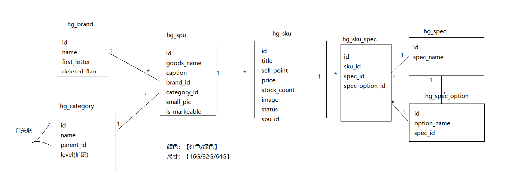
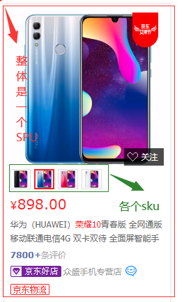

# 第十五单元 sku管理

# 【授课重点】

1. 梳理商品各表关系
2. sku与spu关系
3. sku管理

# 【考核要求】

1. 能够使用ajax方式进行图片上传
3. 能够独立完成sku管理功能

# 【教学内容】

## 15.1 表关系

​		

## 15.2 sku与spu关系



## 15.3 sku管理

### 15.3.1 sku页面

1. 页面原型-sku_list.html

   ```
   <!DOCTYPE html>
   <html lang="zh-CN">
     <head>
       <meta charset="utf-8">
       <meta http-equiv="X-UA-Compatible" content="IE=edge">
       <meta name="viewport" content="width=device-width, initial-scale=1">
       <title>hgshop后台管理系统</title>
   
   	<!-- Bootstrap core CSS -->
       <link href="resource/css/bootstrap.css" rel="stylesheet"/>
       <link rel="stylesheet" href="resource/css/bootstrap-treeview.css" />
       <script type="text/javascript" src="resource/jquery/jquery-3.4.1.js"></script>
       <script type="text/javascript" src="resource/bootstrap/js/bootstrap.min.js"></script>
       <script type="text/javascript" src="resource/bootstrap/js/bootstrap-treeview.js" ></script>
   
   </head>
   <body>
   
   		<div class="container-fluid">
   			
   					<div class="row">
   						<!-- 加入了列 填充整行 -->
   						<form class="col-sm-12" action="skuList" method="post">
   							<div class="form-group">
   								<label>商品名称</label> 
   								<input type="text" name="goodsName" class="form-control" placeholder="请输入品牌名称" value="">
   							</div>
   
   							<div class="form-group">
   								<label>商品副标题</label> 
   								<input type="text" name="caption" class="form-control" placeholder="请输入品牌的首字母" value="">
   							</div>
   							<button class="btn btn-success" type="submit">搜索</button>
   						</form>
   					</div>
   
   					<!-- 外边距(下方) 10像素的大小 -->
   					<div class="row" style="margin-bottom: 10px;">
   						<!-- 右端对齐 -->
   						<div class="col-sm-12" align="right">
   							<input type="button" class="btn btn-danger"
   								onclick="deleteSku()" value="批量删除" />
   							<button class="btn btn-primary btn-sm" onclick="preAddSku()"
   								data-toggle="modal" data-target="#skuAddModal">添加sku</button>
   						</div>
   					</div>
   
   					<div class="row">
   						<table class="table table-striped">
   							<thead>
   								<tr>
   									<th scope="col"><input type="checkbox" id="cbk" />全选</th>
   									<th scope="col">序号</th>
   									<th scope="col">商品图片</th>
   									<th scope="col">商品标题</th>
   									<th scope="col">商品价格</th>
   									<th scope="col">商品状态</th>
   									<th scope="col">商品库存</th>
   									<th scope="col">操作</th>
   								</tr>
   							</thead>
   							<tbody>
   									<tr>
   										<td scope="row">
   											<input type="checkbox" class="ck"	value=""/>
   										</td>
   										<td></td>
   										<td>
   											
   										</td>
   										<td></td>
   										<td></td>
   										<td></td>
   										<td></td>
   										<td></td>
   										<td>
   											<a href="javascript:void(0)" onclick="deleteSku()" class="btn btn-info">删除</a>
   											<button class="btn btn-info btn-sm" data-toggle="modal"
   												data-target="#skuAddModal"
   												onclick="getSkuById()">修改</button>
   											<button class="btn btn-primary btn-sm" data-toggle="modal"
   												data-target="#skuAddModal"
   												onclick="getSkuById()">详情</button></td>
   									</tr>
   							</tbody>
   						</table>
   
   						<nav>
   						  <ul class="pagination">
   						    <li>
   						      <a href="#">
   						        <span aria-hidden="true">上一页</span>
   						      </a>
   						    </li>
   						    <li><a href="#">1</a></li>
   						    <li><a href="#">2</a></li>
   						    <li>
   						      <a href="#" aria-label="Next">
   						        <span aria-hidden="true">下一页</span>
   						      </a>
   						    </li>
   						  </ul>
   						</nav>
   					</div>
   					
   				</div>
   
   			</div>
   
   
   	<!-- ////////////////写入添加模态框 //////////////////////////////-->
   	<div class="modal fade" id="skuAddModal" tabindex="-1" role="dialog"
   		aria-labelledby="myModalLabel" aria-hidden="true">
   
   		<div class="modal-dialog">
   			<div class="modal-content">
   				<div class="modal-header">
   					<!-- 关闭的x效果 -->
   					<button type="button" class="close" data-dismiss="modal"
   						aria-hidden="true">&times;</button>
   
   					<!-- 模态框的标题 -->
   					<h4 class="modal-title" id="skuAddModalLabel">添加商品操作</h4>
   				</div>
   				<div class="modal-body">
   					<form id="addFrm" enctype="multipart/form-data" action="javascript:void(0)">
   						<input type="hidden" name="id" id="addId"/>
   						<input type="hidden" name="image" id="addImage"/>
   						<div class="form-group row">
   							<label for="addTitle"
   								class="col-sm-3 col-form-label col-form-label-sm">商品标题</label>
   							<div class="col-sm-9">
   								<input type="text" class="form-control form-control-sm"
   									id="addTitle" name="title" placeholder="请输入商品标题">
   							</div>
   						</div>
   
   						<div class="form-group row">
   							<label for="addPrice" class="col-sm-3 col-form-label">商品价格</label>
   							<div class="col-sm-9">
   								<input type="number" class="form-control" id="addPrice"
   									name="price" placeholder="请输入商品价格">
   							</div>
   						</div>
   						
   						<div class="form-group row">
   							<label for="addCostPrice" class="col-sm-3 col-form-label">成本价格</label>
   							<div class="col-sm-9">
   								<input type="number" class="form-control" id="addCostPrice"
   									name="costPrice" placeholder="请输入成本价格">
   							</div>
   						</div>
   						
   						
   						<div class="form-group row">
   							<label for="addMarketPrice" class="col-sm-3 col-form-label">市场价格</label>
   							<div class="col-sm-9">
   								<input type="number" class="form-control" id="addMarketPrice"
   									name="marketPrice" placeholder="请输入成本价格">
   							</div>
   						</div>
   
   
   						<div class="form-group row">
   							<label for="addSpuId" class="col-sm-3 col-form-label">所属商品</label>
   							<div class="col-sm-9">
   								<select class="form-control" id="addSpuId" name="spuId">
   									<option value="">请选择商品</option>
   								</select>
   							</div>
   						</div>
   
   
   
   	                     <div class="form-group row">
   							<label for="addStockCount" class="col-sm-3 col-form-label">商品库存</label>
   							<div class="col-sm-9">
   								<input type="number" class="form-control" id="addStockCount"
   									name="stockCount" placeholder="请输入商品库存">
   							</div>
   						</div>
   						
   						  <div class="form-group row">
   							<label for="addSellPoint" class="col-sm-3 col-form-label">商品卖点</label>
   							<div class="col-sm-9">
   								<input type="text" class="form-control" id="addSellPoint"
   									name="sellPoint" placeholder="请输入商品库存量">
   							</div>
   						</div>
   						
   						
   						  <div class="form-group row">
   							<label for="addBarCode" class="col-sm-3 col-form-label">商品条形码</label>
   							<div class="col-sm-9">
   								<input type="text" class="form-control" id="addBarCode"
   									name="barCode" placeholder="请输入商品条形码">
   							</div>
   						</div>
   						
   						
   
   						<div class="form-group row">
   							<label for="addImage1" class="col-sm-3 col-form-label">商品图标</label>
   							<div class="col-sm-9">
   								<input type="file" class="form-control" id="addImage1"
   									name="file" />
   								
   							</div>
   						</div>
   						
   						<div class="form-group row">
   							
   							<div class="col-sm-6">
   							   	<input type="button" class="btn btn-info" value="增加下来选中规格及选项内容"
   									onclick="addSpecAndSpecOption()" />
   							</div>
   							
   							<div class="col-sm-6">
   								<select id="addskuSpec" class="form-control">
   								  <option value="">请选择规格</option>
   								</select>
   							</div>
   						</div>
   						
   					</form>
   				</div>
   				<div class="modal-footer">
   					<button type="button" class="btn btn-default" data-dismiss="modal">关闭</button>
   					<button type="button" class="btn btn-primary" id="addButton" onclick="addSku()">添加</button>
   				</div>
   			</div>
   			<!-- /.modal-content -->
   		</div>
   		<!-- /.modal -->
   	</div>
   	<!-- ///////////////////添加模态框结束//////////////////////////// -->
   
   
   	<script type="text/javascript">
   	function preAddSku(){
   		//追加商品
    		$.post("spus", {},function(data) {
           	//遍历数据
           	for(var i in data){
               	$("#addSpuId").append("<option value='"+data[i].id+"'>"+data[i].goodsName+"</option>");
           	}
   		},"json");
   
       	//追加规格
   		$.post("specs", {},function(data) {
           	//遍历数据
           	for(var i in data){
               	$("#addSkuSpecId").append("<option value='"+data[i].id+"'>"+data[i].specName+"</option>");
            	}
   		},"json");
      }
   	
   	var ii=0;
       function addSpecAndSpecOption(){
           //规格的specId
           var specId = $("#addSkuSpecId option:selected").val();
           //查询出规格对应的规格选项
           $.post('specDetail',{id:specId},function(spec){
               if(spec!=null && spec.options!=null && spec.options.length>0){
                  //定义拼接的字符串
                  var options='';
                  //遍历规格选项
                  for(var i in spec.options){
                      options+='<option value="'+spec.options[i].id+'">'+spec.options[i].optionName+'</option>';
                  }
                  //创建div对象
                  var str = '<div class="form-group row"><label class="col-sm-3 col-form-label">'+spec.specName+'</label><input type="hidden" name="skuSpec['+ii+'].specId" value="'+spec.id+'"/><div class="col-sm-9"><select name="skuSpec['+ii+'].specOptionId" class="form-control"><option value="0">请选择'+spec.specName+'项</option>'+options+'</select></div></div>';
                  //加入到指定的form中
                  $("#addFrm").append(str);
                  ii++;
               }else{
                  alert("你的规格没有规格选项");
               }
               
           },'json');
       }
   	
   	function addSku(){
   		var formData = new FormData($('#modalForm')[0]);
   		$.ajax({
               type:'post',
               data:formData,
               url:'skuAdd',
   			processData : false, // 告诉jQuery不要去处理发送的数据
   			contentType : false, // 告诉jQuery不要去设置Content-Type请求头
   			dataType:'json',
   			success:function(data){
                  	if(data){
   	               	//关闭模态框
   	               	$('#myModal').modal('hide')
               		window.location.reload();
                  	}else{
                  		alert("sku添加失败");
                  	}
    			}
   		});
   	}
   	
   	function getSkuById(id,flag){
       		preAddSku();
       		$.post('getSkuById',{id:id},function(data){
       			if(flag == 1){
       				$('#addButton').show();
       				$('#myModalLabel').text('编辑sku');
       				$('#modalForm input').prop('readonly',false);
       				$('#modalForm input').prop('disabled',false);
       				$('#modalForm select').prop('disabled', false);
       			}else{
       				$('#myModalLabel').text('查看sku');
       				$('#addButton').hide();
       				$('#modalForm input').prop('readonly',true);
       				$('#modalForm input').prop('disabled',true);
       				$('#modalForm select').prop('disabled', true);
       			}
       			$('#addId').val(data.id);
       			$('#addImage').val(data.image);
       			$('#addImage2').prop('src','pic/' + data.image);
       			$('#addTitle').val(data.title);
       			$('#addSellPoint').val(data.sellPoint);
       			$('#addPrice').val(data.price);
       			$('#addStockCount').val(data.stockCount);
       			$('#addBarcode').val(data.barcode);
       			$('#addStatus').val(data.status);
       		},'json');
       	}
       	$(function(){
       		$('#cbk').on('click',function(){
       			$('.ck').prop('checked', this.checked);
       		});
       	})
       	function deleteSku(ids){
       		if(ids==undefined){
       			ids = $('.ck:checked').map(function(){
       				return this.value;
       			}).get().join(',');
       		}
       		if(ids!=''){
       			if(confirm('确定要删除选中的数据吗?')){
       				$.post('skuDelete',{ids:ids},function(data){
       	    			if(data){
       	    				window.location.reload();
       	    			}else{
       	    				alert('删除sku失败');
       	    			}
       	    		},'json');
       			}
       		}else{
       			alert('请选中要删除的数据');
       		}
       	}
   		
   	</script>
   </body>
   </html>
   ```

2. 项目引入页面

   ```
   <%@ page language="java" contentType="text/html; charset=UTF-8"
       pageEncoding="UTF-8"%>
   <%@taglib prefix="c" uri="http://java.sun.com/jsp/jstl/core" %>
   <!DOCTYPE html>
   <html lang="zh-CN">
     <head>
     	<base href="${pageContext.request.contextPath }/">
       <meta charset="utf-8">
       <meta http-equiv="X-UA-Compatible" content="IE=edge">
       <meta name="viewport" content="width=device-width, initial-scale=1">
       <title>hgshop后台管理系统</title>
   
   	<!-- Bootstrap core CSS -->
       <link href="resource/css/bootstrap.css" rel="stylesheet"/>
       <link rel="stylesheet" href="resource/css/bootstrap-treeview.css" />
       <script type="text/javascript" src="resource/jquery/jquery-3.4.1.js"></script>
       <script type="text/javascript" src="resource/bootstrap/js/bootstrap.min.js"></script>
       <script type="text/javascript" src="resource/bootstrap/js/bootstrap-treeview.js" ></script>
   
   </head>
   <body>
   
   		<div class="container-fluid">
   					<div class="row">
   						<!-- 加入了列 填充整行 -->
   						<form class="col-sm-12" action="skuList" method="post">
   							<div class="form-group">
   								<label>商品标题</label> 
   								<input type="text" name="title" class="form-control" placeholder="请输入商品名称" value="${sku.title}">
   							</div>
   
   							<div class="form-group">
   								<label>商品卖点</label> 
   								<input type="text" name="sellPoint" class="form-control" placeholder="请输入卖点" value="${sku.sellPoint}">
   							</div>
   							<button class="btn btn-success" type="submit">搜索</button>
   						</form>
   					</div>
   
   					<!-- 外边距(下方) 10像素的大小 -->
   					<div class="row" style="margin-bottom: 10px;">
   						<!-- 右端对齐 -->
   						<div class="col-sm-12" align="right">
   							<input type="button" class="btn btn-danger"
   								onclick="deleteSku()" value="批量删除" />
   							<button class="btn btn-primary btn-sm" onclick="preAddSku()"
   								data-toggle="modal" data-target="#myModal">添加sku</button>
   						</div>
   					</div>
   
   					<div class="row">
   						<table class="table table-striped">
   							<thead>
   								<tr>
   									<th scope="col"><input type="checkbox" id="cbk" />全选</th>
   									<th scope="col">序号</th>
   									<th scope="col">商品图片</th>
   									<th scope="col">商品标题</th>
   									<th scope="col">商品价格</th>
   									<th scope="col">商品状态</th>
   									<th scope="col">商品库存</th>
   									<th scope="col">操作</th>
   								</tr>
   							</thead>
   							<tbody>
   								<c:forEach items="${pageInfo.list}" var="sku" varStatus="index">
   									<tr>
   										<td scope="row">
   											<input type="checkbox" class="ck" value="${sku.id}"/>
   										</td>
   										<td>${index.count}</td>
   										<td class="col-sm-2">
   											
   										</td>
   										<td class="col-sm-2">${sku.title}</td>
   										<td>${sku.price/100}</td>
   										<td>${sku.status==0 ? '上架' : '下架' }</td>
   										<td>${sku.stockCount}</td>
   										<td>
   											<a href="javascript:void(0)" onclick="deleteSku(${sku.id})" class="btn btn-info">删除</a>
   											<button class="btn btn-info btn-sm" data-toggle="modal"
   												data-target="#myModal2"
   												onclick="getSkuById(${sku.id},1)">修改</button>
   											<button class="btn btn-primary btn-sm" data-toggle="modal"
   												data-target="#myModal3"
   												onclick="getSkuById(${sku.id},2)">详情</button></td>
   									</tr>
   									</c:forEach>
   							</tbody>
   						</table>
   
   						<nav>
   				  <ul class="pagination">
   				  	<c:if test="${pageInfo.hasPreviousPage}">
   				    <li>
   				      <a href="skuList?pageNum=${pageInfo.prePage}&title=${sku.title}&sellPoint=${sku.sellPoint}">
   				        <span aria-hidden="true">上一页</span>
   				      </a>
   				    </li>
   				    </c:if>
   				    <c:forEach items="${pageInfo.navigatepageNums}" var="pageNum">
   				    	<c:if test="${pageInfo.pageNum==pageNum}">
   				    	<li class="active"><a href="skuList?pageNum=${pageNum}&title=${sku.title}&sellPoint=${sku.sellPoint}">${pageNum}</a></li>
   				    	</c:if>
   				    	<c:if test="${pageInfo.pageNum!=pageNum}">
   				    	<li><a href="skuList?pageNum=${pageNum}&title=${sku.title}&sellPoint=${sku.sellPoint}">${pageNum}</a></li>
   				    	</c:if>
   				    </c:forEach>
   				    <c:if test="${pageInfo.hasNextPage}">
   				    <li>
   				      <a href="skuList?pageNum=${pageInfo.nextPage}&title=${sku.title}&sellPoint=${sku.sellPoint}" aria-label="Next">
   				        <span aria-hidden="true">下一页</span>
   				      </a>
   				    </li>
   				    </c:if>
   				  </ul>
   				</nav>
   					</div>
   					
   				</div>
   
   
   	<!-- ////////////////添加模态框 //////////////////////////////-->
   	<div class="modal fade" id="myModal" tabindex="-1" role="dialog"
   		aria-labelledby="myModalLabel" aria-hidden="true">
   
   		<div class="modal-dialog">
   			<div class="modal-content">
   				<div class="modal-header">
   					<!-- 关闭的x效果 -->
   					<button type="button" class="close" data-dismiss="modal"
   						aria-hidden="true">&times;</button>
   
   					<!-- 模态框的标题 -->
   					<h4 class="modal-title">添加sku</h4>
   				</div>
   				<div class="modal-body">
   					<form id="modalForm" enctype="multipart/form-data" action="javascript:void(0)">
   						<div class="form-group row">
   							<label for="title"
   								class="col-sm-3 col-form-label col-form-label-sm">商品标题</label>
   							<div class="col-sm-9">
   								<input type="text" class="form-control form-control-sm"
   									id="title" name="title" placeholder="请输入商品标题">
   							</div>
   						</div>
   
   						<div class="form-group row">
   							<label for="price" class="col-sm-3 col-form-label">商品价格</label>
   							<div class="col-sm-9">
   								<input type="number" class="form-control" id="price"
   									name="price" placeholder="请输入商品价格">
   							</div>
   						</div>
   						
   						<div class="form-group row">
   							<label for="costPrice" class="col-sm-3 col-form-label">成本价格</label>
   							<div class="col-sm-9">
   								<input type="number" class="form-control" id="costPrice"
   									name="costPrice" placeholder="请输入成本价格">
   							</div>
   						</div>
   						
   						
   						<div class="form-group row">
   							<label for="marketPrice" class="col-sm-3 col-form-label">市场价格</label>
   							<div class="col-sm-9">
   								<input type="number" class="form-control" id="marketPrice"
   									name="marketPrice" placeholder="请输入市场价格">
   							</div>
   						</div>
   
   
   						<div class="form-group row">
   							<label for="spuId" class="col-sm-3 col-form-label">所属商品</label>
   							<div class="col-sm-9">
   								<select class="form-control" id="spuId" name="spuId">
   									<option value="">请选择商品</option>
   								</select>
   							</div>
   						</div>
   
   
   
   	                     <div class="form-group row">
   							<label for="stockCount" class="col-sm-3 col-form-label">商品库存</label>
   							<div class="col-sm-9">
   								<input type="number" class="form-control" id="stockCount"
   									name="stockCount" placeholder="请输入商品库存">
   							</div>
   						</div>
   						
   						  <div class="form-group row">
   							<label for="sellPoint" class="col-sm-3 col-form-label">商品卖点</label>
   							<div class="col-sm-9">
   								<input type="text" class="form-control" id="sellPoint"
   									name="sellPoint" placeholder="请输入商品库存量">
   							</div>
   						</div>
   						
   						
   						  <div class="form-group row">
   							<label for="barcode" class="col-sm-3 col-form-label">商品条形码</label>
   							<div class="col-sm-9">
   								<input type="text" class="form-control" id="barcode"
   									name="barcode" placeholder="请输入商品条形码">
   							</div>
   						</div>
   						
   						
   
   						<div class="form-group row">
   							<label for="image11" class="col-sm-3 col-form-label">商品图标</label>
   							<div class="col-sm-9">
   								<input type="file" class="form-control" id="image11"
   									name="file" />
   								
   							</div>
   						</div>
   						
   						<div class="form-group row">
   							
   							<div class="col-sm-6">
   							   	<input type="button" class="btn btn-info" value="增加选中规格及选项内容"
   									onclick="addSpecAndSpecOption()" />
   							</div>
   							
   							<div class="col-sm-6">
   								<select id="addSkuSpecId" class="form-control">
   								  <option value="">请选择规格</option>
   								</select>
   							</div>
   						</div>
   						
   					</form>
   				</div>
   				<div class="modal-footer">
   					<button type="button" class="btn btn-default" data-dismiss="modal">关闭</button>
   					<button type="button" class="btn btn-primary" onclick="addSku()">添加</button>
   				</div>
   			</div>
   			<!-- /.modal-content -->
   		</div>
   		<!-- /.modal -->
   	</div>
   	<!-- ///////////////////添加模态框结束//////////////////////////// -->
   	
   		
   	
   	<!-- ////////////////修改模态框 //////////////////////////////-->
   	<div class="modal fade" id="myModal2" tabindex="-1" role="dialog"
   		aria-labelledby="myModalLabel" aria-hidden="true">
   
   		<div class="modal-dialog">
   			<div class="modal-content">
   				<div class="modal-header">
   					<!-- 关闭的x效果 -->
   					<button type="button" class="close" data-dismiss="modal"
   						aria-hidden="true">&times;</button>
   
   					<!-- 模态框的标题 -->
   					<h4 class="modal-title">编辑sku</h4>
   				</div>
   				<div class="modal-body">
   					<form id="modalForm2" enctype="multipart/form-data" action="javascript:void(0)">
   						<input type="hidden" name="id" id="id2"/>
   						<input type="hidden" name="image" id="image20"/>
   						<div class="form-group row">
   							<label for="title2"
   								class="col-sm-3 col-form-label col-form-label-sm">商品标题</label>
   							<div class="col-sm-9">
   								<input type="text" class="form-control form-control-sm"
   									id="title2" name="title" placeholder="请输入商品标题">
   							</div>
   						</div>
   
   						<div class="form-group row">
   							<label for="price2" class="col-sm-3 col-form-label">商品价格</label>
   							<div class="col-sm-9">
   								<input type="number" class="form-control" id="price2"
   									name="price" placeholder="请输入商品价格">
   							</div>
   						</div>
   						
   						<div class="form-group row">
   							<label for="costPrice2" class="col-sm-3 col-form-label">成本价格</label>
   							<div class="col-sm-9">
   								<input type="number" class="form-control" id="costPrice2"
   									name="costPrice" placeholder="请输入成本价格">
   							</div>
   						</div>
   						
   						
   						<div class="form-group row">
   							<label for="marketPrice2" class="col-sm-3 col-form-label">市场价格</label>
   							<div class="col-sm-9">
   								<input type="number" class="form-control" id="marketPrice2"
   									name="marketPrice" placeholder="请输入市场价格">
   							</div>
   						</div>
   
   
   						<div class="form-group row">
   							<label for="spuId2" class="col-sm-3 col-form-label">所属商品</label>
   							<div class="col-sm-9">
   								<select class="form-control" id="spuId2" name="spuId">
   									<option value="">请选择商品</option>
   								</select>
   							</div>
   						</div>
   
   
   
   	                     <div class="form-group row">
   							<label for="stockCount2" class="col-sm-3 col-form-label">商品库存</label>
   							<div class="col-sm-9">
   								<input type="number" class="form-control" id="stockCount2"
   									name="stockCount" placeholder="请输入商品库存">
   							</div>
   						</div>
   						
   						  <div class="form-group row">
   							<label for="sellPoint2" class="col-sm-3 col-form-label">商品卖点</label>
   							<div class="col-sm-9">
   								<input type="text" class="form-control" id="sellPoint2"
   									name="sellPoint" placeholder="请输入商品卖点">
   							</div>
   						</div>
   						
   						
   						  <div class="form-group row">
   							<label for="barcode2" class="col-sm-3 col-form-label">商品条形码</label>
   							<div class="col-sm-9">
   								<input type="text" class="form-control" id="barcode2"
   									name="barcode" placeholder="请输入商品条形码">
   							</div>
   						</div>
   						
   						
   
   						<div class="form-group row">
   							<label for="image21" class="col-sm-3 col-form-label">商品图标</label>
   							<div class="col-sm-9">
   								<input type="file" class="form-control" id="image21"
   									name="file" />
   								
   							</div>
   						</div>
   						
   						<div class="form-group row">
   							
   							<div class="col-sm-6">
   							   	<input type="button" class="btn btn-info" value="增加下来选中规格及选项内容"
   									onclick="addSpecAndSpecOption(2)" />
   							</div>
   							
   							<div class="col-sm-6">
   								<select id="addSkuSpecId2" class="form-control">
   								  <option value="">请选择规格</option>
   								</select>
   							</div>
   						</div>
   						
   					</form>
   				</div>
   				<div class="modal-footer">
   					<button type="button" class="btn btn-default" data-dismiss="modal">关闭</button>
   					<button type="button" class="btn btn-primary" onclick="addSku(1)">编辑</button>
   				</div>
   			</div>
   			<!-- /.modal-content -->
   		</div>
   		<!-- /.modal -->
   	</div>
   	<!-- ///////////////////修改模态框结束//////////////////////////// -->
   
   
   	<!-- ////////////////查看模态框 //////////////////////////////-->
   	<div class="modal fade" id="myModal3" tabindex="-1" role="dialog"
   		aria-labelledby="myModalLabel" aria-hidden="true">
   
   		<div class="modal-dialog">
   			<div class="modal-content">
   				<div class="modal-header">
   					<!-- 关闭的x效果 -->
   					<button type="button" class="close" data-dismiss="modal"
   						aria-hidden="true">&times;</button>
   
   					<!-- 模态框的标题 -->
   					<h4 class="modal-title">查看sku</h4>
   				</div>
   				<div class="modal-body">
   					<form id="modalForm3" enctype="multipart/form-data" action="javascript:void(0)">
   						<div class="form-group row">
   							<label for="title3"
   								class="col-sm-3 col-form-label col-form-label-sm">商品标题</label>
   							<div class="col-sm-9">
   								<span id="title3"></span>
   							</div>
   						</div>
   
   						<div class="form-group row">
   							<label for="price3" class="col-sm-3 col-form-label">商品价格</label>
   							<div class="col-sm-9">
   								<span id="price3"></span>
   							</div>
   						</div>
   						
   						<div class="form-group row">
   							<label for="costPrice3" class="col-sm-3 col-form-label">成本价格</label>
   							<div class="col-sm-9">
   								<span id="costPrice3"></span>
   							</div>
   						</div>
   						
   						
   						<div class="form-group row">
   							<label for="marketPrice" class="col-sm-3 col-form-label">市场价格</label>
   							<div class="col-sm-9">
   								<span id="marketPrice3"></span>
   							</div>
   						</div>
   
   
   						<div class="form-group row">
   							<label for="spuId3" class="col-sm-3 col-form-label">所属商品</label>
   							<div class="col-sm-9">
   								<span id="spuId3"></span>
   							</div>
   						</div>
   
   
   
   	                     <div class="form-group row">
   							<label for="stockCount3" class="col-sm-3 col-form-label">商品库存</label>
   							<div class="col-sm-9">
   								<span id="stockCount3"></span>
   							</div>
   						</div>
   						
   						  <div class="form-group row">
   							<label for="sellPoint3" class="col-sm-3 col-form-label">商品卖点</label>
   							<div class="col-sm-9">
   								<span id="sellPoint3"></span>
   							</div>
   						</div>
   						
   						
   						  <div class="form-group row">
   							<label for="barcode3" class="col-sm-3 col-form-label">商品条形码</label>
   							<div class="col-sm-9">
   								<span id="barcode3"></span>
   							</div>
   						</div>
   						
   						
   
   						<div class="form-group row">
   							<label for="image32" class="col-sm-3 col-form-label">商品图标</label>
   							<div class="col-sm-9">
   								
   							</div>
   						</div>
   					</form>
   				</div>
   				<div class="modal-footer">
   					<button type="button" class="btn btn-default" data-dismiss="modal">关闭</button>
   				</div>
   			</div>
   			<!-- /.modal-content -->
   		</div>
   		<!-- /.modal -->
   	</div>
   	<!-- ///////////////////查看模态框结束//////////////////////////// -->
   	
   
   	<script type="text/javascript">
   	function preAddSku(flag){
   		var obj,obj1;
   		if(!flag){
   			//新增模态框
   			obj=$("#spuId");	
   			obj1=$("#addSkuSpecId");	
   		}else{
   			//修改模态框
   			obj=$("#spuId2");
   			obj1=$("#addSkuSpecId2");	
   			
   		}
   		obj.html('<option value="">请选择商品</option>');
      		//追加商品
    		$.post("spus", {},function(data) {
           	//遍历数据
           	for(var i in data){
               	obj.append("<option value='"+data[i].id+"'>"+data[i].goodsName+"</option>");
           	}
   		},"json");
      		obj1.html('<option value="">请选择规格</option>');
       	//追加规格
   		$.post("specs", {},function(data) {
           	//遍历数据
           	for(var i in data){
               	obj1.append("<option value='"+data[i].id+"'>"+data[i].specName+"</option>");
            	}
   		},"json");
   		$('.specOptionDiv').remove();
      }
   	
   	var index=0;
   	var index2=0;
       function addSpecAndSpecOption(flag){
       	var obj,obj1,obj2;
       	if(!flag){
       		obj=$("#addSkuSpecId option:selected");
       		obj1=$("#modalForm");
       		obj2=index;
       	}else{
       		obj=$("#addSkuSpecId2 option:selected");
       		obj1=$("#modalForm2");
       		obj2=index2;
       	}
           //规格的specId
           var specId = obj.val();
           //查询出规格对应的规格选项
           $.post('getSpecById',{id:specId},function(spec){
               if(spec!=null && spec.options!=null && spec.options.length>0){
                  //定义拼接的字符串
                  var options='';
                  //遍历规格选项
                  for(var i in spec.options){
                      options+='<option value="'+spec.options[i].id+'">'+spec.options[i].optionName+'</option>';
                  }
                  //创建div对象
                  var str = '<div class="form-group row specOptionDiv"><label class="col-sm-3 col-form-label">'+spec.specName+'</label><input type="hidden" name="skuSpec['+obj2+'].specId" value="'+spec.id+'"/><div class="col-sm-9"><select name="skuSpec['+obj2+'].specOptionId" class="form-control"><option value="0">请选择'+spec.specName+'项</option>'+options+'</select></div></div>';
                  //加入到指定的form中
                  obj1.append(str);
                 	if(!flag){
                 		index++;
                 	}else{
                 		index2++;
                 	}
               }else{
                  alert("你的规格没有规格选项");
               }
           },'json');
       }
   	
   	function addSku(flag){
   		var obj,obj1;
   		if(!flag){
   			//添加
   			obj=$('#modalForm')[0];
   			obj1=$('#myModal');
   		}else{
   			//修改
   			obj=$('#modalForm2')[0];
   			obj1=$('#myModal2');
   		}
   		var formData = new FormData(obj);
   		$.ajax({
               type:'post',
               data:formData,
               url:'skuAdd',
   			processData : false, // 告诉jQuery不要去处理发送的数据
   			contentType : false, // 告诉jQuery不要去设置Content-Type请求头
   			dataType:'json',
   			success:function(data){
                  	if(data){
   	               	//关闭模态框
   	               	obj1.modal('hide')
               		window.location.reload();
                  	}else{
                  		alert("sku操作失败");
                  	}
    			}
   		});
   	}
   	
   	//修改回显或查看详情
   	function getSkuById(id,flag){
   			//flag=1时，修改
       		if(flag==1){preAddSku(flag);}
   			$.post('getSkuById',{id:id},function(data){
   				//sku中有hg_sku全部信息及hg_sku_spec列表
       			var sku = data.sku;
   				//当前skuId对应的规格参数及规格参数列表
   				//[{"颜色":["黑色","白色"]},{"尺码":["S","M","L"]}]
       			var specs = data.specs;
       			
       			//1.规格参数div展示
       			for(var i in specs){
       				//颜色
   	            	var spec = specs[i];
       				//["黑色","白色"]
   	            	var optionArr = spec.options;
                      	var options = '';
   	            	for(var j in optionArr){
   	            		//黑色
                      		var option = optionArr[j];
                      		options += '<option value="'+option.id+'">'+option.optionName+'</option>';
   	            	}
   	            	//颜色:<select><option>黑色</option><option>白色</option></select>
                       var str = '<div class="form-group row specOptionDiv"><label class="col-sm-3 col-form-label">'+spec.specName+'</label><input type="hidden" name="skuSpec['+index2+'].specId" value="'+spec.id+'"/><div class="col-sm-9"><select id="specOptionId' + index2 + '" name="skuSpec['+index2+'].specOptionId" class="form-control"><option value="0">请选择'+spec.specName+'项</option>'+options+'</select></div></div>';
                       $("#modalForm2").append(str);
                   	
                       //1.2.将各个规格参数选项进行默认值选中
                       //[{"颜色":"黑色"},{"尺码":"S"}]
                   	var specs1 = sku.skuSpec;    			
       				for(var k in specs1){
       					//1.2.1.如果规格参数选项是当前sku关联的spec_id，option处于选中状态
       					if(specs1[k].specId==spec.id){	
       						$('#specOptionId' + index2 + ' option[value=' + specs1[k].specOptionId + ']').prop('selected',true);
       						break;
       					}
       				}	
       				index2++;
       			}
       			//2.sku信息展示
       			$('#id2').val(sku.id);
       			$('#image20').val(sku.image);
       			$('#image22').prop('src','pic/' + sku.image);
       			$('#title2').val(sku.title);
       			$('#sellPoint2').val(sku.sellPoint);
       			$('#price2').val(sku.price);
       			$('#costPrice2').val(sku.costPrice);
       			$('#marketPrice2').val(sku.marketPrice);
       			$('#spuId2 option[value=' + sku.spuId + ']').prop('selected', true);
       			$('#stockCount2').val(sku.stockCount);
       			$('#barcode2').val(sku.barcode);
       			$('#status2').val(sku.status);
       		},'json');
       	}
       	$(function(){
       		$('#cbk').on('click',function(){
       			$('.ck').prop('checked', this.checked);
       		});
       	})
       	function deleteSku(ids){
       		if(!ids){
       			ids = $('.ck:checked').map(function(){
       				return this.value;
       			}).get().join(',');
       		}
       		if(ids!=''){
       			if(confirm('确定要删除选中的数据吗?')){
       				$.post('skuDelete',{ids:ids},function(data){
       	    			if(data){
       	    				window.location.reload();
       	    			}else{
       	    				alert('删除sku失败');
       	    			}
       	    		},'json');
       			}
       		}else{
       			alert('请选中要删除的数据');
       		}
       	}
   		
   	</script>
   </body>
   </html>
   ```

### 15.3.2 添加sku

1. 控制层

   1.1 获取spu列表(SpuController类中)

   ```
   @RequestMapping("/spus")
   @ResponseBody
   public List<Spu> spus() {
   	return spuService.spus();
   }
   ```

   1.2 获取规格参数列表(SpecController类中)

   ```
   /**
    * 添加sku页面获取规格列表
    * @return
    */
   @RequestMapping("/specs")
   @ResponseBody
   public List<Spec> specs() {
   	return specService.specs();
   }
   ```

   1.3 新增sku(SkuController类中)

   ```
   @RequestMapping("/skuAdd")
   @ResponseBody
   public boolean skuAdd(Sku sku, MultipartFile file) throws IllegalStateException, IOException {
   	String originalFilename = file.getOriginalFilename();
   	if (StringUtils.isNotBlank(originalFilename)) {
       	String fileName = UUID.randomUUID() + "_" + originalFilename;
           File destFile = new File("G://pic/", fileName);
           if (!destFile.getParentFile().exists()) {
       		destFile.getParentFile().mkdirs();
       	}
       	file.transferTo(destFile);
   
   		String oldPath = sku.getImage();
   		if (StringUtils.isNotBlank(oldPath)) {
   			FileUtils.forceDelete(new File("G://pic/" + oldPath));
   		}
   		sku.setImage(fileName);
   	}
   	return skuService.saveOrUpdateSku(sku) > 0;
   }
   ```

2. 接口层

   2.1 获取spu列表(SpuService接口中)

   ```
   List<Spu> spus();
   ```

   2.2 获取规格参数列表(SpecService接口中)

   ```
   List<Spec> specs();
   ```

   2.3 新增sku(SkuService接口中)

   ```
   Integer saveOrUpdateSku(Sku sku);
   ```

3. 服务层

   3.1 获取spu列表(SpuServiceImpl类中)

   ```
   @Override
   public List<Spu> spus() {
   	return spuMapper.selectSpus();
   }
   ```

   3.2 获取规格参数列表(SpecServiceImpl类中)

   ```
   @Override
   public List<Spec> specs() {
   	return specMapper.selectSpecs();
   }
   ```

   3.3 新增sku(SkuServiceImpl类中)

   ```
   /**
   * 添加或修改sku
   */
   @Override
   public Integer saveOrUpdateSku(Sku sku) {
       Integer count = 0;
       //①新增
       if (sku.getId() == null) {
           sku.setStatus("0");
           sku.setCreateTime(new Date());
           sku.setUpdateTime(new Date());
           count = skuMapper.insertSku(sku);
       } else {
           //Ⅱ修改
           sku.setUpdateTime(new Date());
           count = skuMapper.updateSku(sku);
           skuMapper.deleteSkuSpecBySkuIds(new Integer[]{sku.getId()});
       }
       if (count > 0) {
       	List<SkuSpec> skuSpecs = sku.getSkuSpec();
       	if (skuSpecs != null) {
               for (SkuSpec skuSpec : skuSpecs) {
                   skuSpec.setSkuId(sku.getId());
                   skuMapper.insertSkuSpec(skuSpec);
               }
       	}
       }
       return count;
   }
   ```

4. 数据访问层

   4.1 获取spu列表

   ```
   List<Spu> selectSpus();
   ```

   ```
   <select id="selectSpus" resultType="spu">
   	select id,goods_name from hg_spu
   </select>
   ```

   4.2 获取规格参数列表

   ```
   List<Spec> selectSpecs();
   ```

   ```
   <select id="selectSpecs" resultType="spec">
   	select id,spec_name from hg_spec
   </select>
   ```

   4.3 新增sku

   ```
   Integer insertSku(Sku sku);
   void insertSkuSpec(SkuSpec skuSpec);
   ```

   ```
   <insert id="insertSku" useGeneratedKeys="true" keyProperty="id">
   insert into hg_sku(title,sell_point,price,stock_count,barcode,image,status,create_time,update_time,cost_price,market_price,spu_id) 
   values (#{title},#{sellPoint},#{price},#{stockCount},#{barcode},#{image},#{status},#{createTime},#{updateTime},#{costPrice},#{marketPrice},#{spuId})
   </insert>
   
   <insert id="insertSkuSpec">
   insert into hg_sku_spec(sku_id,spec_id,spec_option_id) values (#{skuId},#{specId},#{specOptionId})
   </insert>
   ```

### 15.3.3 sku列表

1. 控制层-SkuController

   ```
   @RequestMapping("/skuList")
   public String skuList(Model model, Integer categoryId, Sku sku, @RequestParam(defaultValue="1")Integer pageNum, @RequestParam(defaultValue="2")Integer pageSize) {
       PageInfo<Sku> pageInfo = skuService.list(sku, pageNum, pageSize);
       model.addAttribute("pageInfo", pageInfo);
       model.addAttribute("sku", sku);
       return "sku_list";
   }
   ```

2. 接口层-SkuService

   ```
   PageInfo<Sku> list(Sku sku, Integer pageNum, Integer pageSize);
   ```

3. 服务层-SkuServiceImpl

   ```
   @Override
   public PageInfo<Spec> list(Spec spec, Integer pageNum, Integer pageSize) {
       PageHelper.startPage(pageNum, pageSize);
       List<Spec> list = specMapper.selectSpecList(spec);
       PageInfo<Spec> pageInfo = new PageInfo<>(list);
       return pageInfo;
   }
   ```

4. 数据访问层-SkuMapper

   ```
   List<Sku> selectSkuList(Sku sku);
   ```

   ```
   <select id="selectSkuList" resultType="sku">
   	select id,image,title,price,status,stock_count from hg_sku
   	<where>
   		<if test="title!=null and title!=''">
   			and title like concat('%',#{title},'%')
   		</if>
   		<if test="sellPoint!=null and sellPoint!=''">
   			and sell_point like concat('%',#{sellPoint},'%')
   		</if>
   	</where>
   </select>
   ```

### 15.3.4 修改sku

1. 控制层-SkuController

   数据回显：

   ```
   @RequestMapping("/getSkuById")
   @ResponseBody
   public Map<String, Object> getSkuById(Integer id) {
   	return skuService.getSkuById(id);
   }
   ```

   获取spu列表/获取规格参数列表/修改sku方法同【添加sku】。

2. 接口层-SkuService

   数据回显：

   ```
   Map<String, Object> getSkuById(Integer id);
   ```

   获取spu列表/获取规格参数列表/修改sku方法同【添加sku】。

3. 服务层-SkuServiceImpl

   数据回显：

   ```
   /**
    * 修改回显或查看详情
    */
   @Override
   public Map<String, Object> getSkuById(Integer id) {
   	Map<String, Object> map = new HashMap<>();
   	//1.获取sku详情
   	Sku sku = skuMapper.selectSkuById(id);
   	//2.将中间表对象列表映射成规格参数id列表
   	List<Integer> specIds = sku.getSkuSpec().stream().map(ks -> 			
   		ks.getSpecId()).collect(Collectors.toList());
   	//3.根据规格参数id列表获取规格参数及规格参数选项信息
   	List<Spec> specList = specMapper.selectSpecByIds(specIds);
   	map.put("sku", sku);
   	map.put("specs", specList);
   	return map;
   }
   ```

   获取spu列表/获取规格参数列表/修改sku方法同【添加sku】。

4. 数据访问层-SkuMapper

   数据回显：

   ```
   Sku selectSkuById(Integer id);
   ```

   ```
   <select id="selectSkuById" resultMap="skuMap">
   select s.*,ks.id ks_id,ks.spec_id,ks.spec_option_id from hg_sku s left join hg_sku_spec ks on s.id=ks.sku_id where s.id=#{id}
   </select>
   ```

   获取spu列表/获取规格参数列表/修改sku方法同【添加sku】。

### 15.3.5 删除sku

1. 控制层-SkuController

   ```
   @RequestMapping("/skuDelete")
   @ResponseBody
   public boolean skuDelete(Integer[] ids) {
   	return skuService.deleteSkuByIds(ids) > 0;
   }
   ```

2. 接口层-SkuService

   ```
   Integer deleteSkuByIds(Integer[] ids);
   ```

3. 服务层-SkuServiceImpl

   ```
   @Override
   public Integer deleteSkuByIds(Integer[] ids) {
   	//1.删除sku表
   	Integer count = skuMapper.deleteSkuByIds(ids);
   	if (count > 0) {
   		//2.删除sku_spec表
   		skuMapper.deleteSkuSpecBySkuIds(ids);
   	}
   	return count;
   }
   ```

4. 数据访问层-SkuMapper

   ```
   Integer deleteSkuByIds(Integer[] ids);
   void deleteSkuSpecBySkuIds(Integer[] ids);
   ```

   ```
   <delete id="deleteSkuByIds">
   	delete from hg_sku where id in
   	<foreach collection="array" open="(" close=")" separator="," item="id">
   		#{id}
   	</foreach>
   </delete>
   	
   <delete id="deleteSkuSpecBySkuIds">
   	delete from hg_sku_spec where sku_id in
   	<foreach collection="array" open="(" close=")" separator="," item="id">
   		#{id}
   	</foreach>
   </delete>
   ```

   