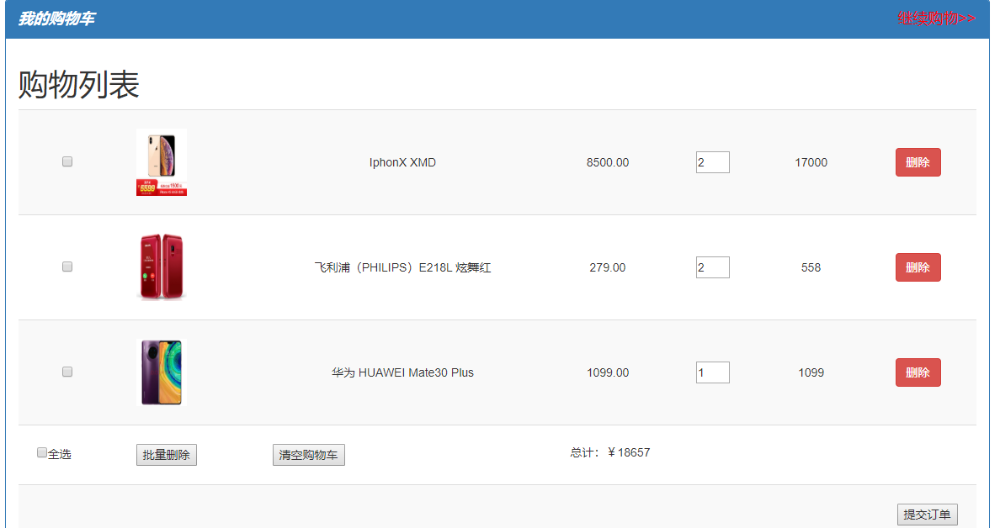
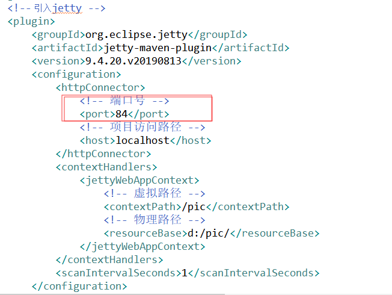
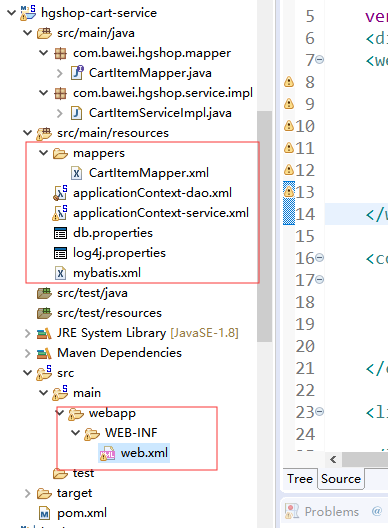
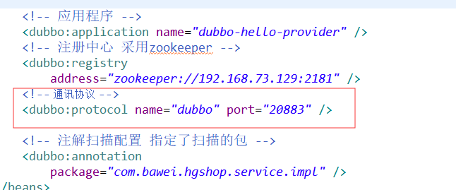
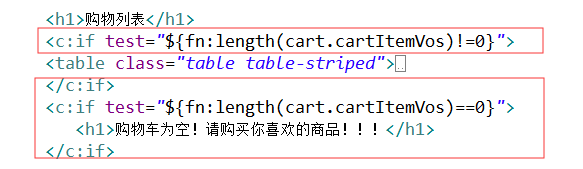

# 第十八单元 购物车

# 【授课重点】

1. 创建hgshop-cart-interface接口
2. 创建hgshop-cart-service接口
3. 实现加入购物车功能
4. 实现购物车列表功能
5. 实现购物车修改功能
6. 实现购物删除/清空购物车功能

# 【考核要求】

1. 掌握dubbo聚合模块项目创建过程
2. 能够独立完成基于表的购物车实现

# 【教学内容】

## 18.1 课程导入

  电商项目中，购物车的功能实现占据核心的业务模块，我们怎么样去实现一个购物车功能尼？能够把我们喜欢的商品存储到购物车列表中尼?

  


## 18.2  创建hgshop-cart-interface接口

​	首先创建购物车的接口模块，打包方式为jar. 

###    18.2.1 pom.xml文件加入依赖

```
 <dependencies>
     	<!-- spring-data-elasticsearch 提高到3.1.5 -->
			<dependency>
				<groupId>org.springframework.data</groupId>
				<artifactId>spring-data-elasticsearch</artifactId>
			</dependency>
			
				<!-- 引入mybaits pagehelper分页助手依赖 -->
			<dependency>
				<groupId>com.github.pagehelper</groupId>
				<artifactId>pagehelper</artifactId>
			</dependency>
			
  </dependencies>
```

###     18.2.2 创建CartItem实体Bean

```
package com.bawei.hgshop.pojo;

import java.io.Serializable;
/**
 * 
 * @ClassName: CartItem 
 * @Description: TODO
 * @author: chj
 * @date: 2019年11月19日 下午3:55:32
 */
import java.math.BigDecimal;
import java.util.Date;

/** 
 * @ClassName: CartItem 
 * @Description: 购物车中的 条目对象
 * @author: chj
 * @date: 2019年11月19日 下午3:58:12  
 */
public class CartItem implements Serializable{

	/**
	 * @fieldName: serialVersionUID
	 * @fieldType: long
	 * @Description: TODO
	 */
	private static final long serialVersionUID = 1L;

	private Integer id;
	/**
	 * @fieldName: uid
	 * @fieldType: Integer
	 * @Description: 用户
	 */
	private Integer uid;
	/**
	 * @fieldName: skuId
	 * @fieldType: Integer
	 * @Description: 商品id
	 */
	private Integer skuId;
	/**
	 * @fieldName: pnum
	 * @fieldType: Integer
	 * @Description: 购买商品的数量
	 */
	private Integer pnum;
	/**
	 * @fieldName: sumTotal
	 * @fieldType: BigDecimal
	 * @Description: 条目小计
	 */
	private BigDecimal sumTotal;
	private Date createTime;
	private Date updateTime;
	
	
	public CartItem() {
		super();
		// TODO Auto-generated constructor stub
	}
	public CartItem(Integer id, Integer uid, Integer skuId, Integer pnum, BigDecimal sumTotal, Date createTime,
			Date updateTime) {
		super();
		this.id = id;
		this.uid = uid;
		this.skuId = skuId;
		this.pnum = pnum;
		this.sumTotal = sumTotal;
		this.createTime = createTime;
		this.updateTime = updateTime;
	}
	public Integer getId() {
		return id;
	}
	public void setId(Integer id) {
		this.id = id;
	}
	public Integer getUid() {
		return uid;
	}
	public void setUid(Integer uid) {
		this.uid = uid;
	}
	public Integer getSkuId() {
		return skuId;
	}
	public void setSkuId(Integer skuId) {
		this.skuId = skuId;
	}
	public Integer getPnum() {
		return pnum;
	}
	public void setPnum(Integer pnum) {
		this.pnum = pnum;
	}
	public BigDecimal getSumTotal() {
		return sumTotal;
	}
	public void setSumTotal(BigDecimal sumTotal) {
		this.sumTotal = sumTotal;
	}
	public Date getCreateTime() {
		return createTime;
	}
	public void setCreateTime(Date createTime) {
		this.createTime = createTime;
	}
	public Date getUpdateTime() {
		return updateTime;
	}
	public void setUpdateTime(Date updateTime) {
		this.updateTime = updateTime;
	}
	@Override
	public String toString() {
		return "CartItem [id=" + id + ", uid=" + uid + ", skuId=" + skuId + ", pnum=" + pnum + ", sumTotal=" + sumTotal
				+ ", createTime=" + createTime + ", updateTime=" + updateTime + "]";
	}
	
	
	
	
}

```

### 18.2.3 创建CartItem的service接口

```
package com.bawei.hgshop.service;

import java.util.List;

import com.bawei.hgshop.pojo.CartItem;

public interface CartItemService {

	/** 
	 * @Title: insertObject 
	 * @Description: 插入购物车条目
	 * @param entity
	 * @return
	 * @return: int
	 */
	int insertObject(CartItem entity);
	
	
	/** 
	 * @Title: updateObject 
	 * @Description: 更新购物车条目
	 * @param entity
	 * @return
	 * @return: int
	 */
	int updateObject(CartItem entity);
	
	
	/** 
	 * @Title: selectByUIdAndSkuId 
	 * @Description: 校验当前用户是否购买过改商品
	 * @param uid
	 * @param skuId
	 * @return
	 * @return: CartItem
	 */
	CartItem selectByUIdAndSkuId(Integer uid,Integer skuId);
	
	/** 
	 * @Title: selectObjectByUId 
	 * @Description: 根据用户的id查询出当前用户的购物车（包含了所有的购物车条目信息）
	 * @param uid
	 * @return
	 * @return: List<CartItem>
	 */
	List<CartItem> selectObjectByUId(Integer uid);
}

```


## 18.3 创建hgshop-cart-service 

 创建hgshop-cart-service服务模块，打成war包。

###   18.3.1 pom.xml文件加入依赖

​    注意：

   1. **加入对应的依赖关系 hgshop-cart-interface**

   2. **修改jetty启动的端口号<port>84</port>**

        

      具体的pom.xml文件如下

```
<dependencies>

		<!-- 加入对应的依赖配置 -->
		<dependency>
			<groupId>com.bawei.hgshop</groupId>
			<artifactId>hgshop-cart-interface</artifactId>
			<version>0.0.1-SNAPSHOT</version>
		</dependency>

		<!-- 引入 redis.clients/jedis 依赖 -->
		<dependency>
			<groupId>redis.clients</groupId>
			<artifactId>jedis</artifactId>
		</dependency>

		<!-- 引入 spring-data-redis 依赖 -->
		<dependency>
			<groupId>org.springframework.data</groupId>
			<artifactId>spring-data-redis</artifactId>
		</dependency>

		<!-- 引入dubbo的依赖配置 -->
		<dependency>
			<groupId>org.apache.dubbo</groupId>
			<artifactId>dubbo</artifactId>
		</dependency>
		<dependency>
			<groupId>org.apache.dubbo</groupId>
			<artifactId>dubbo-dependencies-zookeeper</artifactId>
			<type>pom</type>
		</dependency>


		<!-- spring -web依赖 -->
		<dependency>
			<groupId>org.springframework</groupId>
			<artifactId>spring-web</artifactId>
		</dependency>

		<dependency>
			<groupId>org.springframework</groupId>
			<artifactId>spring-webmvc</artifactId>
		</dependency>

		<!-- spring-jdbc依赖 -->
		<dependency>
			<groupId>org.springframework</groupId>
			<artifactId>spring-jdbc</artifactId>
		</dependency>
		<!-- spring-tx 事务依赖 -->
		<dependency>
			<groupId>org.springframework</groupId>
			<artifactId>spring-tx</artifactId>
		</dependency>
		<!-- spring-context-support上下文依赖 -->
		<dependency>
			<groupId>org.springframework</groupId>
			<artifactId>spring-context-support</artifactId>
		</dependency>
		<!-- 引入spring-test依赖 -->
		<dependency>
			<groupId>org.springframework</groupId>
			<artifactId>spring-test</artifactId>
		</dependency>

		<!-- mybatis核心包 -->
		<dependency>
			<groupId>org.mybatis</groupId>
			<artifactId>mybatis</artifactId>
		</dependency>
		<!-- mybatis-spring 整合jar -->
		<dependency>
			<groupId>org.mybatis</groupId>
			<artifactId>mybatis-spring</artifactId>
		</dependency>
		<!-- druid数据源 -->
		<dependency>
			<groupId>com.alibaba</groupId>
			<artifactId>druid</artifactId>
		</dependency>
		<!-- Mysql数据库驱动包 -->
		<dependency>
			<groupId>mysql</groupId>
			<artifactId>mysql-connector-java</artifactId>
		</dependency>
		<!-- 日志文件管理包 -->
		<!-- log start -->
		<dependency>
			<groupId>log4j</groupId>
			<artifactId>log4j</artifactId>
		</dependency>
		<!-- 单元测试 -->
		<dependency>
			<groupId>junit</groupId>
			<artifactId>junit</artifactId>
			<scope>test</scope>
		</dependency>


		<!-- 引入org.aspectj依赖 -->
		<dependency>
			<groupId>org.aspectj</groupId>
			<artifactId>aspectjweaver</artifactId>
		</dependency>
		<dependency>
			<groupId>org.aspectj</groupId>
			<artifactId>aspectjrt</artifactId>
		</dependency>
	</dependencies>


	<build>
		<plugins>
			<!-- 引入jetty -->
			<plugin>
				<groupId>org.eclipse.jetty</groupId>
				<artifactId>jetty-maven-plugin</artifactId>
				<version>9.4.20.v20190813</version>
				<configuration>
					<httpConnector>
						<!-- 端口号 -->
						<port>84</port>
						<!-- 项目访问路径 -->
						<host>localhost</host>
					</httpConnector>
					<contextHandlers>
						<jettyWebAppContext>
							<!-- 虚拟路径 -->
							<contextPath>/pic</contextPath>
							<!-- 物理路径 -->
							<resourceBase>d:/pic/</resourceBase>
						</jettyWebAppContext>
					</contextHandlers>
					<scanIntervalSeconds>1</scanIntervalSeconds>
				</configuration>
			</plugin>

			<!-- 打包去掉测试类 -->
			<plugin>
				<groupId>org.apache.maven.plugins</groupId>
				<artifactId>maven-surefire-plugin</artifactId>
				<version>2.18.1</version>
				<configuration>
					<skipTests>true</skipTests>
				</configuration>
			</plugin>

			<!-- 编译的环境 jdk版本1.8 -->
			<plugin>
				<groupId>org.apache.maven.plugins</groupId>
				<artifactId>maven-compiler-plugin</artifactId>
				<version>3.5.1</version>
				<configuration>
					<source>1.8</source>
					<target>1.8</target>
					<encoding>UTF-8</encoding>
				</configuration>
			</plugin>

		</plugins>
	</build>
```

###  18.3.2 粘贴webapp与src/main/resources资源配置文件

  

   注意：**在applicationContext-service.xml文件中修改dubbo协议的端口号**

  

### 18.3.3 创建CartItemMapper接口

方法说明：

1. insertObject 插入购物车条目

2. selectByUIdAndSkuId 根据用户id与商品id查询 购物车条目，返回null证明当前用户购物车中不存在商品，不为空证明购物车中存在该商品

3. updateObject 更新条目 更新购物车购买商品的数量和小计
4. selectObjectByUId 查询当前用户购物车的所有条目

```
package com.bawei.hgshop.mapper;

import java.util.List;

import org.apache.ibatis.annotations.Param;

import com.bawei.hgshop.pojo.CartItem;

/** 
 * @ClassName: CartItemMapper 
 * @Description: 数据库操作购物车条目
 * @author: chj
 * @date: 2019年11月19日 下午4:02:53  
 */
public interface CartItemMapper {

	/** 
	 * @Title: insertObject 
	 * @Description: 插入购物车条目
	 * @param entity
	 * @return
	 * @return: int
	 */
	int insertObject(CartItem entity);
	
	
	/** 
	 * @Title: updateObject 
	 * @Description: 更新购物车条目
	 * @param entity
	 * @return
	 * @return: int
	 */
	int updateObject(CartItem entity);
	
	
	/** 
	 * @Title: selectByUIdAndSkuId 
	 * @Description: 校验当前用户是否购买过改商品
	 * @param uid
	 * @param skuId
	 * @return
	 * @return: CartItem
	 */
	CartItem selectByUIdAndSkuId(@Param("uid")Integer uid,@Param("skuId")Integer skuId);
	
	/** 
	 * @Title: selectObjectByUId 
	 * @Description: 根据用户的id查询出当前用户的购物车（包含了所有的购物车条目信息）
	 * @param uid
	 * @return
	 * @return: List<CartItem>
	 */
	List<CartItem> selectObjectByUId(Integer uid);
}

```

### 18.3.4 创建CartItemMapper对应的映射文件CartItemMapper.xml

```
package com.bawei.hgshop.mapper;

import java.util.List;

import org.apache.ibatis.annotations.Param;

import com.bawei.hgshop.pojo.CartItem;

/** 
 * @ClassName: CartItemMapper 
 * @Description: 数据库操作购物车条目
 * @author: chj
 * @date: 2019年11月19日 下午4:02:53  
 */
public interface CartItemMapper {

	/** 
	 * @Title: insertObject 
	 * @Description: 插入购物车条目
	 * @param entity
	 * @return
	 * @return: int
	 */
	int insertObject(CartItem entity);
	
	
	/** 
	 * @Title: updateObject 
	 * @Description: 更新购物车条目
	 * @param entity
	 * @return
	 * @return: int
	 */
	int updateObject(CartItem entity);
	
	
	/** 
	 * @Title: selectByUIdAndSkuId 
	 * @Description: 校验当前用户是否购买过改商品
	 * @param uid
	 * @param skuId
	 * @return
	 * @return: CartItem
	 */
	CartItem selectByUIdAndSkuId(@Param("uid")Integer uid,@Param("skuId")Integer skuId);
	
	/** 
	 * @Title: selectObjectByUId 
	 * @Description: 根据用户的id查询出当前用户的购物车（包含了所有的购物车条目信息）
	 * @param uid
	 * @return
	 * @return: List<CartItem>
	 */
	List<CartItem> selectObjectByUId(Integer uid);
}

```

### 18.3.5 创建购物车service的实现类

```
package com.bawei.hgshop.service.impl;

import java.util.List;

import org.apache.dubbo.config.annotation.Service;
import org.springframework.beans.factory.annotation.Autowired;

import com.bawei.hgshop.mapper.CartItemMapper;
import com.bawei.hgshop.pojo.CartItem;
import com.bawei.hgshop.service.CartItemService;

@Service
public class CartItemServiceImpl implements CartItemService{

	@Autowired
	private CartItemMapper cartItemMapper;
	
	@Override
	public int insertObject(CartItem entity) {
		// TODO Auto-generated method stub
		return cartItemMapper.insertObject(entity);
	}

	@Override
	public int updateObject(CartItem entity) {
		// TODO Auto-generated method stub
		return cartItemMapper.updateObject(entity);
	}

	@Override
	public CartItem selectByUIdAndSkuId(Integer uid, Integer skuId) {
		// TODO Auto-generated method stub
		return cartItemMapper.selectByUIdAndSkuId(uid, skuId);
	}

	@Override
	public List<CartItem> selectObjectByUId(Integer uid) {
		// TODO Auto-generated method stub
		return cartItemMapper.selectObjectByUId(uid);
	}

}

```


注意：**执行一下Maven install**

😂😂😂😂😂😂😂😂😂😂😂😂😂😜


## 18.4 实现加入购物车功能

### 18.4.1 在pom.xml文件中加入购物车接口依赖

```
	<!-- 购物车接口依赖 -->
		<dependency>
			<groupId>com.bawei.hgshop</groupId>
			<artifactId>hgshop-cart-interface</artifactId>
			<version>0.0.1-SNAPSHOT</version>
		</dependency>
```

### 18.4.2 在index.jsp页面中 添加加入购物车的事件

```
<a data-user-id="${sessionScope.user!=null?sessionScope.user.uid:0 }" 
href="javascript:void(0)" 
onclick="addCart(this,${newSku.id},${newSku.price})" 
class="btn btn-primary" role="button">加入购物车</a>
```

**自定义属性：data-user-id**

**onclick点击事件addCart() 触发传递的this当前的DOM对象**

​      备注扩展测试练习：测试视频中href="javascript:addCart(...)"传递的方式是否有bug尼

加入js事件处理代码

```
        //cart的添加事件
		function addCart(aDom, skuId, price) {
			//html5自定义属性的获取方式   -->jquery 怎么获取自定属性
			var userId = aDom.dataset.userId;
			//判断用户是否登录
			if (userId == 0) {
				alert("请先登录");
			} else {
			window.location.href = "${pageContext.request.contextPath}/addCart?skuId="
						+ skuId + "&price=" + price;
			}

		}
```

### 18.4.3 CartController类实现addCart请求的处理

   addCart请求的处理

```
package com.bawei.hgshop.controller;

import java.math.BigDecimal;

import javax.servlet.http.HttpServletRequest;

import org.apache.dubbo.config.annotation.Reference;
import org.springframework.stereotype.Controller;
import org.springframework.web.bind.annotation.RequestMapping;
import org.springframework.web.bind.annotation.RequestParam;

import com.bawei.hgshop.pojo.CartItem;
import com.bawei.hgshop.pojo.User;
import com.bawei.hgshop.service.CartItemService;

@Controller
public class CartController {

	@Reference
	private CartItemService cartItemService;

	@RequestMapping("/addCart")
	public String addCart(HttpServletRequest request, Integer skuId, BigDecimal price,
			@RequestParam(defaultValue = "1") Integer pnum) {
		// 获取用户对象
		User user = (User) request.getSession().getAttribute("user");
		
		// 首先检测购物车中是否存在改商品
		CartItem cartItem = cartItemService.selectByUIdAndSkuId(user.getUid(), skuId);
		// 判断条目对象是否为null
		if (cartItem != null) {
			cartItem.setPnum(cartItem.getPnum() + pnum);
			// BigDecimal add 加法 multiply 乘法
			cartItem.setSumTotal(cartItem.getSumTotal().add(price.multiply(new BigDecimal(pnum))));
			// 更新购物车
			cartItemService.updateObject(cartItem);
		} else {
			// 创建新的条目，因为数据库中没有条目
			cartItem = new CartItem();
			// 设置用户id
			cartItem.setUid(user.getUid());
			// 设置商品id
			cartItem.setSkuId(skuId);
			// 设置商品数量
			cartItem.setPnum(pnum);
			// 设置价格 multiply 乘的算法
			cartItem.setSumTotal(price.multiply(new BigDecimal(pnum)));
			// 第一次加入购物车
			cartItemService.insertObject(cartItem);
		}
		//返回成功界面
		return "cart_success";
	}
}

```


扩展：**BigDecimal的加减乘除操作**


## 18.5 修改购物车

​        商品数量修改, 小计修改和对应的页面上的总价格 也要变化.

​        商品数量,小计修改发送ajax请求,做数据库的修改 / 页面上的修改操作 

### 18.5.1 在Mapper中定义修改的方法

```
	/** 
	 * @Title: updateObject 
	 * @Description: 更新购物车条目
	 * @param entity
	 * @return
	 * @return: int
	 */
	int updateObject(CartItem entiy);
	
```

### 18.5.2 在Mapper对应映射文件中进行配置

```
<update id="updateObject">
		update hg_cart set
		pnum=#{pnum},sum_total=#{sumTotal},updatetime=now() where
		id=#{id}
	</update>
```

### 18.5.3 在业务层service定义方法

```
	
	/** 
	 * @Title: updateObject 
	 * @Description: 更新购物车条目
	 * @param entity
	 * @return
	 * @return: int
	 */
	int updateObject(CartItem entity);
	
```

###  18.5.4 在业务层service.impl中实现方法

```
@Override
	public int updateObject(CartItem entity) {
		// TODO Auto-generated method stub
		return cartItemMapper.updateObject(entity);
	}
```

### 18.5.5 单个数量改变时候,要实现小计，总计，数据库的变化

数量的input标签

```
<input data-id="${cartItem.id}" data-pnum="${cartItem.pnum}" 
 data-price="${cartItem.price}"
 min="1" type="number" style="width: 40px;"
 onchange="changeNum(this)" value="${cartItem.pnum }" />
```

小计的html代码

```
<td class="priceTd">${cartItem.sumTotal}</td>
```

总计的html代码

```
<td colspan="4">总计：￥<span id="cartTotal">${cart.total}</span></td>
```


自定义属性:data-*  具体理解参考**扩展HTML5自定义属性**

onchange事件changeNum(this) //传递了当前的dom对象

js代码

```
 function changeNum(inputDom){
           var cartItem_Id= $(inputDom).data("id");
           //原有的pnum值
           var cartItem_pnum= $(inputDom).data("pnum");
           var cartItem_price = $(inputDom).data("price");
           //新的数量
           var cartItem_new_pnum = $(inputDom).val();

           //计算一下小计
           var sumtotal = $(inputDom).val()*$(inputDom).data("price");
            
	       $.post("${pageContext.request.contextPath}/cartItemUpdate",
	    	       {id:cartItem_Id,pnum:cartItem_new_pnum,sumTotal:sumtotal},
	    	       function(data){
                       if(data){
                           //改变效果
                    	   changeHtml(inputDom);
                         }else{
                             //改回原有值
                        	 $(inputDom).val(cartItem_pnum);
                         }
    	       },"json");
	   
	       
   }

   function changeHtml(inputDom){
	   //计算值
       var sumtotal = $(inputDom).val()*$(inputDom).data("price");
       //获取紧邻的后面同辈元素的元素
       var $td = $(inputDom).parent().next();
       //设置文本
       $td.text(sumtotal);
       //遍历map集合 使用+号拼接
       var sumtotals = $(".priceTd").map(function(){
            return $(this).text();
        }).get().join("+");
       //通过eval函数计算求和
       var total = eval(sumtotals);
       //设置文本值
       $("#cartTotal").text(total);
    }

```

### 18.5.6 控制层实现

```
@RequestMapping("/cartItemUpdate")
	@ResponseBody
	public boolean updateCart(CartItem entity) {
		return cartItemService.updateObject(entity)>0;
	}
```


## 18.6 删除购物车

### 18.6.1 在Mapper中定义修改的方法

```
/** 
	 * @Title: deleteObejectByIds 
	 * @Description: 批量删除购物车条目 /清空购物车删除当前购物车的所有条目/可以考虑通过根据用户id删除
	 * @param ids
	 * @return
	 * @return: int
	 */
	int deleteObejectByIds(Integer ids[]);
```

### 18.6.2在Mapper对应映射文件中进行配置

```
<delete id="deleteObejectByIds">
	  delete from hg_cart where id in
		<foreach collection="array" open="(" close=")" item="id"
			separator=",">
			#{id}
		</foreach>
	</delete>
```

### 18.6.3 在业务层service定义方法

```
/** 
	 * @Title: deleteObejectByIds 
	 * @Description: 批量删除购物车条目 /清空购物车删除当前购物车的所有条目/可以考虑通过根据用户id删除
	 * @param ids
	 * @return
	 * @return: int
	 */
	int deleteObejectByIds(Integer ids[]);
```


### 18.6.4 在业务层service.impl定义方法实现

```
	@Override
	public int deleteObejectByIds(Integer[] ids) {
		// TODO Auto-generated method stub
		return cartItemMapper.deleteObejectByIds(ids);
	}
```

### 18.6.5 前端页面中关于批量删除/清空购物车/单个删除实现

单个删除

```
<td style="text-align: center; vertical-align: middle;"><a
									href="javascript:void(0)"
									onclick="deleteObjectByIds(${cartItem.id})"
									class="btn btn-danger">删除</a></td>
```

批量与清空购物车

```
<td><input type="checkbox" id="cbk" />全选</td>
<td><button onclick="deleteObjects()">批量删除</button></td>
<td><button onclick="clearCart()">清空购物车</button></td>
```

js实现代码：

```
	//文档就绪
	$(function() {
		//注册全选事件
		$("#cbk").click(function() {
			//实现全选与全不选功能
			$(".ck").prop("checked", this.checked);
		});
	});


	function clearCart(){
		//获取要删除的数据
		var ids = $(".ck").map(function() {
			return this.value;
		}).get().join(",");
		
		//确认是否要删除
		if (confirm("你确定要清除购物车吗")) {
				deleteObjectByIds(ids);
		}
		
	 }

	//批量删除触发的函数
	function deleteObjects() {
		//获取要删除的数据
		var ids = $(".ck:checked").map(function() {
			return this.value;
		}).get().join(",");

		//判断是否有删除的数据
		if (ids != '') {
			//确认是否要删除
			if (confirm("你确定要删除选中的数据吗")) {
				deleteObjectByIds(ids);
			}
		} else {
			alert("请选择要删除的数据");
		}

	};


	

	//根据id删除数据
	function deleteObjectByIds(idsValue) {
		$.post("${pageContext.request.contextPath}/cartDelete", {
			ids : idsValue
		}, function(data) {
			if (data) {
				alert("删除成功");
				//重修加载当前页
				window.location.reload();
			} else {
				alert("删除失败");
			}
		}, "json");
	};
```


### 18.6.6 控制层处理请求实现

```
@RequestMapping("cartDelete")
	@ResponseBody
	public boolean cartDelete(Integer ids[]) {
		return cartItemService.deleteObejectByIds(ids)>0;
	}
```

### 18.6.7 购物车是否为空

首先在jsp页面中引入fn函数

```
<%@ taglib uri="http://java.sun.com/jsp/jstl/functions" prefix="fn" %>
```

然后在jsp页面中 通过fn对购物车列表集合进行判断

  

具体代码：

```
	<c:if test="${fn:length(cart.cartItemVos)!=0}">
				<table class="table table-striped">
					<tbody>
						<c:forEach var="cartItem" items="${cart.cartItemVos}">
							<tr>
								<td style="text-align: center; vertical-align: middle;"
									scope="row">
									<input type="checkbox" class="ck" value="${cartItem.id}" /></td>
								<td>
								</td>
								<td style="text-align: center; vertical-align: middle;">${cartItem.skuName}</td>
								<td style="text-align: center; vertical-align: middle;">${cartItem.price}</td>
								<td style="text-align: center; vertical-align: middle;">
								 <input
									data-id="${cartItem.id}" data-pnum="${cartItem.pnum}"
									data-price="${cartItem.price}" min="1" type="number"
									style="width: 40px;" onchange="changeNum(this)"
									value="${cartItem.pnum }" />
								</td>
								<td style="text-align: center; vertical-align: middle;"
									class="priceTd">${cartItem.sumTotal}</td>
								<td style="text-align: center; vertical-align: middle;"><a
									href="javascript:void(0)"
									onclick="deleteObjectByIds(${cartItem.id})"
									class="btn btn-danger">删除</a></td>
							</tr>
						</c:forEach>

						<tr>
							<td><input type="checkbox" id="cbk" />全选</td>
							<td><button onclick="deleteObjects()">批量删除</button></td>
							<td><button onclick="clearCart()">清空购物车</button></td>
							<td colspan="4">总计：￥<span id="cartTotal">${cart.total}</span>
							</td>
						</tr>

						<tr>
							<td colspan="7" align="right">
								<button>提交订单</button>
							</td>
						</tr>
					</tbody>
				</table>
				</c:if>
				<c:if test="${fn:length(cart.cartItemVos)==0}">
				   <h1>购物车为空！请购买你喜欢的商品！！！</h1>
				</c:if>
```


## 18.7 课堂总结

​      通过dubbo聚合项目完成了电商的购物车功能，重点理解加入购物车功能的思路，修改购物车js的操作，清空与删除购物车的业务逻辑。

## 18.8 作业

完成授课中的购物车功能.

# 扩展 HTML5自定义属性

​       在HTML5中添加了data-*的方式来自定义属性，所谓data-*实际上上就是data-前缀加上自定义的属性名，使用这样的结构可以进行数据存放

## (1) 在标签上定义自定义属性 

```
<div id="test" data-first-name="liao">
  there is codes
 </div>
```

## (2) 通过js来设置自定义属性或者读取自定义属性值

```
var tempDom = document.getElementById('test');
//获取属性值
tempDom.dataset.firstName;//或者tempDom.dataset['firstName'] 
```

## (3) jquery怎么获取html5的自定义属性

```
$("#test").data("firstName");
```

### 
