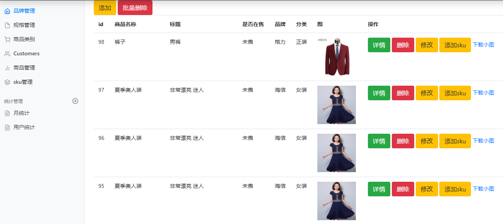
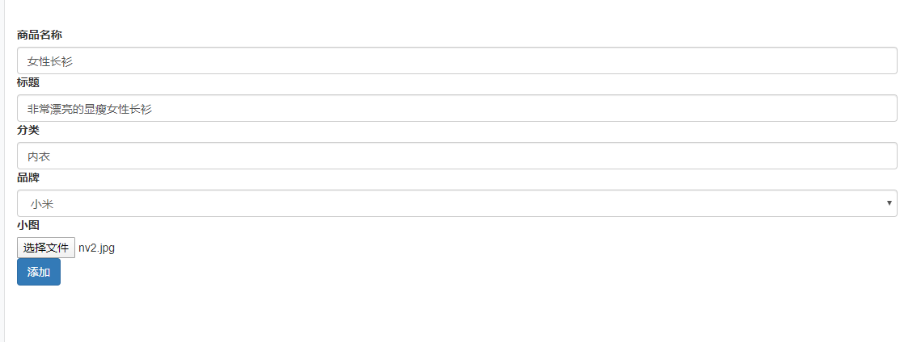
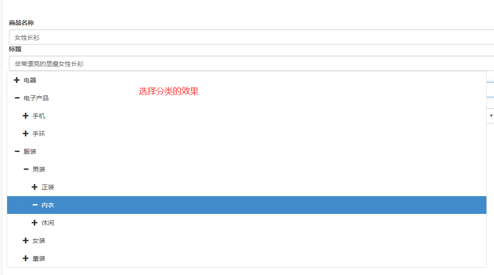

# 第十四单元 规格参数管理及spu管理

# 【授课重点】

1. 规格参数管理
2. spu管理

# 【考核要求】

1. 能够使用ajax方式进行图片上传
4. 能够独立完成规格参数管理功能
3. 能够独立完成spu管理功能

# 【教学内容】

## 14.1 规格参数管理

### 14.1.1 修改规格参数及选项

1. 控制层-SpecController

   ```
   @RequestMapping("/getSpecById")
   @ResponseBody
   public Spec getSpecById(Integer id) {
   	return specService.getSpecById(id);
   }
   ```

   ```
   @RequestMapping("/specAdd")
   @ResponseBody
   public boolean specAdd(Spec spec){
   	return specService.saveOrUpdateSpec(spec) > 0;
   }
   ```

   

2. 接口层-SpecService

   ```
   Spec getSpecById(Integer id);
   
   Integer saveOrUpdateSpec(Spec spec);
   ```

   

3. 服务层-SpecServiceImpl

   ```
   @Override
   public Spec getSpecById(Integer id) {
   	return specMapper.selectSpecById(id);
   }
   	
   @Override
   public Integer saveOrUpdateSpec(Spec spec) {
   	Integer count = null;
   	if (spec.getId() == null) {
   		//1.新增
   		//1.1.插入hg_spec
   		count = specMapper.insertSpec(spec);
   	} else {
   		//2.修改
   		//2.1.修改hg_spec
   		count = specMapper.updateSpec(spec);
   		//2.2.删除对应的hg_spec_option所有的记录
   		specMapper.deleteSpecOptionBySpecId(spec.getId());
   	}
   	//3.批量插入hg_spec_option
   	for (SpecOption specOption : spec.getOptions()) {
   		if (StringUtils.isNotBlank(specOption.getOptionName())) {
   			specOption.setSpecId(spec.getId());
   			specMapper.insertSpecOption(specOption);
   		}
   	}
   	return count;
   }
   ```

   

4. 数据访问层-SpecMapper

   ```
   Spec selectSpecById(Integer id);
   
   Integer updateSpec(Spec spec);
   
   ```

   ```
   <resultMap type="spec" id="specMap">
       <id column="id" property="id"/>
       <result column="spec_name" property="specName"/>
       <collection property="options" javaType="list" ofType="specOption">
      		<id column="option_id" property="id"/>
       	<result column="option_name" property="optionName"/>
       </collection>
   </resultMap>
   <select id="selectSpecById" resultMap="specMap">
       select s.id,s.spec_name,so.id option_id,so.option_name
       from hg_spec s left join hg_spec_option so
       on s.id=so.spec_id
       where s.id=#{id}
   </select>
   <update id="updateSpec">
   	update hg_spec set spec_name=#{specName} where id=#{id}
   </update>
   ```

   

### 14.1.2 删除规格参数及选项

1. 控制层-SpecController

   ```
   @RequestMapping("/specDelete")
   @ResponseBody
   public boolean specDelete(Integer[] ids){
   	return specService.deleteSpecByIds(ids) > 0;
   }
   ```

2. 接口层-SpecService

   ```
   Integer deleteSpecByIds(Integer[] ids);
   ```

3. 服务层-SpecServiceImpl

   ```
   @Override
   public Integer deleteSpecByIds(Integer[] ids) {
       Integer count = specMapper.deleteSpecByIds(ids);
       specMapper.deleteSpecOptionBySpecIds(ids);
       return count;
   }
   ```

   

4. 数据访问层-SpecMapper

   ```
   Integer deleteSpecByIds(Integer[] ids);
   
   void deleteSpecOptionBySpecIds(Integer[] specIds);
   
   ```

   ```
   <delete id="deleteSpecOptionBySpecIds">
   	delete from hg_spec_option where spec_id in
   	<foreach collection="array" item="specId" open="(" close=")" separator=",">
   		#{specId}
   	</foreach>
   </delete>
   <delete id="deleteSpecByIds">
       delete from hg_spec where id in
       <foreach collection="array" item="id" open="(" close=")" separator=",">
       	#{id}
       </foreach>
   </delete>
   ```

   

## 14.2 spu管理


### 14.2.1 spu页面

​	实现效果

​	 

1. 页面原型(商品分类树型列表)-spu_list.html

   ```
   <!DOCTYPE html>
   <html lang="zh-CN">
     <head>
       <meta charset="utf-8">
       <meta http-equiv="X-UA-Compatible" content="IE=edge">
       <meta name="viewport" content="width=device-width, initial-scale=1">
       <title>hgshop后台管理系统</title>
   
   	<!-- Bootstrap core CSS -->
       <link href="resource/css/bootstrap.css" rel="stylesheet"/>
       <link rel="stylesheet" href="resource/css/bootstrap-treeview.css" />
       <script type="text/javascript" src="resource/jquery/jquery-3.4.1.js"></script>
       <script type="text/javascript" src="resource/bootstrap/js/bootstrap.min.js"></script>
       <script type="text/javascript" src="resource/bootstrap/js/bootstrap-treeview.js" ></script>
       
       <script type="text/javascript">
   
     		$(function() {
     			$('.main').css('height',window.screen.height);
     			
           var defaultData = [
             {
               text: 'Parent 1',
               href: '#parent1',
               tags: ['4'],
               selectable: false,
               nodes: [
                 {
                   text: 'Child 1',
                   href: '#child1',
                   tags: ['2'],
                   selectable: false,
                   nodes: [
                     {
                       text: 'Grandchild 1',
                       href: '#Grandchild 1',
                       tags: ['0']
                     },
                     {
                       text: 'Grandchild 2',
                       href: '#grandchild2',
                       tags: ['0']
                     }
                   ]
                 },
                 {
                   text: 'Child 2',
                   href: '#child2',
                   tags: ['0']
                 }
               ]
             },
             {
               text: 'Parent 2',
               href: '#parent2',
               tags: ['0']
             },
             {
               text: 'Parent 3',
               href: '#parent3',
               tags: ['0']
             },
             {
               text: 'Parent 4',
               href: '#parent4',
               tags: ['0']	
             },
             {
               text: 'Parent 5',
               href: '#parent5'  ,
               tags: ['0']
             }
           ];
   
           $('#tree').treeview({
             data: defaultData,
   	        onNodeSelected: function(event, node) {
   						$('iframe').prop('src', 'spu_list1.html');						
   	        }
           });
   			});
   		</script>
     </head>
   
   <body>
   
   	<div class="container-fluid">
     		<div class="row">
   				<!-- 左边部分 -->
   				<div class="col-md-3" id="tree"></div>
   				<div class="col-md-9 main">
             <iframe width="100%" height="100%" name="mainFrame" src="welcome.html" frameborder="0"></iframe>
         	</div>
   			</div>
   		</div>
   
   	</div>
   
   
   </body>
   </html>
   ```

2. 页面原型(spu列表)-spu_list1.html

   ```
   <!DOCTYPE html>
   <html lang="zh-CN">
     <head>
       <meta charset="utf-8">
       <meta http-equiv="X-UA-Compatible" content="IE=edge">
       <meta name="viewport" content="width=device-width, initial-scale=1">
       <title>hgshop后台管理系统</title>
   
   	<!-- Bootstrap core CSS -->
       <link href="resource/css/bootstrap.css" rel="stylesheet"/>
       <link rel="stylesheet" href="resource/css/bootstrap-treeview.css" />
       <script type="text/javascript" src="resource/jquery/jquery-3.4.1.js"></script>
       <script type="text/javascript" src="resource/bootstrap/js/bootstrap.min.js"></script>
       <script type="text/javascript" src="resource/bootstrap/js/bootstrap-treeview.js" ></script>
       
       <script>
       	$(function(){
       		var defaultData = [
             {
               text: 'Parent 1',
               href: '#parent1',
               tags: ['4'],
               selectable: false,
               nodes: [
                 {
                   text: 'Child 1',
                   href: '#child1',
                   tags: ['2'],
                   selectable: false,
                   nodes: [
                     {
                       text: 'Grandchild 1',
                       href: '#Grandchild 1',
                       tags: ['0']
                     },
                     {
                       text: 'Grandchild 2',
                       href: '#grandchild2',
                       tags: ['0']
                     }
                   ]
                 },
                 {
                   text: 'Child 2',
                   href: '#child2',
                   tags: ['0']
                 }
               ]
             },
             {
               text: 'Parent 2',
               href: '#parent2',
               tags: ['0']
             },
             {
               text: 'Parent 3',
               href: '#parent3',
                tags: ['0']
             },
             {
               text: 'Parent 4',
               href: '#parent4',
               tags: ['0']	
             },
             {
               text: 'Parent 5',
               href: '#parent5'  ,
               tags: ['0']
             }
           ];
       		$("#addCategoryName").click(function() {
   					var options = {
   						levels : 1,
   						data : defaultData,
   						onNodeSelected : function(event, data) {
   							$("#addCategoryName").val(data.text);
   							$("#tree").hide();//选中树节点后隐藏树
   						}
   					};
   					$('#tree').treeview(options);
   					$('#tree').show()
   				});
       	})
       	
       </script>
     </head>
   
   <body>
   
   	<div class="container-fluid">
   					<div class="row">
   						<!-- 加入了列 填充整行 -->
   						<form class="col-sm-12" action="spuList" method="post">
   							<div class="form-group">
   								<label>商品名称</label> 
   								<input type="text" name="goodsName" class="form-control" placeholder="请输入品牌名称" value="">
   							</div>
   
   							<div class="form-group">
   								<label>商品副标题</label> 
   								<input type="text" name="caption" class="form-control" placeholder="请输入品牌的首字母" value="">
   							</div>
   							<!-- 隐藏分类的id值 -->
   							<input type="hidden" id="cid" name="categoryId" value=""/>
   							<button class="btn btn-success">搜索</button>
   						</form>
   					</div>
   
   					<!-- 外边距(下方) 10像素的大小 -->
   					<div class="row" style="margin-bottom: 10px;">
   						<!-- 右端对齐 -->
   						<div class="col-sm-12" align="right">
   							<input type="button" class="btn btn-danger"
   								onclick="deleteObjects()" value="批量删除" />
   							<button class="btn btn-primary btn-sm" onclick="preAddSpu()"
   								data-toggle="modal" data-target="#spuAddModal">添加商品</button>
   						</div>
   					</div>
   
   
   					<div class="row">
   						<table class="table table-striped">
   							<thead>
   								<tr>
   									<th scope="col"><input type="checkbox" id="cbk" />全选</th>
   									<th scope="col">序号</th>
   									<th scope="col">图标</th>
   									<th scope="col">商品名称</th>
   									<th scope="col">商品状态</th>
   									<th scope="col">商品品牌</th>
   									<th scope="col">商品分类</th>
   									<th scope="col">操作</th>
   								</tr>
   							</thead>
   							<tbody>
   									<tr>
   										<td scope="row">
   											<input type="checkbox" class="ck"	value=""/>
   										</td>
   										<td></td>
   										<td>
   											
   										</td>
   										<td></td>
   										<td></td>
   										<td></td>
   										<td></td>
   										<td></td>
   										<td>
   											<a href="javascript:void(0)" onclick="deleteObjectByIds()" class="btn btn-info">删除</a>
   											<button class="btn btn-info btn-sm" data-toggle="modal"
   												data-target="#spuEditModal"
   												onclick="updateSpu()">修改</button>
   											<button class="btn btn-primary btn-sm" data-toggle="modal"
   												data-target="#spuDetailModal"
   												onclick="detailSpu()">详情</button></td>
   									</tr>
   							</tbody>
   						</table>
   
   						<nav>
   						  <ul class="pagination">
   						    <li>
   						      <a href="#">
   						        <span aria-hidden="true">上一页</span>
   						      </a>
   						    </li>
   						    <li><a href="#">1</a></li>
   						    <li><a href="#">2</a></li>
   						    <li>
   						      <a href="#" aria-label="Next">
   						        <span aria-hidden="true">下一页</span>
   						      </a>
   						    </li>
   						  </ul>
   						</nav>
   					</div>
   
   	</div>
   
   
   	<!-- ////////////////写入添加模态框 //////////////////////////////-->
   	<div class="modal fade" id="spuAddModal" tabindex="-1" role="dialog"
   		aria-labelledby="myModalLabel" aria-hidden="true">
   
   		<div class="modal-dialog">
   			<div class="modal-content">
   				<div class="modal-header">
   					<!-- 关闭的x效果 -->
   					<button type="button" class="close" data-dismiss="modal"
   						aria-hidden="true">&times;</button>
   
   					<!-- 模态框的标题 -->
   					<h4 class="modal-title" id="spuAddModalLabel">添加商品操作</h4>
   				</div>
   				<div class="modal-body">
   					<form id="addFrm" enctype="multipart/form-data">
   						<div class="form-group row">
   
   							<label for="addGoodsName"
   								class="col-sm-3 col-form-label col-form-label-sm">商品名称</label>
   							<div class="col-sm-9">
   								<input type="text" class="form-control form-control-sm"
   									id="addGoodsName" name="goodsName" placeholder="请输入商品名称">
   							</div>
   						</div>
   
   						<div class="form-group row">
   							<label for="addCaption" class="col-sm-3 col-form-label">商品副标题</label>
   							<div class="col-sm-9">
   								<input type="text" class="form-control" id="addCaption"
   									name="caption" placeholder="请输入商品的副标题">
   							</div>
   						</div>
   
   						<div class="form-group row">
   							<label for="addismarketTable" class="col-sm-3 col-form-label">商品状态</label>
   							<div class="col-sm-9">
   								<select class="form-control" name="ismarketTable">
   									<option value="0">上架</option>
   									<option value="1">下架</option>
   								</select>
   							</div>
   						</div>
   
   						<div class="form-group row">
   							<label for="addBrand" class="col-sm-3 col-form-label">商品品牌</label>
   							<div class="col-sm-9">
   								<select class="form-control" id="addBrand" name="brand.id">
   									<option value="0">请选择品牌</option>
   								</select>
   							</div>
   						</div>
   
   						<div class="form-group row">
   							<label for="addCategory" class="col-sm-3 col-form-label">商品分类</label>
   							<!-- 左边部分 -->
   							<div class="col-sm-9">
   								<input type="hidden" class="form-control" id="addCategory"
   									name="categoryId"> <input
   									type="text" class="form-control" id="addCategoryName"
   									placeholder="选择商品分类">
   								<div id="tree" style="display: none; position:absolute; z-index:1010; background-color:white; "></div>
   							</div>
   						</div>
   
   
   						<div class="form-group row">
   							<label for="addsmallPic" class="col-sm-3 col-form-label">商品图标</label>
   							<div class="col-sm-9">
   								<input type="file" class="form-control" id="addsmallPic"
   									name="file" />
   							</div>
   						</div>
   
   
   					</form>
   				</div>
   				<div class="modal-footer">
   					<button type="button" class="btn btn-default" data-dismiss="modal">关闭</button>
   					<button type="button" class="btn btn-primary" onclick="addObject()">添加</button>
   				</div>
   			</div>
   			<!-- /.modal-content -->
   		</div>
   		<!-- /.modal -->
   	</div>
   	<!-- ///////////////////添加模态框结束//////////////////////////// -->
   
   
   </body>
   </html>
   ```

3. 项目引入页面

   3.1 spu_list.jsp

   ```
   <%@ page language="java" contentType="text/html; charset=UTF-8"
       pageEncoding="UTF-8"%>
   <%@taglib prefix="c" uri="http://java.sun.com/jsp/jstl/core" %>
   <!DOCTYPE html>
   <html lang="zh-CN">
     <head>
     	<base href="${pageContext.request.contextPath }/">
   <meta charset="utf-8">
   <meta http-equiv="X-UA-Compatible" content="IE=edge">
   <meta name="viewport" content="width=device-width, initial-scale=1">
   <title>hgshop后台管理系统</title>
   
   <!-- Bootstrap core CSS -->
   <link href="resource/css/bootstrap.css" rel="stylesheet" />
   <link rel="stylesheet" href="resource/css/bootstrap-treeview.css" />
   <script type="text/javascript" src="resource/jquery/jquery-3.4.1.js"></script>
   <script type="text/javascript"
   	src="resource/bootstrap/js/bootstrap.min.js"></script>
   <script type="text/javascript"
   	src="resource/bootstrap/js/bootstrap-treeview.js"></script>
   
   <script type="text/javascript">
   	$(function() {
   		$('.main').css('height', window.screen.height);
   		$.post('getAllCategories1', {}, function(data) {
   			$('#tree').treeview({
   				data : data,
   				onNodeSelected : function(event, node) {
   					$('iframe').prop('src', 'spuList?categoryId=' + node.id);
   				}
   			});
   		});
   	});
   </script>
   </head>
   
   <body>
   
   	<div class="container-fluid">
   		<div class="row">
   			<!-- 左边部分 -->
   			<div class="col-md-3" id="tree"></div>
   			<div class="col-md-9 main">
   				<iframe width="100%" height="100%" name="mainFrame"
   					src="" frameborder="0"></iframe>
   			</div>
   		</div>
   	</div>
   
   
   
   </body>
   </html>
   ```

   3.2 spu_list_1.jsp

   ```
   <%@ page language="java" contentType="text/html; charset=UTF-8"
       pageEncoding="UTF-8"%>
   <%@taglib prefix="c" uri="http://java.sun.com/jsp/jstl/core" %>
   <!DOCTYPE html>
   <html lang="zh-CN">
     <head>
     	<base href="${pageContext.request.contextPath }/">
     <head>
       <meta charset="utf-8">
       <meta http-equiv="X-UA-Compatible" content="IE=edge">
       <meta name="viewport" content="width=device-width, initial-scale=1">
       <title>hgshop后台管理系统</title>
   
   	<!-- Bootstrap core CSS -->
       <link href="resource/css/bootstrap.css" rel="stylesheet"/>
       <link rel="stylesheet" href="resource/css/bootstrap-treeview.css" />
       <script type="text/javascript" src="resource/jquery/jquery-3.4.1.js"></script>
       <script type="text/javascript" src="resource/bootstrap/js/bootstrap.min.js"></script>
       <script type="text/javascript" src="resource/bootstrap/js/bootstrap-treeview.js" ></script>
       
       <script>
       	$(function(){
       		$("#categoryName").click(function() {
       			$.post('getAllCategories1', {}, function(data) {
       				var options = {
      						levels : 2,
      						data : data,
      						onNodeSelected : function(event, data) {
      							$("#categoryId").val(data.id);
      							$("#categoryName").val(data.text);
      							$("#tree").hide();//选中树节点后隐藏树
      						}
      					};
       				$('#tree').treeview(options);
   					$('#tree').show();
       			});
   			});
       		$("#categoryName2").click(function() {
       			$.post('getAllCategories1', {}, function(data) {
       				var options = {
      						levels : 2,
      						data : data,
      						onNodeSelected : function(event, data) {
      							$("#categoryId2").val(data.id);
      							$("#categoryName2").val(data.text);
      							$("#tree2").hide();//选中树节点后隐藏树
      						}
      					};
       				$('#tree2').treeview(options);
   					$('#tree2').show();
       			});
   			});
       	});
       	//【新增商品】按钮或【修改】按钮点击时调用
       	function preAddSpu(){
   			//获取品牌列表
       		$.post("getAllBrands", {},function(data) {
       			//遍历数据
       			$('#brandId').html("<option value=''>--请选择--</option>");
                  	for(var i in data){
                       $('#brandId').append("<option value='"+data[i].id+"'>"+data[i].name+"</option>");
                   }
   			},"json");
          }
       	function addSpu(flag){
       		var obj1,obj2;
       		if(!flag){
       			//添加
       			obj1=$('#modalForm')[0];
       			obj2=$('#myModal');
       		}else{
       			//修改
       			obj1=$('#modalForm2')[0];
       			obj2=$('#myModal2');
       		}
       		var formData = new FormData(obj1);
       		$.ajax({
                   type:'post',
                   data:formData,
                   url:'spuAdd',
   				processData : false, // 告诉jQuery不要去处理发送的数据
   				contentType : false, // 告诉jQuery不要去设置Content-Type请求头
   				dataType:'json',
   				success:function(data){
                   	if(data){
                   		//关闭模态框
                           obj2.modal('hide');
                           window.location.reload();
                          }else{
                           alert("商品操作失败");
                          }
   	 				 }
   			   });
       	}
       	//在线预览图片
       	function show(obj,flag){
       		var obj1;
       		if(!flag){
       			obj1=$("#smallPic12");
       		}else{
       			obj1=$("#smallPic22");
       		}
       		var rd = new FileReader();//创建文件读取对象
               var files = obj.files[0];//获取file组件中的文件
               rd.readAsDataURL(files);//文件读取装换为base64类型
               rd.onloadend = function(e) {
                   //加载完毕之后获取结果赋值给img
                   obj1.prop('src', this.result);
                   obj1.show();
               }
       	}
       	function getSpuById(id){
       		$.post("getAllBrands", {},function(data) {
       			//遍历数据
       			$('#brandId2').html("<option value=''>--请选择--</option>");
                  	for(var i in data){
                       $('#brandId2').append("<option value='"+data[i].id+"'>"+data[i].name+"</option>");
                   }
   			},"json");
       		
       		
       		$.post('getSpuById',{id:id},function(data){
       				$("#smallPic22").prop("src", "pic/" + data.smallPic);
           			$("#smallPic22").show();
           			$('#id2').val(data.id);
           			$('#smallPic20').val(data.smallPic);
           			$('#goodsName2').val(data.goodsName);
           			$('#caption2').val(data.caption);
           			$('#isMarketable2').val(data.isMarketable);
           			$('#brandId2').val(data.brandId);
           			$('#brandId2 option[value=' + data.brandId + ']').prop('selected',true);
           			$('#categoryId2').val(data.categoryId);
           			$('#categoryName2').val(data.cName);
       		},'json');
       	}
       	function viewById(id){
       		$.post('getSpuById',{id:id},function(data){
       			$("#smallPic32").prop("src", "pic/" + data.smallPic);
       			$("#smallPic32").show();
       			$('#goodsName3').text(data.goodsName);
       			$('#caption3').text(data.caption);
       			$('#isMarketable3').text(data.isMarketable==0 ? '上架' : '下架');
       			$('#brandName3').text(data.bName);
       			$('#categoryName3').text(data.cName);
       		},'json');
       	}
       	$(function(){
       		$('#cbk').on('click',function(){
       			$('.ck').prop('checked', this.checked);
       		});
       	})
       	function deleteSpu(ids){
       		if(!ids){
       			ids = $('.ck:checked').map(function(){
       				return this.value;
       			}).get().join(',');
       		}
       		if(ids!=''){
       			if(confirm('确定要删除选中的数据吗?')){
       				$.post('spuDelete',{ids:ids},function(data){
       	    			if(data){
       	    				window.location.reload();
       	    			}else{
       	    				alert('删除spu失败');
       	    			}
       	    		},'json');
       			}
       		}else{
       			alert('请选中要删除的数据');
       		}
       	}
       	
       </script>
     </head>
   
   <body>
   
   	<div class="container-fluid">
   					<div class="row">
   						<!-- 加入了列 填充整行 -->
   						<form class="col-sm-12" action="spuList" method="post">
   							<div class="form-group">
   								<label>商品名称</label> 
   								<input type="text" name="goodsName" class="form-control" placeholder="请输入品牌名称" value="${spu.goodsName}">
   							</div>
   
   							<div class="form-group">
   								<label>商品副标题</label> 
   								<input type="text" name="caption" class="form-control" placeholder="请输入商品副标题" value="${spu.caption}">
   							</div>
   							<!-- 隐藏分类的id值 -->
   							<input type="hidden" id="cid" name="categoryId" value="${spu.categoryId}"/>
   							<button class="btn btn-success" type="submit">搜索</button>
   						</form>
   					</div>
   
   					<!-- 外边距(下方) 10像素的大小 -->
   					<div class="row" style="margin-bottom: 10px;">
   						<!-- 右端对齐 -->
   						<div class="col-sm-12" align="right">
   							<input type="button" class="btn btn-danger"
   								onclick="deleteSpu()" value="批量删除" />
   							<button class="btn btn-primary btn-sm" onclick="preAddSpu()"
   								data-toggle="modal" data-target="#myModal">添加商品</button>
   						</div>
   					</div>
   
   
   					<div class="row">
   						<table class="table table-striped">
   							<thead>
   								<tr>
   									<th scope="col"><input type="checkbox" id="cbk" />全选</th>
   									<th scope="col">序号</th>
   									<th scope="col">图标</th>
   									<th scope="col">商品名称</th>
   									<th scope="col">商品状态</th>
   									<th scope="col">商品品牌</th>
   									<th scope="col">商品分类</th>
   									<th scope="col">操作</th>
   								</tr>
   							</thead>
   							<tbody>
   								<c:forEach items="${pageInfo.list}" var="spu" varStatus="index">
   									<tr>
   										<td scope="row">
   											<input type="checkbox" class="ck" value="${spu.id}"/>
   										</td>
   										<td>${index.count}</td>
   										<td class="col-sm-2">
   											
   										</td>
   										<td class="col-sm-2">${spu.goodsName}</td>
   										<td>${spu.isMarketable==0 ? '上架' : '下架'}</td>
   										<td>${spu.bName}</td>
   										<td>${spu.cName}</td>
   										<td>
   											<a href="javascript:void(0)" onclick="deleteSpu(${spu.id})" class="btn btn-info">删除</a>
   											<button class="btn btn-info btn-sm" data-toggle="modal"
   												data-target="#myModal2"
   												onclick="getSpuById(${spu.id})">修改</button>
   											<button class="btn btn-primary btn-sm" data-toggle="modal"
   												data-target="#myModal3"
   												onclick="viewById(${spu.id})">详情</button></td>
   									</tr>
   								</c:forEach>
   							</tbody>
   						</table>
   
   						<nav>
   				  <ul class="pagination">
   				  	<c:if test="${pageInfo.hasPreviousPage}">
   				    <li>
   				      <a href="spuList?pageNum=${pageInfo.prePage}&goodsName=${spu.goodsName}&caption=${spu.caption}&categoryId=${spu.categoryId}">
   				        <span aria-hidden="true">上一页</span>
   				      </a>
   				    </li>
   				    </c:if>
   				    <c:forEach items="${pageInfo.navigatepageNums}" var="pageNum">
   				    	<c:if test="${pageInfo.pageNum==pageNum}">
   				    	<li class="active"><a href="spuList?pageNum=${pageNum}&goodsName=${spu.goodsName}&caption=${spu.caption}&categoryId=${spu.categoryId}">${pageNum}</a></li>
   				    	</c:if>
   				    	<c:if test="${pageInfo.pageNum!=pageNum}">
   				    	<li><a href="spuList?pageNum=${pageNum}&goodsName=${spu.goodsName}&caption=${spu.caption}&categoryId=${spu.categoryId}">${pageNum}</a></li>
   				    	</c:if>
   				    </c:forEach>
   				    <c:if test="${pageInfo.hasNextPage}">
   				    <li>
   				      <a href="spuList?pageNum=${pageInfo.nextPage}&goodsName=${spu.goodsName}&caption=${spu.caption}&categoryId=${spu.categoryId}" aria-label="Next">
   				        <span aria-hidden="true">下一页</span>
   				      </a>
   				    </li>
   				    </c:if>
   				  </ul>
   				</nav>
   					</div>
   
   	</div>
   
   
   	<!-- ////////////////添加模态框 //////////////////////////////-->
   	<div class="modal fade" id="myModal" tabindex="-1" role="dialog"
   		aria-labelledby="myModalLabel" aria-hidden="true">
   
   		<div class="modal-dialog">
   			<div class="modal-content">
   				<div class="modal-header">
   					<!-- 关闭的x效果 -->
   					<button type="button" class="close" data-dismiss="modal"
   						aria-hidden="true">&times;</button>
   
   					<!-- 模态框的标题 -->
   					<h4 class="modal-title" id="spuAddModalLabel">添加商品操作</h4>
   				</div>
   				<div class="modal-body">
   					<form id="modalForm" enctype="multipart/form-data" action="javascript:void(0)">
   						<div class="form-group row">
   							<label for="goodsName"
   								class="col-sm-3 col-form-label col-form-label-sm">商品名称</label>
   							<div class="col-sm-9">
   								<input type="text" class="form-control form-control-sm"
   									id="goodsName" name="goodsName" placeholder="请输入商品名称">
   							</div>
   						</div>
   
   						<div class="form-group row">
   							<label for="caption" class="col-sm-3 col-form-label">商品副标题</label>
   							<div class="col-sm-9">
   								<input type="text" class="form-control" id="caption"
   									name="caption" placeholder="请输入商品的副标题">
   							</div>
   						</div>
   
   						<div class="form-group row">
   							<label for="isMarketable" class="col-sm-3 col-form-label">商品状态</label>
   							<div class="col-sm-9">
   								<select class="form-control" id="isMarketable" name="isMarketable">
   									<option value="">请选择</option>
   									<option value="0">上架</option>
   									<option value="1">下架</option>
   								</select>
   							</div>
   						</div>
   
   						<div class="form-group row">
   							<label for="brandId" class="col-sm-3 col-form-label">商品品牌</label>
   							<div class="col-sm-9">
   								<select class="form-control" id="brandId" name="brandId">
   									<option value="">请选择品牌</option>
   								</select>
   							</div>
   						</div>
   
   						<div class="form-group row">
   							<label for="categoryName" class="col-sm-3 col-form-label">商品分类</label>
   							<!-- 左边部分 -->
   							<div class="col-sm-9">
   								<input type="hidden" class="form-control" id="categoryId" name="categoryId"> 
   								<input type="text" class="form-control" id="categoryName" placeholder="选择商品分类">
   								<div id="tree" style="display: none; position:absolute; z-index:1010; background-color:white; "></div>
   							</div>
   						</div>
   
   
   						<div class="form-group row">
   							<label for="smallPic1" class="col-sm-3 col-form-label">商品图标</label>
   							<div class="col-sm-9">
   								<input type="file" class="form-control" id="smallPic11"
   									name="file" onchange="show(this)"/>
   								
   							</div>
   						</div>
   
   
   					</form>
   				</div>
   				<div class="modal-footer">
   					<button type="button" class="btn btn-default" data-dismiss="modal">关闭</button>
   					<button type="button" class="btn btn-primary" onclick="addSpu()">添加</button>
   				</div>
   			</div>
   			<!-- /.modal-content -->
   		</div>
   		<!-- /.modal -->
   	</div>
   	<!-- ///////////////////添加模态框结束//////////////////////////// -->
   
   	<!-- ////////////////修改模态框 //////////////////////////////-->
   	<div class="modal fade" id="myModal2" tabindex="-1" role="dialog"
   		aria-labelledby="myModalLabel" aria-hidden="true">
   
   		<div class="modal-dialog">
   			<div class="modal-content">
   				<div class="modal-header">
   					<!-- 关闭的x效果 -->
   					<button type="button" class="close" data-dismiss="modal"
   						aria-hidden="true">&times;</button>
   
   					<!-- 模态框的标题 -->
   					<h4 class="modal-title">修改商品</h4>
   				</div>
   				<div class="modal-body">
   					<form id="modalForm2" enctype="multipart/form-data" action="javascript:void(0)">
   						<input type="hidden" name="id" id="id2"/>
   						<input type="hidden" name="smallPic" id="smallPic20"/>
   						<div class="form-group row">
   							<label for="goodsName2"
   								class="col-sm-3 col-form-label col-form-label-sm">商品名称</label>
   							<div class="col-sm-9">
   								<input type="text" class="form-control form-control-sm"
   									id="goodsName2" name="goodsName" placeholder="请输入商品名称">
   							</div>
   						</div>
   
   						<div class="form-group row">
   							<label for="caption2" class="col-sm-3 col-form-label">商品副标题</label>
   							<div class="col-sm-9">
   								<input type="text" class="form-control" id="caption2"
   									name="caption" placeholder="请输入商品的副标题">
   							</div>
   						</div>
   
   						<div class="form-group row">
   							<label for="isMarketable2" class="col-sm-3 col-form-label">商品状态</label>
   							<div class="col-sm-9">
   								<select class="form-control" id="isMarketable2" name="isMarketable">
   									<option value="">请选择</option>
   									<option value="0">上架</option>
   									<option value="1">下架</option>
   								</select>
   							</div>
   						</div>
   
   						<div class="form-group row">
   							<label for="brandId2" class="col-sm-3 col-form-label">商品品牌</label>
   							<div class="col-sm-9">
   								<select class="form-control" id="brandId2" name="brandId">
   									<option value="">请选择品牌</option>
   								</select>
   							</div>
   						</div>
   
   						<div class="form-group row">
   							<label for="categoryName2" class="col-sm-3 col-form-label">商品分类</label>
   							<!-- 左边部分 -->
   							<div class="col-sm-9">
   								<input type="hidden" class="form-control" id="categoryId2" name="categoryId"> 
   								<input type="text" class="form-control" id="categoryName2" placeholder="选择商品分类">
   								<div id="tree2" style="display: none; position:absolute; z-index:1010; background-color:white; "></div>
   							</div>
   						</div>
   
   
   						<div class="form-group row">
   							<label for="smallPic21" class="col-sm-3 col-form-label">商品图标</label>
   							<div class="col-sm-9">
   								<input type="file" class="form-control" id="smallPic21"
   									name="file" onchange="show(this,2)"/>
   								
   							</div>
   						</div>
   					</form>
   				</div>
   				<div class="modal-footer">
   					<button type="button" class="btn btn-default" data-dismiss="modal">关闭</button>
   					<button type="button" class="btn btn-primary" onclick="addSpu(2)">编辑</button>
   				</div>
   			</div>
   			<!-- /.modal-content -->
   		</div>
   		<!-- /.modal -->
   	</div>
   	<!-- ///////////////////修改模态框结束//////////////////////////// -->
   	
   	<!-- ////////////////查看模态框 //////////////////////////////-->
   	<div class="modal fade" id="myModal3" tabindex="-1" role="dialog"
   		aria-labelledby="myModalLabel" aria-hidden="true">
   
   		<div class="modal-dialog">
   			<div class="modal-content">
   				<div class="modal-header">
   					<!-- 关闭的x效果 -->
   					<button type="button" class="close" data-dismiss="modal"
   						aria-hidden="true">&times;</button>
   
   					<!-- 模态框的标题 -->
   					<h4 class="modal-title">查看商品</h4>
   				</div>
   				<div class="modal-body">
   					<form id="modalForm3" action="javascript:void(0)">
   						<div class="form-group row">
   							<label for="goodsName3"
   								class="col-sm-3 col-form-label col-form-label-sm">商品名称</label>
   							<div class="col-sm-9">
   								<span id="goodsName3"></span>
   							</div>
   						</div>
   
   						<div class="form-group row">
   							<label for="caption3" class="col-sm-3 col-form-label">商品副标题</label>
   							<div class="col-sm-9">
   								<span id="caption3"></span>
   							</div>
   						</div>
   
   						<div class="form-group row">
   							<label for="isMarketable3" class="col-sm-3 col-form-label">商品状态</label>
   							<div class="col-sm-9">
   								<span id="isMarketable3"></span>
   							</div>
   						</div>
   
   						<div class="form-group row">
   							<label for="brandName3" class="col-sm-3 col-form-label">商品品牌</label>
   							<div class="col-sm-9">
   								<span id="brandName3"></span>
   							</div>
   						</div>
   
   						<div class="form-group row">
   							<label for="categoryName3" class="col-sm-3 col-form-label">商品分类</label>
   							<!-- 左边部分 -->
   							<div class="col-sm-9">
   								<span id="categoryName3"></span>
   							</div>
   						</div>
   						<div class="form-group row">
   							<label for="smallPic32" class="col-sm-3 col-form-label">商品图标</label>
   							<div class="col-sm-9">
   								
   							</div>
   						</div>
   					</form>
   				</div>
   				<div class="modal-footer">
   					<button type="button" class="btn btn-default" data-dismiss="modal">关闭</button>
   				</div>
   			</div>
   			<!-- /.modal-content -->
   		</div>
   		<!-- /.modal -->
   	</div>
   	<!-- ///////////////////查看模态框结束//////////////////////////// -->
   	
   </body>
   </html>
   ```

4. 禁用bootstrap-treeview节点选中状态

   4.1 在hgshop-goods-interface工程的Category实体类中添加selectable属性，用于控制bootstrap-treeview节点选中

   ```
   //用于在使用treeview时,控制一级二级不能选中
   private boolean selectable = true;
   
   public boolean isSelectable() {
   	return selectable;
   }
   public void setSelectable(boolean selectable) {
   	this.selectable = selectable;
   }
   @Override
   public String toString() {
   	return "Category [id=" + id + ", name=" + name + ", parentId=" + parentId + ", 		childs=" + childs
   	+ ", parentName=" + parentName + ", selectable=" + selectable + "]";
   }
   ```

   4.2 在hgshop-manage工程的CategoryController类中添加处理器，用来控制一级二级节点不允许选中

   ```
   /**
    * 用于在spu管理中，控制一级二级分类不能选中
    * @return
    */
   @RequestMapping("/getAllCategories1")
   @ResponseBody
   public List<Category> getAllCategories1(){
       List<Category> list = categoryService.getAllCategories();
       //jdk8写法
       list.forEach(c1 -> {
           c1.setSelectable(false);
           c1.getChilds().forEach(c2 -> c2.setSelectable(false));
   	});
   	//jdk7写法
   	//for (Category c1 : list) {
   		//c1.setSelectable(false);
   		//List<Category> c2s = c1.getChilds();
   		//for (Category c2 : c2s) {
   			//c2.setSelectable(false);
   		//}
   	//}
   	return list;
   }
   ```

5. 图片预览与ajax图片上传

   5.1 图片预览

   【添加】和【修改】模态框中的【上传文件】按钮绑定onchange="show(this)"，用来图片预览。

   ​	

   ```
   //在线预览图片
   function show(obj,flag){
       var obj1;
       if(!flag){
       	obj1=$("#smallPic12");
       }else{
       	obj1=$("#smallPic22");
       }
       var rd = new FileReader();//创建文件读取对象
       var files = obj.files[0];//获取file组件中的文件
       rd.readAsDataURL(files);//文件读取装换为base64类型
       rd.onloadend = function(e) {
       	//加载完毕之后获取结果赋值给img
       	obj1.prop('src', this.result);
       	obj1.show();
       }
   }
   ```

   5.2 ajax上传图片

   在【添加】和【修改】模态框中执行【添加】和【编辑】按钮时，需要进行上传图片的处理。

   使用ajax上传图片时，需要有几点进行控制：

   1. 使用js的FormData对象传递表单数据。

   2. ajax选项格式中需添加processData : false和contentType : false分别用来【告诉jQuery不要去处理发送的数据】和【告诉jQuery不要去设置Content-Type请求头】

      ```
      function addSpu(flag){
      	var obj1,obj2;
          if(!flag){
              //添加
              obj1=$('#modalForm')[0];
              obj2=$('#myModal');
          }else{
              //修改
              obj1=$('#modalForm2')[0];
              obj2=$('#myModal2');
          }
          var formData = new FormData(obj1);
          $.ajax({
              type:'post',
              data:formData,
              url:'spuAdd',
              processData : false, // 告诉jQuery不要去处理发送的数据
              contentType : false, // 告诉jQuery不要去设置Content-Type请求头
              dataType:'json',
              success:function(data){
              	if(data){
                      //关闭模态框
                      obj2.modal('hide');
                      window.location.reload();
              	}else{
              		alert("商品操作失败");
              	}
              }
          });
      }
      ```

      

### 14.2.2 添加spu

​	


 


1. 控制层-SpuController

   1.1 因为需要上传图片，所以需在spring-mvc.xml中配置文件上传解析器

   ```
    <!-- 文件上传的处理类 -->
   <bean id="multipartResolver"
   		class="org.springframework.web.multipart.commons.CommonsMultipartResolver"></bean>
   ```

   1.2 上传图片处理及添加spu

   ```
   @RequestMapping("/spuAdd")
   @ResponseBody
   public boolean spuAdd(Spu spu, MultipartFile file) throws IllegalStateException, IOException {
       //1.如果有图片，就上传图片；如果没有，就跳过
       String fileName = file.getOriginalFilename();
       if (StringUtils.isNotBlank(fileName)) {
           //1.1.生成存放图片的路径
           //G://pic
           //G://pic/20200111
           //G://pic/20200112
           String date = new SimpleDateFormat("yyyyMMdd").format(new Date());
           fileName = date + "/" + fileName;
           //File destFile = new File("G://pic"+File.separator+date, fileName);
           File destFile = new File("G://pic", fileName);
   
           if (!destFile.getParentFile().exists()) {
           	destFile.getParentFile().mkdirs();
           }
           //1.2.上传图片
           file.transferTo(destFile);
           //1.3.如果是修改操作，并且替换成了新图片，需要删除之前的旧图片
           if (StringUtils.isNotBlank(spu.getSmallPic())) {
               //不好使,试试
               //new File("G://pic/" + spu.getSmallPic()).delete();
               //jetty:run 报错!
               //tomcat7:run 报错! 本地仓库的jar包替换一下
       		FileUtils.forceDelete(new File("G://pic/" + spu.getSmallPic()));
   		}
   		//1.4.给spu的smallPic属性赋值
   		spu.setSmallPic(fileName);
   	}
   	//2.保持spu信息
   	return spuService.saveOrUpdateSpu(spu) > 0;
   }
   ```

2. 接口层-SpuService

   ```
   Integer saveOrUpdateSpu(Spu spu);
   ```

3. 服务层-SpuServiceImpl

   ```
   @Override
   public Integer saveOrUpdateSpu(Spu spu) {
       Integer count = null;
       if (spu.getId() == null) {
           //新增
           count = spuMapper.insertSpu(spu);
       } else {
           //修改
           count = spuMapper.updateSpu(spu);
       }
       return count;
   }
   ```

4. 数据访问层-SpuMapper

   ```
   Integer insertSpu(Spu spu);
   ```

   ```
   <insert id="insertSpu" useGeneratedKeys="true" keyProperty="id">
   insert into hg_spu(goods_name,is_marketable,brand_id,caption,category_id,small_pic) 
   values (#{goodsName},#{isMarketable},#{brandId},#{caption},#{categoryId},#{smallPic})
   </insert>
   ```

### 14.2.3 spu列表

1. 控制层-SpuController

   ```
   @RequestMapping("/spuList")
   public String spuList(Model model, Integer categoryId, Spu spu, @RequestParam(defaultValue="1")Integer pageNum, @RequestParam(defaultValue="2")Integer pageSize) {
       //1.设置spu中categoryId属性
       if (categoryId != null) {
           spu.setCategoryId(categoryId);
       }
       //2.查询列表
       PageInfo<Spu> pageInfo = spuService.list(spu, pageNum, pageSize);
       model.addAttribute("pageInfo", pageInfo);
       spu.setCategoryId(categoryId);
       model.addAttribute("spu", spu);
       return "spu_list1";
   }
   ```

2. 接口层-SpuService

   ```
   PageInfo<Spu> list(Spu spu, Integer pageNum, Integer pageSize);
   ```

3. 服务层-SpuServiceImpl

   ```
   @Override
   public PageInfo<Spu> list(Spu spu, Integer pageNum, Integer pageSize) {
       PageHelper.startPage(pageNum, pageSize);
       List<Spu> list = spuMapper.selectSpuList(spu);
       PageInfo<Spu> pageInfo = new PageInfo<Spu>(list);
       return pageInfo;
   }
   ```

4. 数据访问层-SpuMapper

   ```
   List<Spu> selectSpuList(Spu spu);
   ```

   ```
   <select id="selectSpuList" resultType="spu">
       select s.id,s.goods_name,s.is_marketable,b.name b_name,c.name c_name,s.small_pic
       from hg_spu s join hg_brand b on s.brand_id=b.id join hg_category c on   
       s.category_id=c.id
       <where>
           <if test="categoryId!=null">
          		and s.category_id=#{categoryId}
           </if>
           <if test="goodsName!=null and goodsName!=''">
           	and s.goods_name like concat('%',#{goodsName},'%')
           </if>
           <if test="caption!=null and caption!=''">
           	and s.caption like concat('%',#{caption},'%')
           </if>
       </where>		
   </select>
   ```

### 14.2.4 修改spu

1. 控制层-SpuController

   ```
   @RequestMapping("/getSpuById")
   @ResponseBody
   public Spu getSpuById(Integer id) {
   	return spuService.getSpuById(id);
   }
   
   @RequestMapping("/spuAdd")
   @ResponseBody
   public boolean spuAdd(Spu spu, MultipartFile file) throws IllegalStateException, IOException {
       //1.如果有图片，就上传图片；如果没有，就跳过
       String fileName = file.getOriginalFilename();
       if (StringUtils.isNotBlank(fileName)) {
           //1.1.生成存放图片的路径
           //G://pic
           //G://pic/20200111
           //G://pic/20200112
           String date = new SimpleDateFormat("yyyyMMdd").format(new Date());
           fileName = date + "/" + fileName;
           //File destFile = new File("G://pic"+File.separator+date, fileName);
           File destFile = new File("G://pic", fileName);
   
           if (!destFile.getParentFile().exists()) {
           	destFile.getParentFile().mkdirs();
           }
           //1.2.上传图片
           file.transferTo(destFile);
           //1.3.如果是修改操作，并且替换成了新图片，需要删除之前的旧图片
           if (StringUtils.isNotBlank(spu.getSmallPic())) {
               //不好使,试试
               //new File("G://pic/" + spu.getSmallPic()).delete();
               //jetty:run 报错!
               //tomcat7:run 报错! 本地仓库的jar包替换一下
   			FileUtils.forceDelete(new File("G://pic/" + spu.getSmallPic()));
   		}
   		//1.4.给spu的smallPic属性赋值
   		spu.setSmallPic(fileName);
   	}
   	//2.保持spu信息
   	return spuService.saveOrUpdateSpu(spu) > 0;
   }
   ```

2. 接口层-SpuService

   ```
   Spu getSpuById(Integer id);
   Integer saveOrUpdateSpu(Spu spu);
   ```

3. 服务层-SpuServiceImpl

   ```
   @Override
   public Spu getSpuById(Integer id) {
   	return spuMapper.selectSpuById(id);
   }
   
   @Override
   public Integer saveOrUpdateSpu(Spu spu) {
       Integer count = null;
   	if (spu.getId() == null) {
           //新增
           count = spuMapper.insertSpu(spu);
   	} else {
   		//修改
   		count = spuMapper.updateSpu(spu);
   	}
   	return count;
   }
   ```

4. 数据访问层-SpuMapper

   ```
   Spu selectSpuById(Integer id);
   Integer updateSpu(Spu spu);
   ```

   ```
   <select id="selectSpuById" resultType="spu">
   select s.*,c.name cName, b.name bName from hg_spu s join hg_category c on s.category_id=c.id join hg_brand b on s.brand_id=b.id where s.id=#{id}
   </select>
   
   <update id="updateSpu">
       update hg_spu set 
       <if test="goodsName!=null and goodsName!=''">
      		goods_name=#{goodsName},
       </if>
       <if test="caption!=null and caption!=''">
       	caption=#{caption},
       </if>
       <if test="brandId!=null">
       	brand_id=#{brandId},
       </if>
       <if test="categoryId!=null">
       	category_id=#{categoryId},
       </if>
       <if test="smallPic!=null and smallPic!=''">
       	small_pic=#{smallPic},
       </if>
       <if test="isMarketable!=null and isMarketable!=''">
       	is_marketable=#{isMarketable}
       </if>
       where id=#{id}
   </update>
   ```

### 14.2.5 删除spu

1. 控制层-SpuController

   ```
   @RequestMapping("/spuDelete")
   @ResponseBody
   public boolean spuDelete(Integer[] ids) {
   	return spuService.deleteSpuByIds(ids) > 0;
   }
   ```

2. 接口层-SpuService

   ```
   Integer deleteSpuByIds(Integer[] ids);
   ```

3. 服务层-SpuServiceImpl

   ```
   @Override
   public Integer deleteSpuByIds(Integer[] ids) {
   	return spuMapper.deleteSpuByIds(ids);
   }
   ```

4. 数据访问层-SpuMapper

   ```
   Integer deleteSpuByIds(Integer[] ids);
   ```

   ```
   <delete id="deleteSpuByIds">
       delete from hg_spu where id in
       <foreach collection="array" open="(" close=")" separator="," item="id">
       	#{id}
       </foreach>
   </delete>
   ```

   

