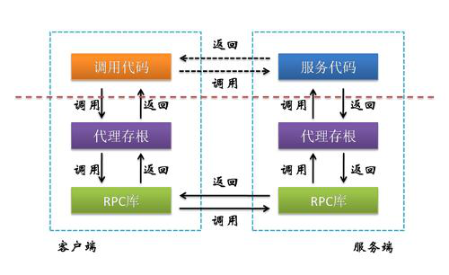
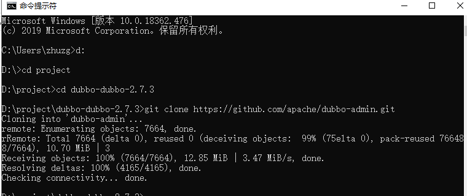
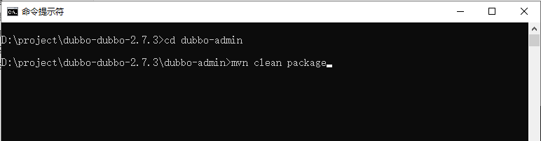
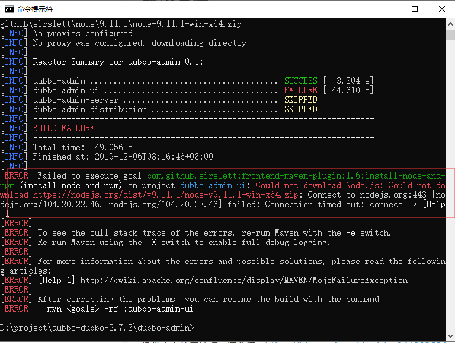
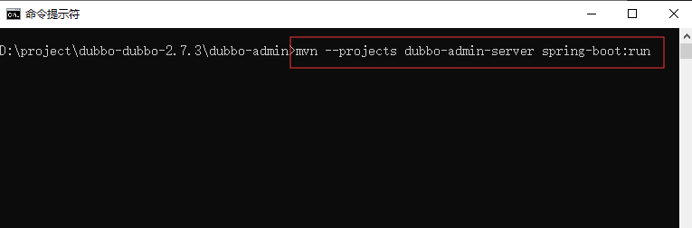
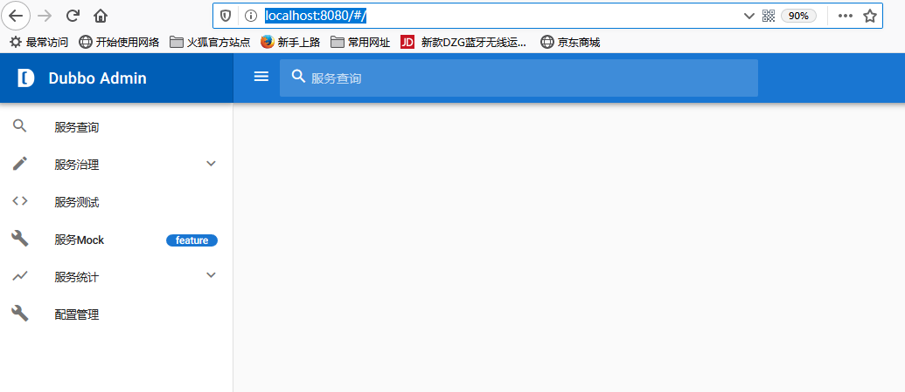

# 第四单元 Dubbo原理及调用流程


# 【授课重点】

1. Dubbo架构概述介绍
2. 三大角色之间的关系
3. Dubbo架构特性
4. Dubbo依赖技术
5. Dubbo-监控中心的安装和使用

# 【考核要求】

1. 掌握Dubbo架构
2. 理解三大角色之间调用关系
3. 掌握Dubbo架构特性
4. Dubbo依赖技术,利用动态代理和socket实现简单的rpc
5. 掌握Dubbo-监控中心的安装和使用

# 【教学内容】

# 4.1 课程导入

  本月讲述内容主要是分布式架构，dubbo 是典型的分布式架构提供者之一。为了更好的应用这个架构，需要了解其架构特点、原理以及他的特性。

# 4.2 Dubbo 架构概述

​	Apache Dubbo™ 是一款高性能Java RPC框架。当并发量比较少，业务逻辑比较单一的情况下使用单体i项目就足够了，但是业务逻辑复杂、并发量大的情况需要引入分布式架构，Dubbo的思想是将每个业务独立成多个服务，部署在不同的服务器上，给调用者提供服务。


## 4.2.1 dubbo 的架构图


  


## 4.2.2 dubbo 架构节点

在上述架构图中包含五个节点和角色说明。

1. Provider 	暴露服务的服务提供方
2. Consumer     调用远程服务的服务消费方
3. Registry 	服务注册与发现的注册中心
4. Monitor 	 统计服务的调用次数和调用时间的监控中心
5. Container      服务运行容器


## 4.2.3  Dubbo 架构节点调用关系

   1.   0（start）     服务容器负责启动，加载，运行服务提供者。

   2.  1（register） 服务提供者在启动时，向注册中心注册自己提供的服务。

   3.  2  (subscribe）服务消费者在启动时，向注册中心订阅自己所需的服务。

   4.  3  (notfify )     注册中心返回服务提供者地址列表给消费者，如果有变更，注册中心将基于长连接推送变更数据给消费者。

   5.  4 (invoke)      服务消费者，从提供者地址列表中，基于软负载均衡算法，选一台提供者进行调用，如果调用失败，再选另一台调用。

   6.  5 (count)        服务消费者和提供者，在内存中累计调用次数和调用时间，定时每分钟发送一次统计数据到监控中心。

​      

# 4.3 Dubbo架构特性

​	Dubbo 架构具有以下几个特点，分别是连通性、健壮性、伸缩性、以及向未来架构的升级性。

##  4.3.1 连通性

1. 注册中心负责服务地址的注册与查找，相当于目录服务，服务提供者和消费者只在启动时与注册中心交互，注册中心不转发请求，压力较小
2. 监控中心负责统计各服务调用次数，调用时间等，统计先在内存汇总后每分钟一次发送到监控中心服务器，并以报表展示
3. 服务提供者向注册中心注册其提供的服务，并汇报调用时间到监控中心，此时间不包含网络开销
4. 服务消费者向注册中心获取服务提供者地址列表，并根据负载算法直接调用提供者，同时汇报调用时间到监控中心，此时间包含网络开销
5. 注册中心，服务提供者，服务消费者三者之间均为长连接，监控中心除外
6. 注册中心通过长连接感知服务提供者的存在，服务提供者宕机，注册中心将立即推送事件通知消费者
7. 注册中心和监控中心全部宕机，不影响已运行的提供者和消费者，消费者在本地缓存了提供者列表
8. 注册中心和监控中心都是可选的，服务消费者可以直连服务提供者


## 4.3.2 健壮性

1. 监控中心宕掉不影响使用，只是丢失部分采样数据

2. 数据库宕掉后，注册中心仍能通过缓存提供服务列表查询，但不能注册新服务

3. 注册中心对等集群，任意一台宕掉后，将自动切换到另一台

4. 注册中心全部宕掉后，服务提供者和服务消费者仍能通过本地缓存通讯

5. 服务提供者无状态，任意一台宕掉后，不影响使用

6. 服务提供者全部宕掉后，服务消费者应用将无法使用，并无限次重连等待服务提供者恢复

   

## 4.3.3 伸缩性

1. 注册中心为对等集群，可动态增加机器部署实例，所有客户端将自动发现新的注册中心

2. 服务提供者无状态，可动态增加机器部署实例，注册中心将推送新的服务提供者信息给消费者

   

## 4.3.4 升级性

   当服务集群规模进一步扩大，带动IT治理结构进一步升级，需要实现动态部署，进行流动计算，现有分布式服务架构不会带来阻力。下图是未来可能的一种架构：

 

节点角色说明

| 节点         | 角色说明                               |
| ------------ | -------------------------------------- |
| `Deployer`   | 自动部署服务的本地代理                 |
| `Repository` | 仓库用于存储服务应用发布包             |
| `Scheduler`  | 调度中心基于访问压力自动增减服务提供者 |
| `Admin`      | 统一管理控制台                         |
| `Registry`   | 服务注册与发现的注册中心               |
| `Monitor`    | 统计服务的调用次数和调用时间的监控中心 |


# 4.4 Dubbo 依赖的技术架构

​	Dubbo的采用netty架构进行通讯，利用远程调用协议（Remote Procedure Call Protocol） 实现调用者与提供者之间的调用关系。Dubbo的实现还需Java 的动态代理技术。

## 4.4.1 netty概述 

​	Netty是由JBOSS提供的一个java开源框架，大家可以从Github下载该项目。Netty提供了异步的、事件驱动的网络应用程序框架和工具，能快速开发高性能、高可靠性的网络服务器和客户端程序。也就是说，它基于NIO的客户、服务器端编程框架,另外它还吸收了多种协议（包括FTP、SMTP、HTTP等各种二进制文本协议）的实现经验，而且经过了相当精心设计。Netty 保证了易于开发的同时还保证了其应用的性能，稳定性和伸缩性。

## 4.4.2 RPC 概述

RPC 是实现分布式计算的事实标准之一。其架构原理如下：

 

在上述图共经过10个步骤。

1. 调用客户端句柄；执行传送参数

2. 调用本地系统内核发送网络消息

3. 消息传送到远程主机

4. 服务器句柄得到消息并取得参数（）

5. 对数据进行序列化，执行远程过程

6. 执行的过程将结果返回服务器句柄

7. 服务器句柄返回结果，调用远程系统内核

8. 消息传回本地主机，反序列化

9. 客户句柄由内核接收消息

10. 客户接收句柄返回的数据

    

## 4.4.3 手写RPC

​	为了更好的理解RPC，我们手写代码实现自己的RPC。为了简化起见，这里咱不是用net框架，而是直接使用socket 的BIO 实现。

​        学生根据思路独自实现。

### 4.4.3.1 实现思路

 1. 编写服务 socket Server （定义类名RpcServer）， 用于接收客户端发送的请求。同时它还提供一个接口函数，用于接受服务的注册。

 2. 编写服务接口及其实现

 3. 编写启动类  ，在启动类中创建 RpcServer 实例，并向该实例中注册2的服务。

 4. 编写客户端代理。

 5. 编写客户端，客户端通过代理向RpcServer 实例 发起PRC请求，并且得到结果。

    

### 4.4.3.2 具体代码实现

#### 4.4.3.2.1 编写服务 socket Server 


```java
package com.mmcro.zhuzg.rpc;
```

~~~java
import java.io.IOException;
import java.io.InputStream;
import java.io.ObjectInputStream;
import java.io.ObjectOutputStream;
import java.io.OutputStream;
import java.lang.reflect.InvocationTargetException;
import java.lang.reflect.Method;
import java.net.ServerSocket;
import java.net.Socket;
import java.util.HashMap;
import java.util.Map;

/**

- 监听服务端 

- @author zhuzg
  *
   */
  public class RpcServer {

  private  int port=8092;

  // 注册中心
  private Map<String,Object> registery= new HashMap<>();

  //添加服务
  public void addService(String serviceName,Object obj) {
  	registery.put(serviceName, obj);
  }

  /**

  - 构造服务
  - @param port
    */
    public RpcServer(int port) {
    this.port=port;
    }

  /**

  - 启动服务

  - @throws IOException
    */
    public  void start() throws IOException {

    ServerSocket ss = new ServerSocket(port);
    //等待客户接入
    while(true) {
    	Socket accept = ss.accept();
    	System.out.println("got a connect");
    	ThreadCli cli = new ThreadCli(accept);
    	cli.start();
    }

    }

  /**

  - 用于服务客户的线程

  - @author zhuzg
    *
     */
    class ThreadCli extends Thread{

    Socket client;
    private ObjectInputStream objectInputStream;
    public ThreadCli(Socket client) {
    	this.client = client;
    	// TODO Auto-generated constructor stub
    }

    @Override
    public void run() {
    	// TODO Auto-generated method stub
    	//super.run();
    	try {
    		InputStream is = client.getInputStream();
    		

    ```
    	ObjectInputStream iso = new ObjectInputStream(is);
    	// 获取服务名
    	String serviceName = iso.readUTF();
    	//获取方法名
    	String methodName = iso.readUTF();
    	//获取参数类型
    	Class<?>[] paraTypes = (Class<?>[]) iso.readObject();
    	//获取参数值
    	Object[] paraValue = (Object[]) iso.readObject();
    	// 从注册中心获取服务
    	Object object = registery.get(serviceName);
    	if(object==null) {
    		
    	}
    	// 利用反射机制调用方法
    	Method method = object.getClass().getMethod(methodName, paraTypes);
    	Object invoke = method.invoke(object, paraValue);
    	
    	// 将反射的方法发送给客户端
    	OutputStream os = client.getOutputStream();
    	ObjectOutputStream oos = new ObjectOutputStream(os);
    	oos.writeObject(invoke);
    
    
    } catch (IOException e) {
    	// TODO Auto-generated catch block
    	e.printStackTrace();
    } catch (ClassNotFoundException e) {
    	// TODO Auto-generated catch block
    	e.printStackTrace();
    } catch (NoSuchMethodException e) {
    	// TODO Auto-generated catch block
    	e.printStackTrace();
    } catch (SecurityException e) {
    	// TODO Auto-generated catch block
    	e.printStackTrace();
    } catch (IllegalAccessException e) {
    	// TODO Auto-generated catch block
    	e.printStackTrace();
    } catch (IllegalArgumentException e) {
    	// TODO Auto-generated catch block
    	e.printStackTrace();
    } catch (InvocationTargetException e) {
    	// TODO Auto-generated catch block
    	e.printStackTrace();
    }
   
    }

  }

  }


~~~

#### 4.4.3.2.2 编写服务接口

   

```java
  package com.mmcro.zhuzg.rpc;

 /**

- 定义接口
- @author zhuzg
  *
   */
  public interface IMyService {
  String mytest(String par1);
  String mytest2(String par1,int m);
  }

	


```

#### 4.4.3.2.3 实现服务接口

 * ```java
    package com.mmcro.zhuzg.rpc;
    
    /**
    
    - 实现接口  仅仅放在服务端
    
    - @author zhuzg
      *
       */
      public class MyServiceImpl implements IMyService {
    
      @Override
      public String mytest(String par1) {
      	// TODO Auto-generated method stub
      	return "hi , " + par1;
      }
    
      @Override
      public String mytest2(String par1, int m) {
      	// TODO Auto-generated method stub
      	String s="";
      	for(int i=0;i<m;i++){
      		s+=par1+",";
      		
    
      
      }
      return s;
      
    
      }
      }
    ```

#### 4.3.2.4 编写启动类，启动服务

```java
package com.mmcro.zhuzg.rpc;
```

```java
import java.io.IOException;

public class StartMain {
	


private static RpcServer rpcServer;

public static void main(String[] args) throws IOException {
	// 创建服务
	rpcServer = new RpcServer(8094);
	// 注册服务
	rpcServer.addService("mytest", new MyServiceImpl());
	// 启动服务
	rpcServer.start();
}


}
```


#### 4.3.2.5 编写客户端代理工厂

~~~java
package com.mmcro.zhuzg.rpc.client;

import java.io.InputStream;
import java.io.ObjectInputStream;
import java.io.ObjectOutputStream;
import java.io.OutputStream;
import java.lang.reflect.InvocationHandler;
import java.lang.reflect.Method;
import java.lang.reflect.Proxy;
import java.net.InetSocketAddress;
import java.net.Socket;

/**

- 获取代理对象

- @author zhuzg
  *
   */
  public class RpcProxy {

  //生成客户端代理对象
  public Object create(Class interf,String host,int port,String serviceName) {
  	

  ```
  Class<?>[] interfaces = {interf};
  return Proxy.newProxyInstance(interf.getClassLoader(),interfaces,new InvocationHandler() {
  
  	@Override
  	public Object invoke(Object proxy, Method method, Object[] args) throws Throwable {
  		// TODO Auto-generated method stub
  		//创建socket 连接
  		Socket socket = new Socket();
  		// 连接服务器
  		socket.connect(new InetSocketAddress(host, port));
  		//获取输出流
  		OutputStream os = socket.getOutputStream();
  		ObjectOutputStream oos = new ObjectOutputStream(os);
  		// 写服务名
  		oos.writeUTF(serviceName);
  		//写方法名
  		oos.writeUTF(method.getName());
  		//写参数类型
  		oos.writeObject(method.getParameterTypes());
  		//写参数值
  		oos.writeObject(args);
  		oos.flush();
  		
  		//读取返回结果
  		InputStream is = socket.getInputStream();
  		ObjectInputStream ois = new ObjectInputStream(is);
  		
  		Object readObject = ois.readObject();				
  		//返回结果返回
  		return readObject;
  	}
  		
  } );
  

  }

}
~~~


#### 4.3.2.6 编写客户端应用程序

```java
package com.mmcro.zhuzg.rpc.client;

import com.mmcro.zhuzg.rpc.IMyService;

/**

- 客户端测试类

- @author zhuzg
  *
   */
  public class TestClientMain {
  private static RpcProxy proxy;

  public static void main(String[] args) {
  	//创建代理工厂
  	proxy = new RpcProxy();
  	//生成代理对象
  	IMyService myService = (IMyService)proxy.create(IMyService.class, "localhost",8094,"mytest");
  	//调用代理对象
  	String mytest = myService.mytest("hi");
  	String mytest2 = myService.mytest2("a", 3);
  	//输出结果
  	System.out.println("mytest is " + mytest);
  	System.out.println("mytest2 is " + mytest2);
  	
  }

}


```

# 4.5 Dubbo-监控中心的安装

## 4.5.1 下载源码

​	

 


## 4.5.2 打包

在打包之前记得修改注册中心的地址，配置文件在

dubbo-admin-server\src\main\resources\application.properties 中。

修改内容为：

   


cd dubbo-admin 目录下，并`执行命令 mvn clean package`进行打包

 


## 4.5.3 问题解决

  在上述过程中如果出现下列问题，则需要按照下列的方式解决。

 


找到dubbo-admin\dubbo-admin-ui下的pom.xml 文件

找到

```xml
        <execution>
            <id>install node and npm</id>
            <goals>
                <goal>install-node-and-npm</goal>
            </goals>
            <configuration>
                <nodeVersion>v9.11.1</nodeVersion>
            </configuration>
        </execution>

修改为
        <execution>
            <id>install node and npm</id>
            <goals>
                <goal>install-node-and-npm</goal>
            </goals>
            <configuration>
                <!--  解决无法使用https 问题  -->
                <nodeDownloadRoot>http://nodejs.org/dist/</nodeDownloadRoot>
                <npmDownloadRoot>http://registry.npmjs.org/npm/-/</npmDownloadRoot>
                <nodeVersion>v9.11.1</nodeVersion>
            </configuration>
        </execution>

                  
```

然后重新打包即可。

## 4.5.4 启动项目

​	在项目的目录下执行命令 mvn --projects dubbo-admin-server spring-boot:run  。 如图：

  


## 4.5.5 使用监控中心

​	在浏览器中输入 http://localhost:8080/#/

​        浏览器中输入：

​       

​		

出现上图即可。


# 4.6 课堂小结

 1. 对Dubbo架构概述

 2. 介绍各个节点之间的关系

 3. 介绍Dubbo架构特性

 4. 介绍了Dubbo的主要依赖技术

 5. Dubbo-监控中心的安装和使用

    

# 4.7 课后作业 

 	1. 阐述什么是 dubbo的连通性 、健壮性和升级性能
 	2. 说明如何实现一个RPC
 	3. 安装dubbo 监控中心